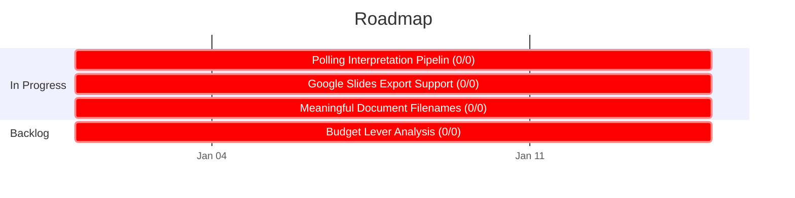

# Roadmap

<!-- Auto-generated by `chart.sh roadmap`. Do not edit manually. -->

| Priority Matrix | Legend |
|:---:|:---|
|  | **In Progress**   *Interpretation Pipeline* — [E13](docs/epic/Active/(EPIC-013)-Polling-Interpretation-Pipeline/(EPIC-013)-Polling-Interpretation-Pipeline.md)     **Backlog**   *Budget Lever Analysis* — [E7](docs/epic/Proposed/(EPIC-007)-Budget-Lever-Analysis/(EPIC-007)-Budget-Lever-Analysis.md) |

### Do First
*High priority, active or unblocking*

*(none)*

### Schedule
*High priority, not yet started*

*(none)*

### In Progress
*Active or unblocking, medium priority*

| Initiative | Epic | Progress | Unblocks | Needs |
|-----------|------|----------|----------|-------|
| [Budget Lever Analysis](docs/initiative/Active/(INITIATIVE-001)-Budget-Lever-Analysis/(INITIATIVE-001)-Budget-Lever-Analysis.md) | [Google Slides Export Support](docs/spec/Active/(SPEC-023)-Google-Slides-Export-Support/(SPEC-023)-Google-Slides-Export-Support.md) | 0/0 | 0 | **needs decomposition** |
|  | [Meaningful Document Filenames](docs/spec/Active/(SPEC-024)-Meaningful-Document-Filenames/(SPEC-024)-Meaningful-Document-Filenames.md) | 0/0 | 0 | **needs decomposition** |
| [Interpretation Pipeline](docs/initiative/Active/(INITIATIVE-003)-Interpretation-Pipeline/(INITIATIVE-003)-Interpretation-Pipeline.md) | [Polling Interpretation Pipeline](docs/epic/Active/(EPIC-013)-Polling-Interpretation-Pipeline/(EPIC-013)-Polling-Interpretation-Pipeline.md) | 0/0 | 0 | **needs decomposition** |

### Backlog
*Not yet prioritized or started*

| Initiative | Epic | Progress | Unblocks | Needs |
|-----------|------|----------|----------|-------|
| [Budget Lever Analysis](docs/initiative/Active/(INITIATIVE-001)-Budget-Lever-Analysis/(INITIATIVE-001)-Budget-Lever-Analysis.md) | [Budget Lever Analysis](docs/epic/Proposed/(EPIC-007)-Budget-Lever-Analysis/(EPIC-007)-Budget-Lever-Analysis.md) | 0/0 | 0 | **activate or drop** |

## Timeline

