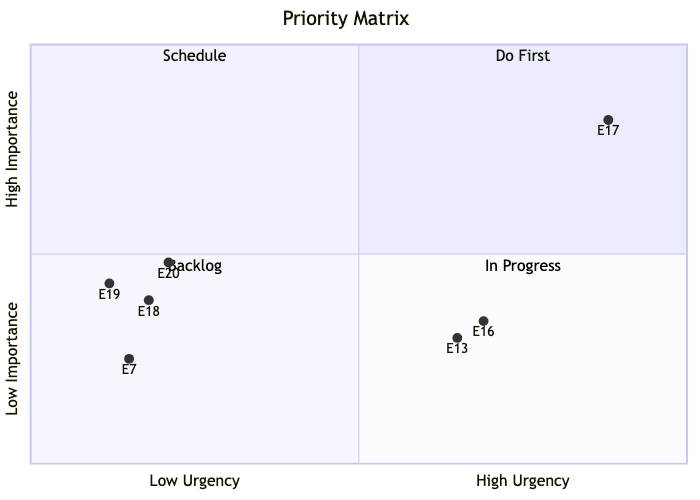
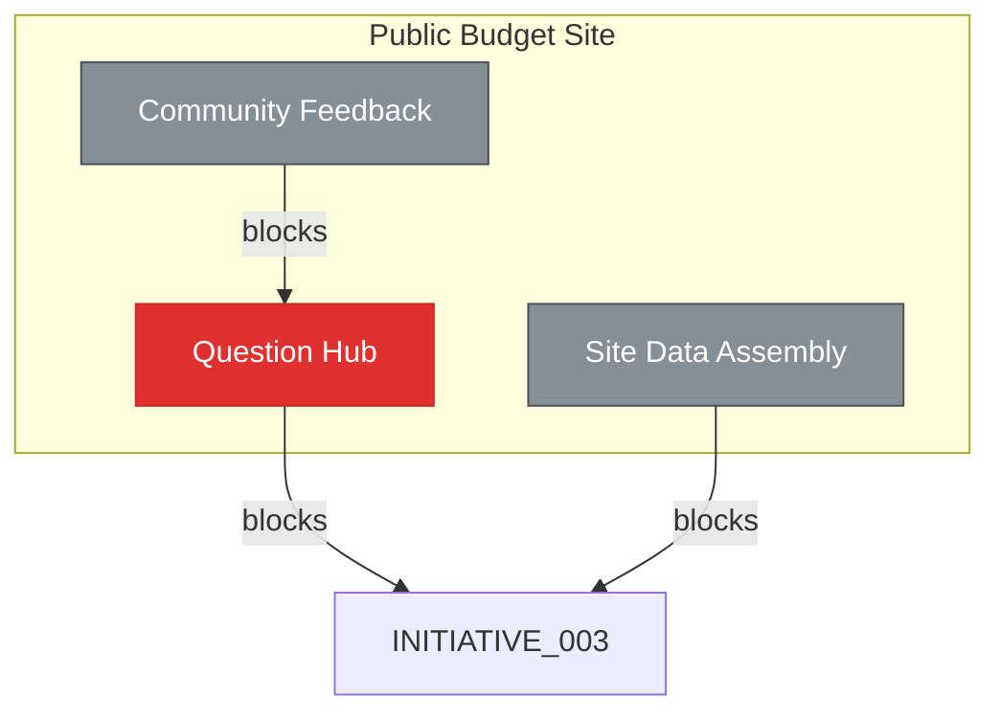

# Roadmap

<!-- Auto-generated by `chart.sh roadmap`. Do not edit manually. -->

| Priority Matrix | Legend |
|:---:|:---|
|  | **Do First** <br> *Public Budget Site* — [E17](docs/epic/Active/(EPIC-017)-Question-Hub/(EPIC-017)-Question-Hub.md) <br> <br> **In Progress** <br> *Interpretation Pipeline* — [E13](docs/epic/Active/(EPIC-013)-Polling-Interpretation-Pipeline/(EPIC-013)-Polling-Interpretation-Pipeline.md) <br> *Public Budget Site* — [E16](docs/epic/Active/(EPIC-016)-Site-Visual-Design/(EPIC-016)-Site-Visual-Design.md) <br> <br> **Backlog** <br> *Budget Lever Analysis* — [E7](docs/epic/Proposed/(EPIC-007)-Budget-Lever-Analysis/(EPIC-007)-Budget-Lever-Analysis.md) <br> *Public Budget Site* — [E18](docs/epic/Proposed/(EPIC-018)-Community-Feedback/(EPIC-018)-Community-Feedback.md), [E19](docs/epic/Proposed/(EPIC-019)-Site-Data-Assembly/(EPIC-019)-Site-Data-Assembly.md) <br> *Interpretation Pipeline* — [E20](docs/epic/Proposed/(EPIC-020)-Feedback-Pipeline-Integration/(EPIC-020)-Feedback-Pipeline-Integration.md) |

## Recommended Next

> **SPEC-025**: Question Extraction — unblocks 2 items, weight: high, score: 6

## Decisions Waiting on You

| Artifact | Unblocks |
|----------|----------|
| EPIC-007: Budget Lever Analysis | — |
| EPIC-020: Feedback Pipeline Integration | — |
| SPEC-029: Persona Routing Selector | — |
| SPEC-030: Briefing Summary Block | — |
| SPEC-031: Student-Friendly Language | — |
| SPEC-032: Last Updated Indicator | — |

## Implementation Ready (agent can handle)

| Artifact | Unblocks |
|----------|----------|
| INITIATIVE-003: Interpretation Pipeline | 3 |
| SPEC-025: Question Extraction | 2 |
| SPEC-033: Evidence Source Links | 1 |
| EPIC-013: Polling Interpretation Pipeline | — |
| EPIC-016: Site Visual Design | — |
| INITIATIVE-001: Budget Lever Analysis | — |
| SPEC-023: Google Slides Export Support | — |
| SPEC-024: Meaningful Document Filenames | — |
| SPEC-028: Privacy-Respecting Analytics | — |

### Do First
*High priority, active or unblocking*

| Initiative | Epic | Progress | Unblocks | Needs |
|-----------|------|----------|----------|-------|
| [Public Budget Site](docs/initiative/Active/(INITIATIVE-004)-Public-Budget-Site/(INITIATIVE-004)-Public-Budget-Site.md) | [Question Extraction](docs/spec/Active/(SPEC-025)-Question-Extraction/(SPEC-025)-Question-Extraction.md) | 0/0 | 2 | **needs decomposition** |
|  | [Question Hub](docs/epic/Active/(EPIC-017)-Question-Hub/(EPIC-017)-Question-Hub.md) | 0/3 | 1 | — |
|  | [Questions Index Page](docs/spec/Active/(SPEC-026)-Questions-Index-Page/(SPEC-026)-Questions-Index-Page.md) | 0/0 | 1 | **needs decomposition** |
|  | [Answer Detail Pages](docs/spec/Active/(SPEC-027)-Answer-Detail-Pages/(SPEC-027)-Answer-Detail-Pages.md) | 0/0 | 0 | **needs decomposition** |

### Schedule
*High priority, not yet started*

*(none)*

### In Progress
*Active or unblocking, medium priority*

| Initiative | Epic | Progress | Unblocks | Needs |
|-----------|------|----------|----------|-------|
| [Budget Lever Analysis](docs/initiative/Active/(INITIATIVE-001)-Budget-Lever-Analysis/(INITIATIVE-001)-Budget-Lever-Analysis.md) | [Google Slides Export Support](docs/spec/Active/(SPEC-023)-Google-Slides-Export-Support/(SPEC-023)-Google-Slides-Export-Support.md) | 0/0 | 0 | **needs decomposition** |
|  | [Meaningful Document Filenames](docs/spec/Active/(SPEC-024)-Meaningful-Document-Filenames/(SPEC-024)-Meaningful-Document-Filenames.md) | 0/0 | 0 | **needs decomposition** |
| [Interpretation Pipeline](docs/initiative/Active/(INITIATIVE-003)-Interpretation-Pipeline/(INITIATIVE-003)-Interpretation-Pipeline.md) | [Polling Interpretation Pipeline](docs/epic/Active/(EPIC-013)-Polling-Interpretation-Pipeline/(EPIC-013)-Polling-Interpretation-Pipeline.md) | 0/0 | 0 | **needs decomposition** |
| [Public Budget Site](docs/initiative/Active/(INITIATIVE-004)-Public-Budget-Site/(INITIATIVE-004)-Public-Budget-Site.md) | [Site Visual Design](docs/epic/Active/(EPIC-016)-Site-Visual-Design/(EPIC-016)-Site-Visual-Design.md) | 0/0 | 0 | **needs decomposition** |
|  | [Privacy-Respecting Analytics](docs/spec/Active/(SPEC-028)-Privacy-Respecting-Analytics/(SPEC-028)-Privacy-Respecting-Analytics.md) | 0/0 | 0 | **needs decomposition** |

### Backlog
*Not yet prioritized or started*

| Initiative | Epic | Progress | Unblocks | Needs |
|-----------|------|----------|----------|-------|
| [Budget Lever Analysis](docs/initiative/Active/(INITIATIVE-001)-Budget-Lever-Analysis/(INITIATIVE-001)-Budget-Lever-Analysis.md) | [Budget Lever Analysis](docs/epic/Proposed/(EPIC-007)-Budget-Lever-Analysis/(EPIC-007)-Budget-Lever-Analysis.md) | 0/0 | 0 | **activate or drop** |
| [Interpretation Pipeline](docs/initiative/Active/(INITIATIVE-003)-Interpretation-Pipeline/(INITIATIVE-003)-Interpretation-Pipeline.md) | [Feedback Pipeline Integration](docs/epic/Proposed/(EPIC-020)-Feedback-Pipeline-Integration/(EPIC-020)-Feedback-Pipeline-Integration.md) | 0/0 | 0 | **activate or drop** |
| [Public Budget Site](docs/initiative/Active/(INITIATIVE-004)-Public-Budget-Site/(INITIATIVE-004)-Public-Budget-Site.md) | [Community Feedback](docs/epic/Proposed/(EPIC-018)-Community-Feedback/(EPIC-018)-Community-Feedback.md) | 0/0 | 0 | **activate or drop** |
|  | [Site Data Assembly](docs/epic/Proposed/(EPIC-019)-Site-Data-Assembly/(EPIC-019)-Site-Data-Assembly.md) | 0/0 | 0 | **activate or drop** |

## Timeline

```mermaid
gantt
    title Roadmap
    dateFormat YYYY-MM-DD
    axisFormat %b %d
    tickInterval 1week
    section Do First
    Question Extraction (0/0) :crit, t0, 2026-01-01, 14d
    Question Hub (0/3) :active, t1, 2026-01-15, 14d
    Questions Index Page (0/0) :crit, t2, after t0, 14d
    Answer Detail Pages (0/0) :crit, t3, after t0 t2, 14d
    section In Progress
    Polling Interpretation Pipelin (0/0) :crit, t4, 2026-01-43, 14d
    Site Visual Design (0/0) :crit, t5, 2026-01-43, 14d
    Google Slides Export Support (0/0) :crit, t6, 2026-01-43, 14d
    Meaningful Document Filenames (0/0) :crit, t7, 2026-01-43, 14d
    Privacy-Respecting Analytics (0/0) :crit, t8, 2026-01-43, 14d
    section Backlog
    Budget Lever Analysis (0/0) :crit, t9, 2026-01-43, 14d
    Community Feedback (0/0) :crit, t10, after t1, 14d
    Site Data Assembly (0/0) :crit, t11, 2026-01-43, 14d
    Feedback Pipeline Integration (0/0) :crit, t12, 2026-01-43, 14d
```

## Blocking Dependencies


