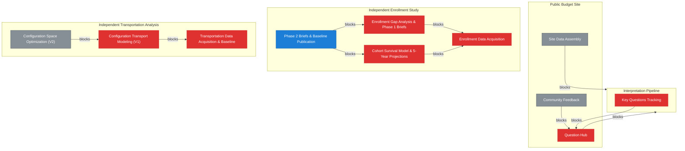

# Roadmap

<!-- Auto-generated by `chart.sh roadmap`. Do not edit manually. -->

| Priority Matrix | Legend |
|:---:|:---|
|  | **Do First** <br> *Public Budget Site* — [E17](docs/epic/Active/(EPIC-017)-Question-Hub/(EPIC-017)-Question-Hub.md) <br> *Independent Enrollment Study* — [E26](docs/epic/Active/(EPIC-026)-Enrollment-Data-Acquisition/(EPIC-026)-Enrollment-Data-Acquisition.md), [E27](docs/epic/Active/(EPIC-027)-Enrollment-Gap-Analysis-Phase-1-Briefs/(EPIC-027)-Enrollment-Gap-Analysis-Phase-1-Briefs.md), [E28](docs/epic/Active/(EPIC-028)-Cohort-Survival-Model-5-Year-Projections/(EPIC-028)-Cohort-Survival-Model-5-Year-Projections.md) <br> *Independent Transportation Analysis* — [E30](docs/epic/Active/(EPIC-030)-Transportation-Data-Acquisition-Baseline/(EPIC-030)-Transportation-Data-Acquisition-Baseline.md), [E31](docs/epic/Active/(EPIC-031)-Configuration-Transport-Modeling-V1/(EPIC-031)-Configuration-Transport-Modeling-V1.md) <br> *Interpretation Pipeline* — [E21](docs/epic/Active/(EPIC-021)-Key-Questions-Tracking/(EPIC-021)-Key-Questions-Tracking.md) <br> <br> **In Progress** <br> *Interpretation Pipeline* — [E13](docs/epic/Active/(EPIC-013)-Polling-Interpretation-Pipeline/(EPIC-013)-Polling-Interpretation-Pipeline.md) <br> *Public Budget Site* — [E16](docs/epic/Active/(EPIC-016)-Site-Visual-Design/(EPIC-016)-Site-Visual-Design.md) <br> *Independent Enrollment Study* — [E29](docs/epic/Active/(EPIC-029)-Phase-2-Briefs-Baseline-Publication/(EPIC-029)-Phase-2-Briefs-Baseline-Publication.md) <br> <br> **Backlog** <br> *Budget Lever Analysis* — [E7](docs/epic/Proposed/(EPIC-007)-Budget-Lever-Analysis/(EPIC-007)-Budget-Lever-Analysis.md) <br> *Public Budget Site* — [E18](docs/epic/Proposed/(EPIC-018)-Community-Feedback/(EPIC-018)-Community-Feedback.md), [E19](docs/epic/Proposed/(EPIC-019)-Site-Data-Assembly/(EPIC-019)-Site-Data-Assembly.md) <br> *Interpretation Pipeline* — [E20](docs/epic/Proposed/(EPIC-020)-Feedback-Pipeline-Integration/(EPIC-020)-Feedback-Pipeline-Integration.md) <br> *Independent Transportation Analysis* — [E33](docs/epic/Proposed/(EPIC-033)-Configuration-Space-Optimization-V2/(EPIC-033)-Configuration-Space-Optimization-V2.md) |

## Recommended Next

> **SPEC-034**: Question Artifact Type — unblocks 4 items, weight: high, score: 12

## Decisions Waiting on You

| Artifact | Unblocks |
|----------|----------|
| EPIC-007: Budget Lever Analysis | — |
| EPIC-020: Feedback Pipeline Integration | — |
| SPEC-029: Persona Routing Selector | — |
| SPEC-030: Briefing Summary Block | — |
| SPEC-031: Student-Friendly Language | — |
| SPEC-032: Last Updated Indicator | — |

## Implementation Ready (agent can handle)

| Artifact | Unblocks |
|----------|----------|
| SPEC-034: Question Artifact Type | 4 |
| INITIATIVE-003: Interpretation Pipeline | 3 |
| EPIC-026: Enrollment Data Acquisition | 2 |
| SPEC-025: Question Extraction | 2 |
| SPEC-048: Maine DOE Enrollment Data Trove | 2 |
| EPIC-030: Transportation Data Acquisition & Baseline | 1 |
| INITIATIVE-005: Independent Enrollment Study | 1 |
| SPEC-051: Enrollment Claims Catalog | 1 |
| SPEC-033: Evidence Source Links | 1 |
| EPIC-013: Polling Interpretation Pipeline | — |
| EPIC-016: Site Visual Design | — |
| INITIATIVE-001: Budget Lever Analysis | — |
| SPEC-023: Google Slides Export Support | — |
| SPEC-024: Meaningful Document Filenames | — |
| SPEC-028: Privacy-Respecting Analytics | — |
| SPEC-049: DHHS Birth Records Trove | — |
| SPEC-050: Housing Permit Data Trove | — |
| SPEC-052: School Choice Transfer Data | — |
| SPEC-069: Enrollment Study Site Pages | — |
| SPEC-070: Transportation Analysis Site Pages | — |
| SPIKE-008: Question Scoring Prototype | — |
| SPIKE-010: Walk Zone & Pedestrian Infrastructure Audit | — |

### Do First
*High priority, active or unblocking*

| Initiative | Epic | Progress | Unblocks | Needs |
|-----------|------|----------|----------|-------|
| [Public Budget Site](docs/initiative/Active/(INITIATIVE-004)-Public-Budget-Site/(INITIATIVE-004)-Public-Budget-Site.md) | [Question Hub](docs/epic/Active/(EPIC-017)-Question-Hub/(EPIC-017)-Question-Hub.md) | 0/3 | 2 | — |
|  | [Question Extraction](docs/spec/Active/(SPEC-025)-Question-Extraction/(SPEC-025)-Question-Extraction.md) | 0/0 | 2 | **needs decomposition** |
|  | [Questions Index Page](docs/spec/Active/(SPEC-026)-Questions-Index-Page/(SPEC-026)-Questions-Index-Page.md) | 0/0 | 1 | **needs decomposition** |
|  | [Answer Detail Pages](docs/spec/Active/(SPEC-027)-Answer-Detail-Pages/(SPEC-027)-Answer-Detail-Pages.md) | 0/0 | 0 | **needs decomposition** |
| [Independent Enrollment Study](docs/initiative/Active/(INITIATIVE-005)-Independent-Enrollment-Study/(INITIATIVE-005)-Independent-Enrollment-Study.md) | [Enrollment Data Acquisition](docs/epic/Active/(EPIC-026)-Enrollment-Data-Acquisition/(EPIC-026)-Enrollment-Data-Acquisition.md) | 0/5 | 2 | — |
|  | [Enrollment Gap Analysis & Phase 1 Briefs](docs/epic/Active/(EPIC-027)-Enrollment-Gap-Analysis-Phase-1-Briefs/(EPIC-027)-Enrollment-Gap-Analysis-Phase-1-Briefs.md) | 0/2 | 1 | — |
|  | [Cohort Survival Model & 5-Year Projections](docs/epic/Active/(EPIC-028)-Cohort-Survival-Model-5-Year-Projections/(EPIC-028)-Cohort-Survival-Model-5-Year-Projections.md) | 0/2 | 1 | — |
| [Independent Transportation Analysis](docs/initiative/Active/(INITIATIVE-006)-Independent-Transportation-Analysis/(INITIATIVE-006)-Independent-Transportation-Analysis.md) | [Transportation Data Acquisition & Baseline](docs/epic/Active/(EPIC-030)-Transportation-Data-Acquisition-Baseline/(EPIC-030)-Transportation-Data-Acquisition-Baseline.md) | 3/3 | 1 | **ready to complete** |
|  | [Configuration Transport Modeling (V1)](docs/epic/Active/(EPIC-031)-Configuration-Transport-Modeling-V1/(EPIC-031)-Configuration-Transport-Modeling-V1.md) | 6/6 | 1 | **ready to complete** |
| [Interpretation Pipeline](docs/initiative/Active/(INITIATIVE-003)-Interpretation-Pipeline/(INITIATIVE-003)-Interpretation-Pipeline.md) | [Key Questions Tracking](docs/epic/Active/(EPIC-021)-Key-Questions-Tracking/(EPIC-021)-Key-Questions-Tracking.md) | 0/5 | 0 | — |

### Schedule
*High priority, not yet started*

*(none)*

### In Progress
*Active or unblocking, medium priority*

| Initiative | Epic | Progress | Unblocks | Needs |
|-----------|------|----------|----------|-------|
| [Budget Lever Analysis](docs/initiative/Active/(INITIATIVE-001)-Budget-Lever-Analysis/(INITIATIVE-001)-Budget-Lever-Analysis.md) | [Google Slides Export Support](docs/spec/Active/(SPEC-023)-Google-Slides-Export-Support/(SPEC-023)-Google-Slides-Export-Support.md) | 0/0 | 0 | **needs decomposition** |
|  | [Meaningful Document Filenames](docs/spec/Active/(SPEC-024)-Meaningful-Document-Filenames/(SPEC-024)-Meaningful-Document-Filenames.md) | 0/0 | 0 | **needs decomposition** |
| [Interpretation Pipeline](docs/initiative/Active/(INITIATIVE-003)-Interpretation-Pipeline/(INITIATIVE-003)-Interpretation-Pipeline.md) | [Polling Interpretation Pipeline](docs/epic/Active/(EPIC-013)-Polling-Interpretation-Pipeline/(EPIC-013)-Polling-Interpretation-Pipeline.md) | 0/0 | 0 | **needs decomposition** |
| [Public Budget Site](docs/initiative/Active/(INITIATIVE-004)-Public-Budget-Site/(INITIATIVE-004)-Public-Budget-Site.md) | [Site Visual Design](docs/epic/Active/(EPIC-016)-Site-Visual-Design/(EPIC-016)-Site-Visual-Design.md) | 0/0 | 0 | **needs decomposition** |
|  | [Privacy-Respecting Analytics](docs/spec/Active/(SPEC-028)-Privacy-Respecting-Analytics/(SPEC-028)-Privacy-Respecting-Analytics.md) | 0/0 | 0 | **needs decomposition** |
| [Independent Enrollment Study](docs/initiative/Active/(INITIATIVE-005)-Independent-Enrollment-Study/(INITIATIVE-005)-Independent-Enrollment-Study.md) | [Phase 2 Briefs & Baseline Publication](docs/epic/Active/(EPIC-029)-Phase-2-Briefs-Baseline-Publication/(EPIC-029)-Phase-2-Briefs-Baseline-Publication.md) | 0/2 | 0 | — |

### Backlog
*Not yet prioritized or started*

| Initiative | Epic | Progress | Unblocks | Needs |
|-----------|------|----------|----------|-------|
| [Budget Lever Analysis](docs/initiative/Active/(INITIATIVE-001)-Budget-Lever-Analysis/(INITIATIVE-001)-Budget-Lever-Analysis.md) | [Budget Lever Analysis](docs/epic/Proposed/(EPIC-007)-Budget-Lever-Analysis/(EPIC-007)-Budget-Lever-Analysis.md) | 0/0 | 0 | **activate or drop** |
| [Interpretation Pipeline](docs/initiative/Active/(INITIATIVE-003)-Interpretation-Pipeline/(INITIATIVE-003)-Interpretation-Pipeline.md) | [Feedback Pipeline Integration](docs/epic/Proposed/(EPIC-020)-Feedback-Pipeline-Integration/(EPIC-020)-Feedback-Pipeline-Integration.md) | 0/0 | 0 | **activate or drop** |
| [Public Budget Site](docs/initiative/Active/(INITIATIVE-004)-Public-Budget-Site/(INITIATIVE-004)-Public-Budget-Site.md) | [Community Feedback](docs/epic/Proposed/(EPIC-018)-Community-Feedback/(EPIC-018)-Community-Feedback.md) | 0/0 | 0 | **activate or drop** |
|  | [Site Data Assembly](docs/epic/Proposed/(EPIC-019)-Site-Data-Assembly/(EPIC-019)-Site-Data-Assembly.md) | 0/2 | 0 | **activate or drop** |
| [Independent Transportation Analysis](docs/initiative/Active/(INITIATIVE-006)-Independent-Transportation-Analysis/(INITIATIVE-006)-Independent-Transportation-Analysis.md) | [Configuration Space Optimization (V2)](docs/epic/Proposed/(EPIC-033)-Configuration-Space-Optimization-V2/(EPIC-033)-Configuration-Space-Optimization-V2.md) | 0/0 | 0 | **activate or drop** |

## Timeline

```mermaid
gantt
    title Roadmap
    dateFormat YYYY-MM-DD
    axisFormat %b %d
    tickInterval 1week
    section Do First
    Question Hub (0/3) :active, t0, 2026-01-01, 14d
    Enrollment Data Acquisition (0/5) :active, t1, 2026-01-01, 14d
    Question Extraction (0/0) :crit, t2, 2026-01-01, 14d
    Enrollment Gap Analysis & Phas (0/2) :active, t3, after t1, 14d
    Cohort Survival Model & 5-Year (0/2) :active, t4, after t1, 14d
    Transportation Data Acquisitio (3/3) :crit, t5, 2026-01-15, 14d
    Configuration Transport Modeli (6/6) :crit, t6, after t5, 14d
    Questions Index Page (0/0) :crit, t7, after t2, 14d
    Key Questions Tracking (0/5) :active, t8, after t0, 14d
    Answer Detail Pages (0/0) :crit, t9, after t2 t7, 14d
    section In Progress
    Polling Interpretation Pipelin (0/0) :crit, t10, 2026-01-43, 14d
    Site Visual Design (0/0) :crit, t11, 2026-01-43, 14d
    Phase 2 Briefs & Baseline Publ (0/2) :active, t12, after t3 t4, 14d
    Google Slides Export Support (0/0) :crit, t13, 2026-01-43, 14d
    Meaningful Document Filenames (0/0) :crit, t14, 2026-01-43, 14d
    Privacy-Respecting Analytics (0/0) :crit, t15, 2026-01-43, 14d
    section Backlog
    Budget Lever Analysis (0/0) :crit, t16, 2026-01-43, 14d
    Community Feedback (0/0) :crit, t17, after t0, 14d
    Site Data Assembly (0/2) :crit, t18, 2026-01-43, 14d
    Feedback Pipeline Integration (0/0) :crit, t19, 2026-01-43, 14d
    Configuration Space Optimizati (0/0) :crit, t20, after t6, 14d
```

## Blocking Dependencies


