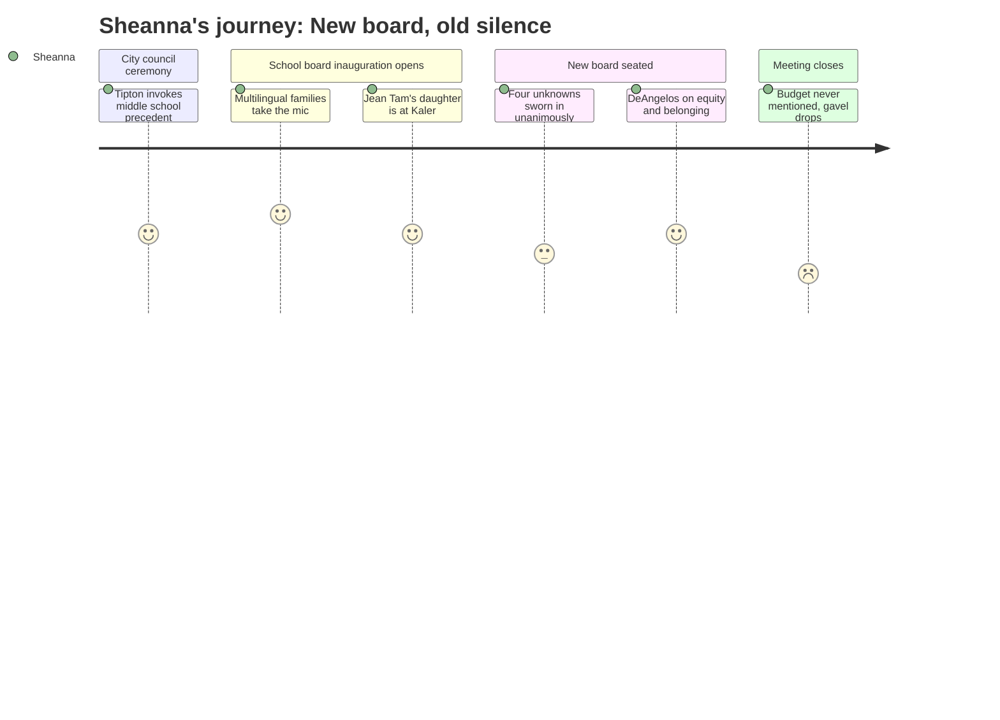

# Interpretation: Sheanna (PERSONA-012)
## Meeting: City Council Regular Meeting -- December 1, 2025 -- 2025-12-01

### Structured Points

#### 1. Multilingual community speakers open the school board inauguration
- **Fact:** Six community members — from Iran, Uganda/Rwanda, Iraq, Cambodia, Angola, and Somalia — addressed the school board in their native languages (Farsi, Kinyarwanda, Arabic, Khmer, Portuguese, and Somali), with an interpreter summarizing their shared message: "We are your neighbors, your community members, your coworkers, and your students. We want to be your friends."
- **Source:** [00:35:54--00:43:02]
- **Emotional valence:** positive
- **Threat level:** 1
- **Open question:** false

#### 2. One of the community speakers has a child currently enrolled at Kaler School
- **Fact:** The presenter identified Jean Tam from Cambodia — who spoke in Khmer and serves as department head at the UNE Oral Health Center — and noted that "her daughter, who's here as well, attends Kaler School."
- **Source:** [00:42:01--00:42:12]
- **Emotional valence:** positive
- **Threat level:** 1
- **Open question:** true

#### 3. DeAngelos elected school board chair unanimously on the first vote of the new board
- **Fact:** Immediately after four new members were sworn in, the reconstituted board voted unanimously to elect Rosemary DeAngelos as chair and Adrian Dowling as vice chair, with no competing nominations for either seat.
- **Source:** [00:45:44--00:47:34]
- **Emotional valence:** neutral
- **Threat level:** 2
- **Open question:** true

#### 4. Mayor-elect Tipton explicitly cites the new middle school as proof South Portland can do hard things together
- **Fact:** In her inaugural address, Tipton said: "I watched residents from every part of the city work through tough discussions to support building a beautiful new middle school — an incredible investment in our children and our future."
- **Source:** [00:17:29--00:17:40]
- **Emotional valence:** positive
- **Threat level:** 1
- **Open question:** false

#### 5. DeAngelos's inaugural address centers power inequity, immigrant belonging, and the obligation to see every child
- **Fact:** DeAngelos spoke at length about students failed by schools because "schools didn't consider them valuable," and invoked the immigrant community speakers to argue: "We must remember there is a power inequity. And we need to ask, is this the change we want?" She closed by framing education as belonging, not just academics.
- **Source:** [00:49:44--01:00:15]
- **Emotional valence:** positive
- **Threat level:** 1
- **Open question:** true

#### 6. Four brand-new board members join with zero disclosed positions on the budget crisis
- **Fact:** Daniel Feller, Eleni Richardson, George Rich, and Tyler Smith were sworn in as new school board members. No candidate statements, policy commitments, or acknowledgment of the district's fiscal situation appeared anywhere in this meeting.
- **Source:** [00:43:16--00:44:38]
- **Emotional valence:** neutral
- **Threat level:** 3
- **Open question:** true

#### 7. The entire meeting passes without a single mention of the budget, enrollment decline, or staffing cuts
- **Fact:** Neither the city council inaugural nor the school board inauguration contained any reference to the district's structural deficit, proposed position eliminations, school reconfiguration, or the upcoming budget cycle — despite this board now being responsible for those decisions.
- **Source:** Full transcript [00:00:13--01:02:53]
- **Emotional valence:** negative
- **Threat level:** 4
- **Open question:** true

### Journey Map

### Reactions

Okay so I stayed for the whole thing and I'm genuinely glad I did, because those community speakers — the woman from Cambodia with her daughter at Kaler, the guy from Somalia who *wrote a book*, the accountant from Iraq — they stood up and gave their message in six different languages and it was one of the most powerful things I've seen at one of these meetings. That's my caseload up there. Those are the families I work with every single day across three buildings, and they showed up to welcome a new school board and basically say *please see us*. I cried. I'm not going to pretend I didn't.

And then DeAngelos got up and she talked about power inequity and about kids who burned down a school because nobody saw them, and about how education is belonging, not just reading and math. That's the chair. That's the person who's going to be running these meetings when they vote on whether to cut 42 teaching positions. And I felt — for maybe twenty minutes — like someone at that table actually understands what I'm talking about when I say this isn't just about money. The Tipton piece too: she went out of her way to name the middle school as proof the community can make hard changes when there's shared purpose. That's the argument I've been making for three years about reconfiguration. Hearing it from the incoming mayor felt like something.

But here's what kept me up: this board just got handed a $7.2 million problem and a 78-position cut list, and tonight they sat there and talked about belonging and Room Eight the cat and not one person said the word *budget*. Not one. I know it's an inauguration. I know that's not what tonight was for. But DeAngelos is talking about kids who are hungry, alone, confused — and I'm sitting there thinking, those are the exact kids who are on MTSS wait lists at two of my buildings right now, and the interventionists who serve them are on the cut list. That room was full of warmth and I believed every word of it. But warmth doesn't tell me whether the new members — Feller, Richardson, Rich, Smith, four total unknowns — are going to fight for the programming that actually reaches those families who stood up there tonight. I need to know where they stand. And that meeting told me nothing.