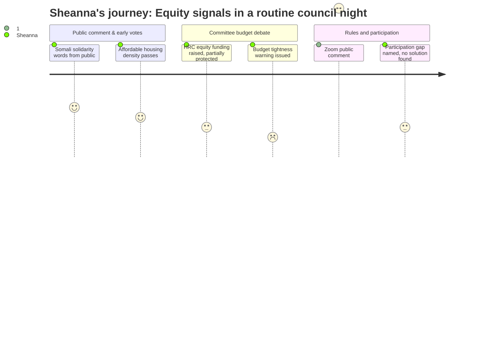

# Interpretation: Sheanna (PERSONA-015)
## Meeting: City Council Regular Meeting -- December 4, 2025 -- 2025-12-04

### Structured Points

#### 1. Steinbrink speaks up for Somali American neighbors
- **Fact:** Community member Jeff Steinbrink used his public comment to forcefully condemn federal rhetoric denigrating Somali Americans, saying their neighbors "need to feel welcome, safe at home, invested in this community" and that South Portland has "an antidote" to Washington's cruelty.
- **Source:** [00:13:58–00:16:52], Citizen Discussion Part One
- **Emotional valence:** positive
- **Threat level:** 1
- **Open question:** false

#### 2. Affordable housing density relief passes unanimously
- **Fact:** Ordinance 13 amending zoning to allow greater density for affordable housing projects passed 7-0, with the planning director noting the most likely beneficiaries are two existing affordable projects where density bonuses have already been maxed out.
- **Source:** [00:20:28–00:22:57], Ordinance 13 25-26
- **Emotional valence:** positive
- **Threat level:** 1
- **Open question:** false

#### 3. Human Rights Commission funding drawn into new budget process
- **Fact:** During debate over Order 109's new committee budget request process, Councilor Walker explicitly flagged concern that the Human Rights Commission — whose annual budget has historically averaged around $10,000 for events like Juneteenth — could be disadvantaged by a $2,500 operating cap, especially compared to committees with parallel city department budgets to draw from.
- **Source:** [00:39:05–00:44:00], Order 109 25-26
- **Emotional valence:** neutral
- **Threat level:** 3
- **Open question:** true

#### 4. Councilor Matthews warns: "It's gonna be a tight budget year"
- **Fact:** During the committee budget cap discussion, Councilor Matthews explicitly said "things are tight" and cautioned against starting the per-committee cap too high, adding "we may have to tell everybody no" — signaling that even small budget asks will face scrutiny in the coming cycle.
- **Source:** [00:47:44–00:47:57], Order 109 25-26 discussion
- **Emotional valence:** negative
- **Threat level:** 4
- **Open question:** true

#### 5. Zoom public comment dies without a path forward
- **Fact:** After Councilor Walker raised the possibility of restoring remote public comment via Zoom, Councilor Pride described why open public comment forums make it legally impossible to mute or exclude disruptive participants — including those who have "zoomed in from all over the country" after learning the city allows unrestricted comment — effectively ending the discussion without any alternative mechanism adopted.
- **Source:** [01:44:00–01:56:30], Workshop: Council Rules
- **Emotional valence:** negative
- **Threat level:** 3
- **Open question:** true

#### 6. Community members name the participation gap — and no one has a solution
- **Fact:** Both John Ponty (public comment) and Councilor Pride (round robin) described the same problem: South Portland residents complain privately about government decisions but don't show up to meetings, out of fear of neighbors, business consequences, or sheer busyness. Neither offered a concrete fix beyond "call us."
- **Source:** [02:06:00–02:10:00] public comment on workshop; [02:16:00–02:20:00] Councilor Pride round robin
- **Emotional valence:** neutral
- **Threat level:** 2
- **Open question:** true

### Journey Map

### Reactions

That Steinbrink comment at the start — I actually teared up a little, not gonna lie. After everything our families have been navigating this year with the federal stuff, to hear someone stand up at a city council meeting and say out loud that our Somali American neighbors need to feel safe and at home here — that's not nothing. That's exactly the energy I try to bring into my buildings every day. We stood together before, we can stand together again. I wish more people had been in that room to hear it.

The committee budget discussion was the one I stayed focused on. On the surface it looks like boring procedural housekeeping — how do volunteer committees request money — but the Human Rights Commission piece had me leaning forward. Walker was right to flag it. The HRC doesn't have a city department to lean on the way planning does, the way sustainability does. And if the operating cap is $2,500 and you've historically needed $10,000 to put on Juneteenth and run your actual programming, you're now dependent on the "special projects" pathway, which means you're in competition mode every April, justifying your existence to a council that just said out loud that things are tight. Matthews said it himself — *things are tight, we may have to tell everybody no.* I heard that. I know what's coming. The district is looking at cutting 78 positions, 12 percent of staff, and the city is already signaling that even $2,500 buckets are going to be a stretch. That's not a math problem. That's an equity problem.

And then they killed Zoom public comment — again — and I get it, I really do, I understand the First Amendment issue and the bad actors. But here's what keeps me up: the parents who can't make a 6:30 meeting because they're working second shift, or they don't have childcare, or they literally just got off the bus from Portland — those are my families. Those are the kids on my caseload at three different buildings. The council sat there and said, essentially, we know people aren't showing up, we know they're afraid or busy, and the answer is call your councilor. Call your councilor. I'm a district employee who can read a budget document and I sometimes can't make these meetings. What chance does a multilingual family in a new-to-them city have? The participation gap is real and they named it and then they moved on to the tree lighting. That's what I keep thinking about.