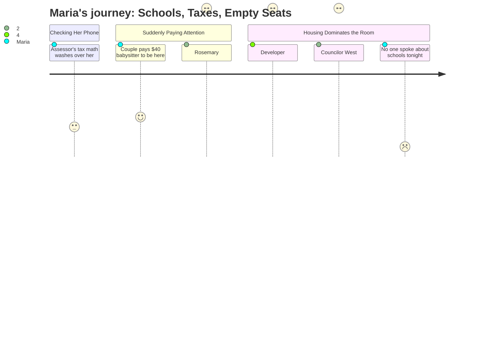

# Interpretation: Maria (PERSONA-001)
## Meeting: City Council Regular Meeting -- December 9, 2025 -- 2025-12-09

### Structured Points

#### 1. Budget Season Begins Immediately -- No Time to Wait
- **Fact:** School board representative Rosemary DeAngelo announced at the city council meeting that the district's budget season will begin "this month" and explicitly invited the public to monitor the school department website for meeting postings and participate throughout the process.
- **Source:** [43:10--44:44]
- **Emotional valence:** negative
- **Threat level:** 4
- **Open question:** true

#### 2. No Permanent Superintendent Heading Into the Hardest Budget in Years
- **Fact:** DeAngelo disclosed that the district is currently operating with an interim superintendent and that the formal search was beginning the very next night (December 10), with three recruiting firms presenting at South Portland High School starting at 5 PM.
- **Source:** [43:10--44:44]
- **Emotional valence:** negative
- **Threat level:** 4
- **Open question:** true

#### 3. 42 Teachers and 16 Ed Techs Are on the Chopping Block
- **Fact:** The district faces a $7.2M structural gap requiring elimination of 78 positions (12% of all staff), including 42 teachers and 16 education technicians, to stay within the school board's 6% tax increase ceiling. Elementary enrollment has already declined 23% over four years.
- **Source:** Fiscal Context summary
- **Emotional valence:** negative
- **Threat level:** 5
- **Open question:** true

#### 4. Developer Says the 170 Ocean Project Will Help School Funding
- **Fact:** Development presenter Casey Prentice stated that the project's tax benefits "can help with every single element of this city's budget, whether it be education funding," explicitly framing the Mill Creek housing development as a direct long-term benefit to school finances and to reducing the residential tax burden.
- **Source:** [67:24]
- **Emotional valence:** positive
- **Threat level:** 2
- **Open question:** true

#### 5. But the TIF Deal Gives the Developer Half Its Tax Revenue Back for 30 Years
- **Fact:** Councilor West revealed that the city's credit enhancement agreement with the 170 Ocean developer returns 50% of the project's property taxes to the developer for the next 30 years. The assistant city manager explained this is structurally standard and roughly equivalent to what the city would lose anyway through state education subsidy reductions on new development outside a TIF district -- but acknowledged the math is not precise.
- **Source:** [109:37--112:45], [113:32--116:39]
- **Emotional valence:** negative
- **Threat level:** 3
- **Open question:** true

#### 6. Parents Are Paying Out of Pocket Just to Have a Voice
- **Fact:** Two residents (Zenya Pantos and Carly Williams) testified that they paid over $40 for a babysitter specifically to attend this meeting together and make public comment, because no virtual participation option currently exists. Both called for the city to restore hybrid meeting access.
- **Source:** [37:42--41:32]
- **Emotional valence:** negative
- **Threat level:** 2
- **Open question:** true

#### 7. Rosemary DeAngelo Directly Invited the Public Into the Budget Process
- **Fact:** DeAngelo explicitly stated "This will not be the only opportunity" for public input on the budget and superintendent search, invited city council members and all stakeholders to attend, and told residents to watch the school department website for all upcoming meeting postings. The invitation was direct and personal.
- **Source:** [43:10--44:44]
- **Emotional valence:** positive
- **Threat level:** 1
- **Open question:** false

---

### Journey Map

---

### Reactions

Okay so I put the kids to bed and watched the whole thing online. Two hours. And the part I can't stop thinking about is like three minutes in the *middle* of the meeting. This woman Rosemary DeAngelo, she's on the school board, stood up during public comment and said budget season starts *this month* -- watch the school website, come participate. And almost as a side note she mentioned we still have an *interim* superintendent, and the search is literally just starting, like recruiting firm presentations were happening the *next night*. December 10th. I'm sitting there thinking: who is in charge? We are walking into what sounds like the most painful budget process the district has ever faced and there's no one in the permanent seat yet.

The rest of the meeting was about this housing development at Mill Creek -- the 170 Ocean project, seven stories, 208 units. I'm not against it in theory. The developer actually said at one point that the tax benefits will help "education funding and all the tough challenges you face every budget season" -- I wrote that down. But then near the end Councilor West got up and said hold on, actually the deal the city already made with this developer gives them back *half* of their property taxes for the next *thirty years*. The city manager tried to explain it's complicated -- something about how the city loses equivalent money through state funding formulas anyway, so the 50% rebate kind of washes out -- but I'm still trying to process that. All this talk about how the project is going to lower the residential tax burden and help the schools, and the net benefit is... in three decades? Maybe? I need someone to draw me a picture.

Here's what I keep coming back to though: two parents stood up tonight and said they had to pay over forty dollars in babysitter money just to attend this meeting and make their three minutes of public comment. Because there's no virtual option. And every single person in that room was there about an apartment building. Not one person -- not one -- said a word about the schools. Rosemary made her announcement and walked away and that was it. I am in three different parent group chats. None of us were in that room. Budget season is starting *now*, Rosemary literally said "come participate," and we were all home. I need to find out when the first school board budget meeting is and actually show up, because I don't want to be the parent who finds out in April that the art teacher got cut.