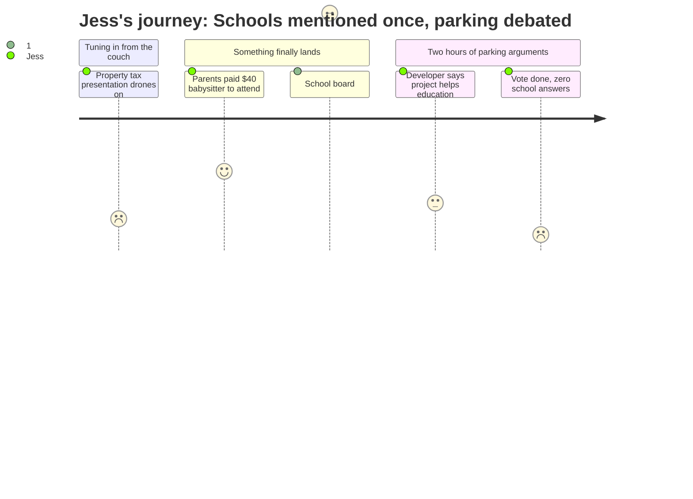

# Interpretation: Jess (PERSONA-003)
## Meeting: City Council Regular Meeting -- December 9, 2025 -- 2025-12-09

### Structured Points

#### 1. Two parents paid a babysitter $40 just to speak at this meeting
- **Fact:** Residents Zenya Pantos and her spouse Carly Williams said they had to plan ahead and hire a babysitter at a cost of over $40 so they could both attend and make public comment. Zenya explained that attending virtually without the ability to speak "doesn't really feel like an option for the way that I wanna be involved in this city." Carly added that she had missed a September committee meeting entirely because she couldn't attend in person.
- **Source:** [37:42--41:32]
- **Emotional valence:** positive
- **Threat level:** 2
- **Open question:** true — If parents this motivated still can't consistently access civic information about the schools, what chance does Jess have of staying informed about what her child is walking into?

#### 2. The school budget process is starting right now — and that's all anyone said
- **Fact:** Rosemary DeAngelo, identifying herself as a school board representative, stated during public comment that "our budget season will begin this month" and invited the public to "watch the school department website for the posting of all our meetings." No councilor asked a follow-up question. No details about the scope or stakes of the budget process were offered.
- **Source:** [43:10--44:45]
- **Emotional valence:** negative
- **Threat level:** 4
- **Open question:** true — The budget is being decided right now. What programs, schools, or services are on the table — and will anything change before Jess's child starts kindergarten?

#### 3. The district is searching for a permanent superintendent — just beginning
- **Fact:** DeAngelo announced that the district's current superintendent is an interim (George Entwhistle) and that the search for a permanent replacement is only now beginning, with a workshop the following evening (December 10) to hear pitches from three recruiting firms. She invited the public to attend.
- **Source:** [42:21--44:00]
- **Emotional valence:** negative
- **Threat level:** 3
- **Open question:** true — Who will be leading the school district when Jess's child starts kindergarten? Will a permanent superintendent even be settled in and stable by then?

#### 4. Schools are 61% of the property tax bill — but no one followed up
- **Fact:** DeAngelo noted — framing it as something she says "every time" — that schools represent 61% of the city's property tax. No councilor followed up. The figure was offered without context about what it means for school funding levels, what happens when revenue falls short, or what the upcoming budget process might decide.
- **Source:** [43:45--44:45]
- **Emotional valence:** neutral
- **Threat level:** 3
- **Open question:** true — If 61% of property taxes go to schools and the city is also under pressure to cap tax increases, what does that mean for the programs and staff that will be in place when her child enrolls?

#### 5. Property values and the tax burden are already rising — and will keep rising
- **Fact:** City Assessor Brent Martin reported that average sold home prices in South Portland rose approximately 8.8% year-over-year and that the mill rate was committed at 1365 for the current year. He described current assessed values as "very robust" and anticipated continued modest adjustments, though he said future stability is not guaranteed.
- **Source:** [11:10--15:47], [28:05--29:05]
- **Emotional valence:** negative
- **Threat level:** 2
- **Open question:** false — Directly relevant to whether staying in South Portland is financially viable for Jess's family; rising values mean rising tax bills regardless of what schools decide.

#### 6. A 208-unit housing development was approved, with vague claims it will help schools
- **Fact:** The council voted unanimously 7-0 to approve a zoning amendment allowing the 170 Ocean Street project to include 208 residential units instead of 140. The developer claimed the project's tax revenue would "help balance the budget and allow the city to do the things we all want to do... on an educational level." No specifics about school funding impact were provided.
- **Source:** [67:01--67:24], [124:17--124:43]
- **Emotional valence:** positive
- **Threat level:** 1
- **Open question:** true — More residents could mean more kids in schools — which could mean more resources, or more strain. Jess has no way to know which from what was said tonight.

#### 7. Almost two hours of this meeting had nothing to do with schools or children
- **Fact:** Of roughly two hours of meeting time, schools received approximately two minutes of airtime — all in a single public comment by a school board representative. The remainder of the meeting covered property assessments, a business spotlight, virtual meeting policy, and a zoning dispute over building height and parking requirements. No councilor raised the school budget or asked DeAngelo a single follow-up question.
- **Source:** Full transcript [00:16--129:05]
- **Emotional valence:** negative
- **Threat level:** 4
- **Open question:** true — Is there any civic venue where the future of the school system gets real sustained attention, not just a two-minute public comment that everyone quietly ignores?

---

### Journey Map

---

### Reactions

Oh my god, okay, I finally sat down and watched the December city council meeting and it was almost two full hours. You know how long they actually talked about schools — the thing that's literally 61% of our property taxes and the whole reason I'm obsessing over whether we stay here? Two minutes. One school board person got up during public comment and said "budget season is starting, watch the school website." And then she sat down. And no one on the council asked her a single follow-up question. Not one. They just let her walk away. And then they spent the rest of the night arguing about whether a building in Mill Creek needs to have parking inside it or on the surface. I'm completely serious.

But here's the part that actually got to me — two women stood up and said they had to hire a babysitter, like actually pay over $40, just so they could both come to this meeting and speak. And one of them said that attending virtually without being able to make a comment doesn't feel like real participation. And I'm watching this on my phone during Mia's nap going — yes, that's it, that's exactly why I don't go. And it kind of made me feel seen and also so much more scared at the same time, because if even these parents — people who live across the street from a councilor and clearly care a lot — are still locked out of this stuff, what am I supposed to do?

The part I genuinely can't stop thinking about is that they also mentioned the district doesn't even have a permanent superintendent right now. They have an interim. And they were just starting to look at recruiting firms to find a real one — literally the next day after this meeting. So three years from now when Mia starts kindergarten, I have no idea who's running the district, I have no idea what programs will still exist, and apparently the way I'm supposed to stay informed is to check a website. And these budget decisions are happening right now, this month, and I don't even know what's on the table. That's the part that's going to keep me up.