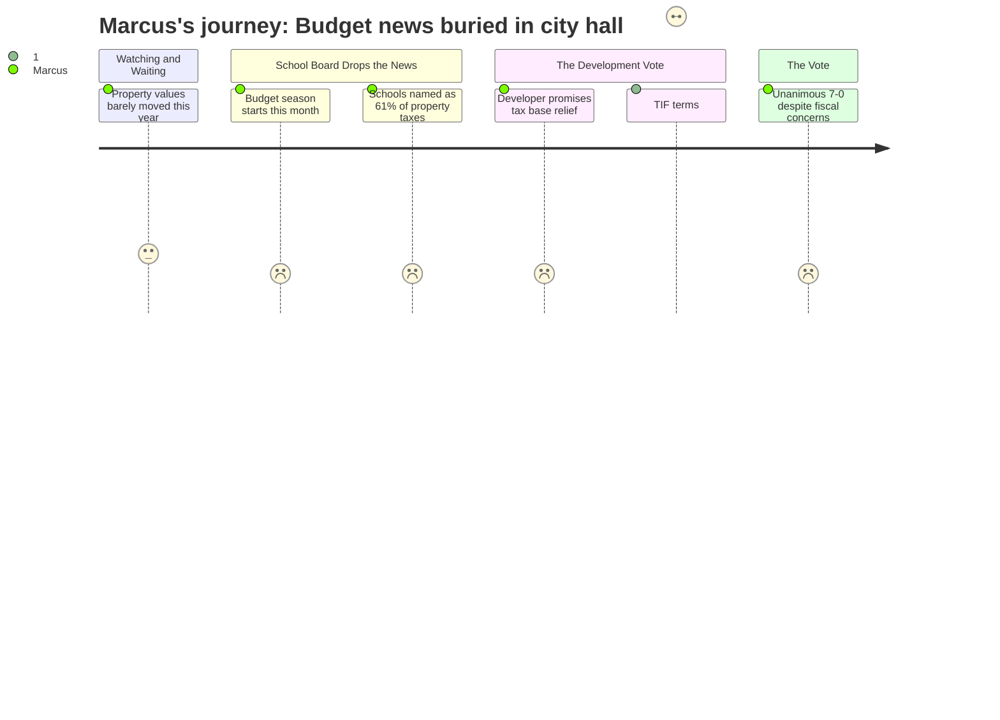

# Interpretation: Marcus (PERSONA-004)
## Meeting: City Council Regular Meeting -- December 9, 2025 -- 2025-12-09

### Structured Points

#### 1. Budget Season Drops in a Five-Minute Public Comment
- **Fact:** School board member Rosemary DeAngelo addressed city council during public comment to announce that the district's budget season "will begin this month" and that the superintendent search launches the following evening. She explicitly connected schools to the city's fiscal structure, stating — for at least the second time before this council — that schools represent 61% of all property tax revenue.
- **Source:** [42:21–44:45]
- **Emotional valence:** negative
- **Threat level:** 4
- **Open question:** true

#### 2. A New Superintendent Is Being Hired Into a $7.2M Crisis
- **Fact:** Three recruiting firms (Maine School Management Association, NESDEC, and Zeal Education Group) are presenting to the school board the next evening, while the district operates under an interim superintendent. The fiscal context the new hire will inherit includes a $7.2M structural budget gap, a depleted fund balance, and 78 proposed position eliminations — including 42 teachers and 16 ed techs.
- **Source:** [43:10–43:45]; Fiscal Context
- **Emotional valence:** negative
- **Threat level:** 3
- **Open question:** true

#### 3. Forty-Two Teaching Positions Are Already on the Table
- **Fact:** The proposed position eliminations entering budget season include 42 teacher positions and 16 ed tech positions, representing 12% of total district staff. Per the fiscal context, staffing grew by 82 positions during the same four-year period that elementary enrollment fell by approximately 300 students — a ratio the district's opponents will use aggressively at every budget hearing.
- **Source:** Fiscal Context
- **Emotional valence:** negative
- **Threat level:** 5
- **Open question:** true

#### 4. Tax Burden Is Shifting Further Onto Homeowners
- **Fact:** The city assessor reported that residential property values rose approximately 3% this year while commercial values dropped about 2.5%, continuing a multi-year trend of burden shifting from commercial to residential taxpayers. The total taxable base grew by only about $125 million — roughly 10% of last year's $1.2B growth — meaning limited new revenue is entering the system.
- **Source:** [15:02–17:24]
- **Emotional valence:** negative
- **Threat level:** 2
- **Open question:** false

#### 5. The Developer's Tax Promise Is Discounted by the TIF Terms
- **Fact:** The developer's presentation argued that the 170 Ocean project will contribute to the tax base and directly benefit "education funding." Councilor West subsequently disclosed that the city's TIF agreement gives the developer a 50% property tax credit for 30 years. The city manager and assistant city manager confirmed the structure, noting it was designed around the premise that municipalities typically realize only ~50% of new development value anyway due to state formula adjustments.
- **Source:** [59:40–67:24] (developer pitch); [109:37–117:25] (West's disclosure and city staff confirmation)
- **Emotional valence:** negative
- **Threat level:** 3
- **Open question:** true

#### 6. State Funding Covers a Fraction of What It Should
- **Fact:** Per the fiscal context, Maine's state funding mechanism covers only approximately 20% of South Portland's actual education costs, against a formula obligation that should deliver roughly 55%. This structural shortfall is the primary driver of the $7.2M gap — and the underlying reason why the board's 6% tax ceiling requires approximately $7.2M in cuts to teaching and support staff.
- **Source:** Fiscal Context
- **Emotional valence:** negative
- **Threat level:** 4
- **Open question:** false

#### 7. Seven to Zero — Including the Councilor Who Named the Problems
- **Fact:** The zoning amendment for 170 Ocean passed 7–0, including the vote of Councilor West, who had just raised explicit concerns about the TIF terms, the changed unit count (124 to 208), and the departure from the Mill Creek master plan's on-site parking requirement. No councilor conditioned approval on TIF renegotiation, and no vote was deferred.
- **Source:** [109:37–112:45] (West's dissent); [123:40–124:28] (roll call)
- **Emotional valence:** negative
- **Threat level:** 2
- **Open question:** false

---

### Journey Map

---

### Reactions

Okay, so I sat through the entire thing last night — two hours. The first forty-five minutes was the city assessor walking through mill rates and neighborhood valuation ratios. Fine, I get it, I'm a taxpayer too. But what I was actually there for was the school stuff, and we got exactly five minutes of it: Rosemary DeAngelo, during public comment, announcing that budget season starts *this month* and that they're kicking off the superintendent search tomorrow night at the high school. She dropped the 61% line again — schools are 61% of property taxes — and then the whole council moved on to a zoning vote.

But the zoning vote was the part I couldn't shake. The developer spent twenty minutes telling the council that building 208 apartments in Mill Creek is going to grow the tax base and help fund education. And then Councilor West stood up and said: hold on, when the city entered this TIF deal, the developer was promising 124 units with on-site parking, and now it's 208 units with parking shipped offsite. And the TIF gives them a 50% property tax credit for *thirty years*. The city manager confirmed the whole structure. So when the developer says "this will help fund your schools," he means roughly half of the new incremental tax revenue this building generates, for the next three decades. The other half goes back to him under a deal the city already signed. I understand the housing argument — I really do, more inventory is real — but "this project will help education funding" is doing a lot of heavy lifting when there's a 30-year rebate written into the terms.

What I can't stop thinking about is the combination: we're heading into a budget season right now with 42 teaching positions on the table. I know the enrollment numbers, I've seen those slides too — elementary enrollment dropped 300 kids in four years, staffing went up by 80. That's real, and I'm not going to pretend it isn't. But the structural problem isn't that we overhired — it's that the state is covering 20% of what its own formula says it owes us, and that gap is what's eating the budget alive. Meanwhile, city council just voted seven to zero — West included, right after she listed every objection — on a deal that delays meaningful new tax revenue for a generation. And three recruiting firms are showing up at SPHS tomorrow to find someone willing to be superintendent at the start of all of this. I genuinely feel for whoever takes that job. But I need them to understand before they sign anything that losing 42 teachers doesn't just affect a budget line — it's a hundred-plus sections gone, class sizes pushed past the point where the research stops being theoretical. Nobody said that out loud last night. That's why I'm going to every single one of these budget meetings.