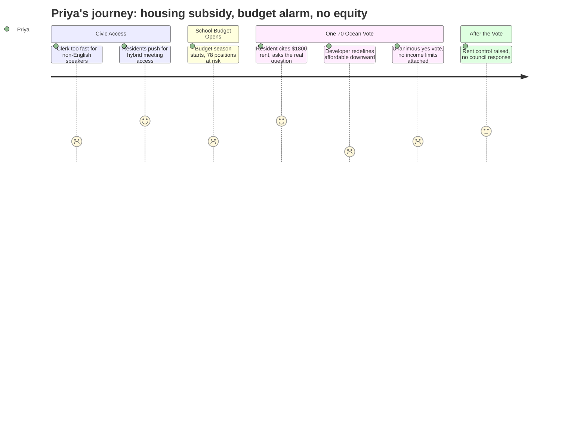

# Interpretation: Priya (PERSONA-005)
## Meeting: City Council Regular Meeting -- December 9, 2025 -- 2025-12-09

### Structured Points

#### 1. Clerk Speed as a Language Access Barrier
- **Fact:** Community member Rosemary DeAngelo opened her public comment by noting -- for at least the second time publicly -- that the clerk reads agenda items too quickly for non-native English speakers to follow, stating "not everyone listening is a native English speaker."
- **Source:** [42:21--43:10]
- **Emotional valence:** negative
- **Threat level:** 2
- **Open question:** true

#### 2. School Budget Season Opens With No Equity Frame
- **Fact:** School board member Rosemary DeAngelo announced that the district's budget season "will begin this month," the superintendent search launches the next day, and the public is invited to engage -- framing participation urgency around the fact that schools represent 61% of the property tax bill, with no mention of which student populations would be affected by upcoming cuts.
- **Source:** [43:10--44:43]
- **Emotional valence:** negative
- **Threat level:** 4
- **Open question:** true

#### 3. Hybrid Meeting Policy Excludes Low-Resource Residents
- **Fact:** Three residents testified that the current in-person-only public comment policy creates economic and logistical barriers for parents, people with disabilities, shift workers, and others -- one couple disclosed spending over $40 on childcare just to both attend and speak. The city manager acknowledged the issue but made no firm commitment to restoring virtual access.
- **Source:** [37:42--50:10]
- **Emotional valence:** negative
- **Threat level:** 3
- **Open question:** true

#### 4. Resident Raises $1,800 Rent and Asks About Affordable Units
- **Fact:** Community member Carly Williams cited Zillow data showing the current market rate for a one-bedroom apartment in South Portland is $1,800/month, directly questioned the developer's use of the phrase "affordable market rate," and asked whether any income-restricted units or TIF funds for affordability were part of the plan.
- **Source:** [90:08--91:43]
- **Emotional valence:** positive
- **Threat level:** 2
- **Open question:** true

#### 5. Developer Redefines "Affordable" Downward
- **Fact:** Developer Casey Prentice explicitly distinguished "capital A" affordable (Section 8 / income-restricted) from "lowercase a" affordable (market rate with small units and efficient layouts), confirming this is not an income-restricted project. He cited studio apartments and efficient floor plans as the affordability mechanism, targeting police officers and restaurant workers.
- **Source:** [98:43--101:06]
- **Emotional valence:** negative
- **Threat level:** 4
- **Open question:** true

#### 6. Public Subsidy for Market-Rate Housing, No Affordability Conditions
- **Fact:** The TIF credit enhancement agreement gives the One 70 Ocean developer 50% of new property tax revenue for 30 years on an $80--90 million project. The city manager confirmed TIF funds can be used for affordable housing and have been before -- but no affordability condition is attached to this agreement. Councilor West was alone in raising concerns; the vote was unanimous in favor.
- **Source:** [109:36--117:25], [98:43--101:06], Roll call at [124:28]; Fiscal Context document
- **Emotional valence:** negative
- **Threat level:** 5
- **Open question:** true

#### 7. Rent Control Raised -- Then Left on the Table
- **Fact:** Rosemary DeAngelo asked the council to revisit South Portland's rent control policy, noting that a 10% cap on rent increases for landlords owning more than 12 units is "a really high number," particularly as the council simultaneously approved more market-rate housing. No councilor responded or committed to a follow-up discussion.
- **Source:** [92:29--93:16]
- **Emotional valence:** neutral
- **Threat level:** 3
- **Open question:** true

#### 8. 78 Positions at Risk With No Equity Analysis on Record
- **Fact:** The fiscal context entering this budget season includes a proposed elimination of 78 positions -- 42 teachers, 16 ed techs, and 14 facilities/food/transport staff -- driven by a $7.2M structural gap. Ed techs disproportionately support students with disabilities. At no point in this meeting was any question raised about which student populations would be most harmed by the cuts or which schools bear the greatest burden.
- **Source:** Fiscal Context document; [43:10] (DeAngelo's budget season announcement)
- **Emotional valence:** negative
- **Threat level:** 5
- **Open question:** true

---

### Journey Map

---

### Reactions

So I sat through the whole December 9th meeting, and here's what I need you to understand: the council spent nearly two hours on a zoning amendment for a market-rate luxury-adjacent apartment building, voted unanimously yes, and in that entire conversation there was exactly one community member who asked the right question. Carly Williams. She stood up and said: a one-bedroom in South Portland right now is $1,800 a month per Zillow, so what does "affordable market rate" actually mean? And the developer had a whole prepared answer about "lowercase a" versus "capital A" affordable -- studios, efficient layouts, workforce housing -- without a single income restriction attached to a single unit. The city is handing this developer 50% of their property taxes back for thirty years. Thirty. That is a publicly funded subsidy for market-rate housing, and the community got nothing in return that protects renters who are actually struggling.

What I keep coming back to is that the city manager straight up said TIF funds can be used for affordable housing and they've done it before. So the mechanism exists. The political will did not. And the one councilor who raised a red flag -- Councilor West, who noted the developer originally promised 124 units with on-site parking and came back asking for 208 units with surface parking offsite, calling that a 67% density increase -- he still voted yes in the end. Rosemary DeAngelo from the school board also got up and mentioned rent control: 10% cap, landlords with 12+ units. She asked for a revisit. Nobody on the council even acknowledged it. They were done with the housing conversation.

The thing that will actually keep me up is what DeAngelo said right before all of that -- that budget season is starting this month, the superintendent search is launching, and schools are 61% of the property tax bill. The fiscal picture going into this is brutal: we're potentially looking at 78 positions cut, including 16 ed techs. Ed techs are the people sitting beside kids with IEPs all day. And there was zero discussion at this council meeting about which students get hurt, which schools, which populations. Nobody asked. I'm going to be at every school board meeting this winter watching for that data, because if it doesn't get named, it doesn't get protected.