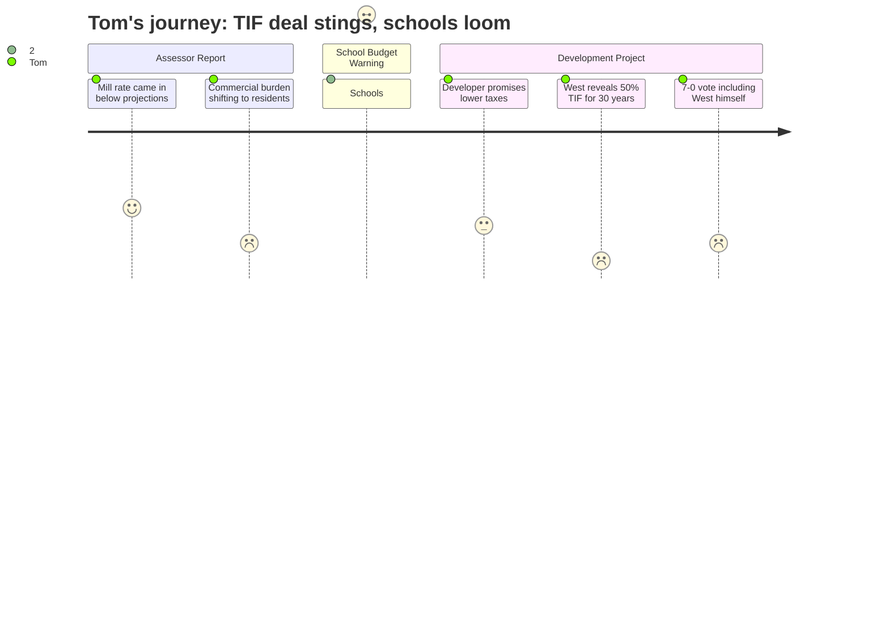

# Interpretation: Tom (PERSONA-006)
## Meeting: City Council Regular Meeting -- December 9, 2025 -- 2025-12-09

### Structured Points

#### 1. Mill Rate Came In Below Projections — A Rare Piece of Good News
- **Fact:** The city assessor reported the mill rate settled at 1,364–1,365, below the projected 1,383–1,384. He stated he has "never said this before" but that he feels the city's assessed values are "very robust" and more stable going into the coming period than in recent years.
- **Source:** [00:15:38--00:16:05], [00:28:26--00:29:00]
- **Emotional valence:** positive
- **Threat level:** 1
- **Open question:** false

#### 2. Residential Owners Continue to Absorb a Greater Share of the Tax Burden
- **Fact:** The assessor confirmed residential property values rose roughly 3% this year while commercial values dropped approximately 2.5%, continuing the tax-burden shift onto homeowners. This follows a jarring 113% rise in single-family residential values over the prior five-year period.
- **Source:** [00:16:48--00:17:10], [00:15:02--00:15:22]
- **Emotional valence:** negative
- **Threat level:** 3
- **Open question:** true

#### 3. Schools Consume 61% of the Tax Bill — and Budget Season Is Just Starting
- **Fact:** School board representative Rosemary DeAngelo stated, on the record, that the schools represent "61% of the property taxes" — a figure she said she repeats every time she speaks to the council. She also announced that budget season will "begin this month" and that the district is simultaneously conducting a superintendent search.
- **Source:** [00:44:19--00:44:36], [00:43:43--00:44:01]
- **Emotional valence:** negative
- **Threat level:** 5
- **Open question:** true

#### 4. Developer Promises the Project Will Lower Property Taxes — But Tom Has Heard This Before
- **Fact:** Both the developer (Casey Prentice) and the economic development director (Leah Duffy) argued that the 170 Ocean Street project would "alleviate the burden on our single family residential tax base" and help "balance the budget." The economic development director explicitly said the project was needed to grow the tax base "with big moves like this."
- **Source:** [01:07:13--01:07:30], [01:10:32--01:10:42]
- **Emotional valence:** neutral
- **Threat level:** 2
- **Open question:** true

#### 5. The City Gave the Developer Half the New Tax Revenue for 30 Years
- **Fact:** Councilor West revealed that the TIF credit enhancement agreement gives the developer "a credit of 50% of the property taxes for the next 30 years." The assistant city manager acknowledged this figure and explained it reflects how state funding formulas redistribute new valuation — but the arrangement means the city will not see the full tax benefit from this project for three decades.
- **Source:** [01:49:44--01:49:52], [01:54:37--01:57:01]
- **Emotional valence:** negative
- **Threat level:** 4
- **Open question:** true

#### 6. Project Grew 67% After the TIF Was Signed — and Nobody Renegotiated
- **Fact:** Councilor West pointed out that when the TIF deal was struck, the developer represented the project as 124 units. It is now proposed at 208 units — a 67% increase — along with the removal of structured parking that was part of the original plan. West said directly: "I think we've been misled." Despite these concerns, West voted yes and the measure passed 7–0.
- **Source:** [01:50:17--01:51:35], [02:04:26--02:04:55]
- **Emotional valence:** negative
- **Threat level:** 4
- **Open question:** true

---

### Journey Map

---

### Reactions

Look, I went in there half-expecting the usual — committees, appointments, nothing I could take home and act on. And the assessor was actually decent news for once. Mill rate came in lower than they thought it would. He said the assessed values are solid, no big shocks coming next year. I'll take it. That's about as good as it gets with this stuff.

But then the school board lady stands up — Rosemary, I've seen her before — and drops it right in the middle of everything: "Schools are 61% of the property taxes." Just like that. And she says budget season is starting *this month* and oh by the way they don't even have a permanent superintendent. So whatever that school budget is going to look like, nobody's steering the ship yet. That's the thing that's going to matter on my tax bill and there's basically no news on it except "stay tuned."

Then they spend the rest of the night on this apartment building in Mill Creek. And here's what got me — one of the councilors, West, stands up and lays it all out: the city cut this developer a deal where he gets *half the new property taxes back for thirty years.* Thirty years! And when they signed that deal, he said there'd be 124 units. Now it's 208. He said flat out, "I think we've been misled." And then — and I'm still thinking about this — West votes yes anyway. Everybody votes yes. Unanimous. I get that the project might be fine, and maybe that TIF math makes sense on paper with all the state formula stuff. But when the guy who called it a bad deal turns around and votes for it, you have to wonder who's watching the store. We've got 61% of the tax bill going to the schools and budget season just opened, and the big new development that's supposed to help with taxes is giving half the new revenue back to the developer until 2055.