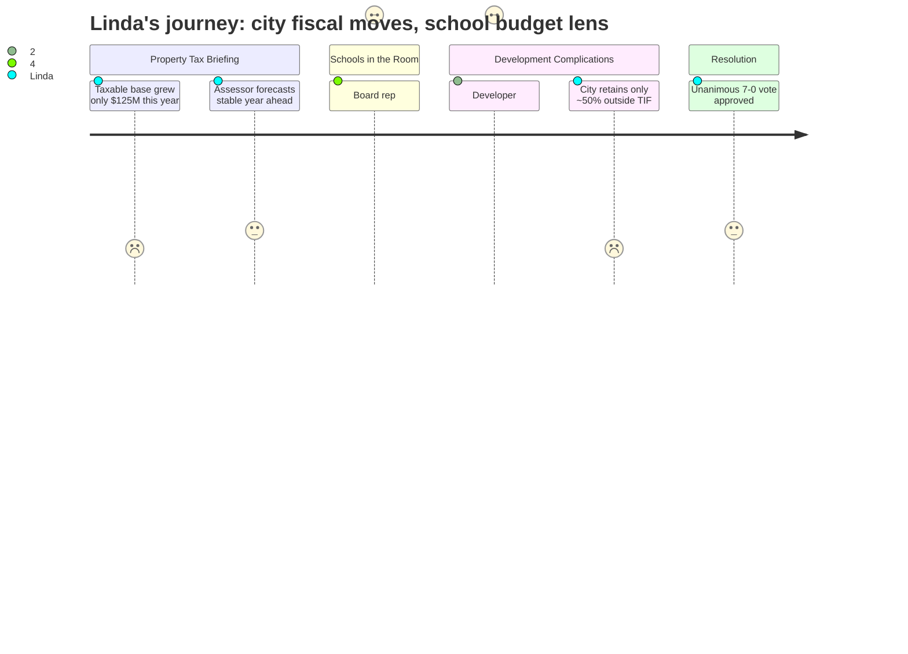

# Interpretation: Linda (PERSONA-004)
## Meeting: City Council Regular Meeting -- December 9, 2025 -- 2025-12-09

### Structured Points

#### 1. Taxable base grew only $120–125M — a fraction of last year's gain
- **Fact:** The city assessor reported that total taxable valuation increased approximately $120–125 million this year, compared to a $1.2 billion increase the prior year — roughly one-tenth the prior-year growth.
- **Source:** [15:02--15:18]
- **Emotional valence:** negative
- **Threat level:** 4
- **Open question:** true

#### 2. Tax burden continues shifting from commercial to residential
- **Fact:** The assessor presented data showing residential property values rose roughly 3% while commercial values dropped approximately 2.5%, extending a multi-year pattern of burden shift onto homeowners.
- **Source:** [16:45--17:09]
- **Emotional valence:** negative
- **Threat level:** 3
- **Open question:** true

#### 3. Assessor forecasts stable valuations heading into the next budget cycle
- **Fact:** The assessor stated he has "never said this before" — that he feels "more comfortable" and "more stable" entering the coming period than at any prior point, and anticipates far fewer valuation adjustments than in recent years.
- **Source:** [28:24--28:55]
- **Emotional valence:** positive
- **Threat level:** 1
- **Open question:** false

#### 4. School board representative publicly ties 61% tax share to superintendent search and budget season start
- **Fact:** Rosemary DeAngelo, speaking as a school board representative, reminded the city council that schools represent 61% of property taxes, announced the superintendent search begins the following evening, and stated that budget season begins "this month" — explicitly connecting school governance to the city's fiscal picture.
- **Source:** [42:51--44:40]
- **Emotional valence:** neutral
- **Threat level:** 2
- **Open question:** true

#### 5. Developer claims project will help "education funding" — but TIFF terms complicate that claim
- **Fact:** Developer Casey Prentice stated the project's tax benefits "can help with every single element of this city's budget, whether it be education funding." However, Councilor West subsequently revealed the TIFF agreement returns 50% of property taxes to the developer for 30 years, and the unit count grew from the contracted minimum of 124 to 208 — a 67% increase — with structured parking eliminated in favor of surface lots.
- **Source:** [01:07:09--01:07:29]; [01:49:44--01:52:01]
- **Emotional valence:** negative
- **Threat level:** 3
- **Open question:** true

#### 6. Assistant city manager reveals: outside TIF districts, the city captures only ~50% of new property value
- **Fact:** Assistant City Manager Josh explained that for every new dollar of property value created outside a TIF district, the city effectively realizes approximately 50 cents, because higher valuations reduce state education subsidy and increase county assessment obligations — making TIF sheltering roughly revenue-neutral by design.
- **Source:** [01:56:13--01:57:01]
- **Emotional valence:** negative
- **Threat level:** 4
- **Open question:** true

#### 7. Rezoning passes 7-0 — a long-term fiscal commitment with benefits deferred far into the future
- **Fact:** The council voted unanimously to approve the zoning text amendment enabling 208 units at One 70 Ocean, with the TIF credit enhancement running at 50% for 30 years and the planning board still to review parking, traffic, and site details before any permits issue.
- **Source:** [02:04:14--02:04:56]
- **Emotional valence:** neutral
- **Threat level:** 2
- **Open question:** true

---

### Journey Map

---

### Reactions

So I watched the city council meeting tonight — long one, mostly the One 70 Ocean rezoning that's been going back and forth for over a year. They voted 7-0 to approve it in the end, which is probably right for the city's long-term development picture. But I want to capture what I'm actually taking from this before I lose it. The piece that's going to stay with me is what the assistant city manager said almost in passing, buried in the middle of explaining the TIFF mechanics. He said that outside a TIF district, the city only captures about fifty cents of every new dollar of property value it creates — because higher valuations reduce the state education subsidy and increase the county assessment. He said it matter-of-factly, like everyone already knew. That is the structural explanation for why the state only funds a fraction of what schools actually cost us. We've heard for years that our per-pupil spending is high and our state subsidy is low. Here was someone from city administration explaining, on the record, exactly why that dynamic exists and why it's baked in. And in the same meeting, the developer was saying this project will help education funding. Eventually, sure. After a 30-year TIFF where they keep half the taxes. The "this helps schools" framing doesn't account for any of that.

The other moment I flagged: Rosemary stood up during public comment and did the thing where she reminds everyone that schools are sixty-one percent of property taxes. She announced the superintendent search and said budget season starts this month. That was the right thing to do, and I'm glad that framing is on record before this council. But the room had already moved on — most people were there for the development vote, not the budget context. When we come forward in the spring with our numbers, that 61% figure is going to land hard on households that are already frustrated. The assessor showed taxable valuation grew about $120 million this year versus $1.2 billion last year. That is the revenue runway we're working with. Flat tax base, growing cost drivers, and now a superintendent vacancy on top of everything else.

And then there's the commercial burden shift that keeps creeping — residential up three percent, commercial down two and a half. Year after year. Every time that gap widens, homeowners feel the school line more acutely and we absorb the political blowback. The project approved tonight adds market-rate residential units near a transit hub — fine, I understand the logic, and I'm not second-guessing the vote. But with the TIFF sheltering half the increment for thirty years, any relief to our side of the budget isn't coming on the timeline we need it. I'm not losing sleep over the vote itself. I'm losing sleep over the gap between what people think is going to help the school budget and what actually will, and how much of that gap is structural and how much of it is going to land on the board to explain.