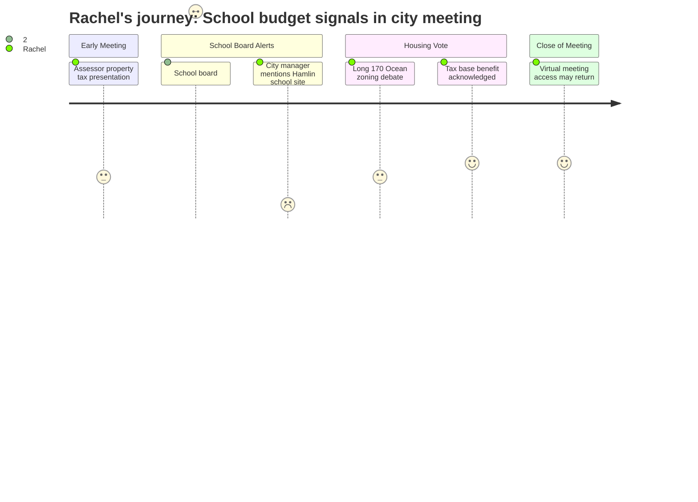

# Interpretation: Rachel (PERSONA-008)
## Meeting: City Council Regular Meeting -- December 9, 2025 -- 2025-12-09

### Structured Points

#### 1. School Budget Season Officially Launched
- **Fact:** School board member Rosemary DeAngelo announced during public comment that "our budget season will begin this month" and urged the public to monitor the school department website to participate. No specifics about the size of the gap or what is under consideration were provided.
- **Source:** [42:50--44:15] public comment, Rosemary DeAngelo (school board member, self-identified)
- **Emotional valence:** negative
- **Threat level:** 4
- **Open question:** true

#### 2. "Old Hamlin School Site" Named as Potential Housing Land
- **Fact:** The city manager stated that "no decision has been made definitively about what would happen if the library site at this site and the old Hamlin school site were vacated and consolidated into Mahoney," framing a school-associated facility as a candidate parcel for housing redevelopment. He also noted it had already been "discussed at prior forums."
- **Source:** [46:55--47:35] city manager response to public commenter Olivia Montgomery
- **Emotional valence:** negative
- **Threat level:** 4
- **Open question:** true

#### 3. Schools Are 61% of Property Taxes — Under Maximum Scrutiny
- **Fact:** DeAngelo explicitly invoked the 61% figure, saying "given that the schools are 61% of the property taxes, I'm hoping that people become involved in this process." Multiple speakers across the meeting independently cited the need to grow the commercial tax base specifically to reduce pressure on homeowners bearing the school tax.
- **Source:** [43:55--44:05] public comment, Rosemary DeAngelo; corroborated at [01:10:35--01:10:55] by economic development director
- **Emotional valence:** negative
- **Threat level:** 3
- **Open question:** false

#### 4. No Permanent Superintendent While Budget Decisions Are Being Made
- **Fact:** DeAngelo announced the school board is only now beginning its superintendent search, with three recruiting firm presentations scheduled for the following evening. An interim superintendent (George Entwistle) is currently in place. Major budget decisions will be shaped without a permanent leader.
- **Source:** [42:50--43:15] public comment, Rosemary DeAngelo
- **Emotional valence:** negative
- **Threat level:** 3
- **Open question:** true

#### 5. Residential Tax Burden Continuing to Shift Toward Homeowners
- **Fact:** The city assessor reported that single-family residential property values rose approximately 3% this year while commercial values fell approximately 2.5%, continuing a multi-year trend of shifting the tax burden toward the same homeowners who fund the schools.
- **Source:** [16:45--17:10] city assessor Brent Martin annual presentation
- **Emotional valence:** negative
- **Threat level:** 2
- **Open question:** false

#### 6. New Commercial Development May Eventually Ease School Tax Pressure
- **Fact:** Economic Development Director Leah Duffy stated the 170 Ocean Street project "will help alleviate the burden on our single family residential tax base" and that "we need to grow our overall tax base with big moves like this project to make a meaningful impact towards stabilizing property taxes."
- **Source:** [01:10:35--01:10:55] economic development director Leah Duffy presentation on 170 Ocean Street
- **Emotional valence:** positive
- **Threat level:** 1
- **Open question:** false

#### 7. Virtual Meeting Access Unresolved — High Stakes for Future Engagement
- **Fact:** Two parents made public comment citing childcare costs ($40+ per meeting) as a barrier to in-person participation and requested restoration of hybrid/virtual comment. The mayor committed to working with the city manager to explore options but made no firm commitment or timeline.
- **Source:** [37:50--42:00] public comment, Zenya Pantos and Carly Williams; [49:50--50:35] mayor's response
- **Emotional valence:** neutral
- **Threat level:** 2
- **Open question:** true

---

### Journey Map

---

### Reactions

Okay so I went because I'd heard the school board member was going to be there. Most of the meeting was honestly just background noise — like 45 minutes of the property assessor explaining mill rates and sales ratios, which, fine, important, but not why I was there. Then Rosemary DeAngelo gets up and says budget season is starting THIS month and people should watch the school website. Which I will be doing. But she said it so matter-of-factly, like it's a routine thing, when we don't even have a permanent superintendent yet. Three recruiting firms are presenting tomorrow night and nobody's been hired. That's who's going to be steering the ship when the budget hits — an interim. The whole thing gave me a pit in my stomach.

But honestly the thing that really got me, and I don't think anyone else in that room even blinked, was when the city manager casually mentioned "the old Hamlin school site" as a piece of land they might turn into housing. He was answering a question about the Mahoney project — some city offices consolidation thing — and he just dropped it in there. "If the library site and the old Hamlin school site were vacated and consolidated into Mahoney." He said "no decision has been made definitively" but then also said this had already come up "at prior forums." So when were those forums? Did parents know? He was talking about it purely as a real estate question — where can we fit housing — and the fact that it was a school building was just a property detail. That's exactly the pattern I'm worried about. The administration starts asking "what buildings do we have?" instead of "what do our kids need?" and the buildings answer comes first.

I stayed for the 170 Ocean Street thing because I heard it might help with the tax base — and the economic development director did say it would help take some pressure off residential taxes, which at least means someone in that building understands that schools are eating everyone alive right now. That was something. But I went home thinking: budget season starts this month, no permanent superintendent, school sites already in the housing-land conversation, and still no actual numbers on the table for parents to react to. I need to be at every school board meeting in January.