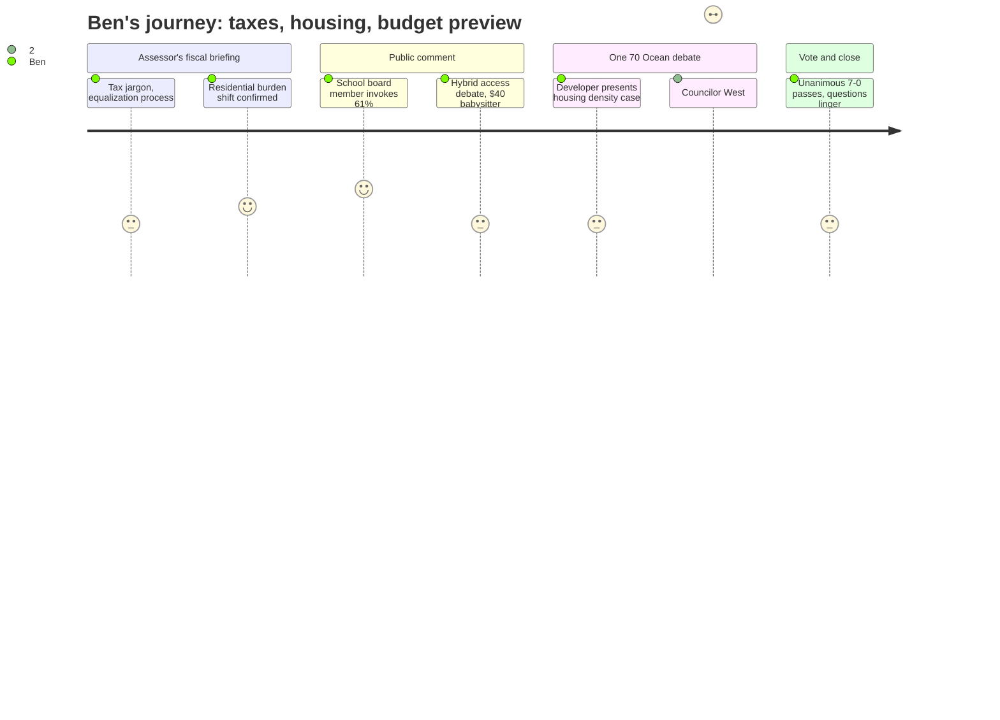

The Mermaid tool isn't authorized in this session, so I'll embed the diagram as a code block in the output. Here is the full interpretation:

---

```yaml
schema_version: "1.0"
meeting_id: "2025-12-09-city-council"
persona_id: "PERSONA-010"
persona_name: "Ben"
meeting_date: 2025-12-09
meeting_title: "City Council Regular Meeting -- December 9, 2025"
interpretation_date: 2026-03-17
interpreter_model: "claude-sonnet-4-6"
```

# Interpretation: Ben (PERSONA-010)
## Meeting: City Council Regular Meeting -- December 9, 2025 -- 2025-12-09

---

### Structured Points

#### 1. School board member invokes 61% at city council
- **Fact:** School board member Rosemary DeAngelo appeared at the city council meeting to announce the superintendent search launch and reminded the room that because schools represent 61% of property taxes, residents should engage with the process. She also stated that the school budget season would begin "this month" and invited the public to watch the school department website for meeting postings.
- **Source:** [00:42:55--00:44:41]
- **Emotional valence:** positive
- **Threat level:** 1
- **Open question:** true

#### 2. Residential tax burden rising as commercial falls behind
- **Fact:** City Assessor Brent Martin presented data showing a continuing tax burden shift: residential property values rose roughly 3% this year while commercial values dropped approximately 2.5%, meaning homeowners are bearing a growing share of the total tax base — a trend he described as a continuation from last year's larger "jolting" shift.
- **Source:** [00:16:54--00:17:09]
- **Emotional valence:** negative
- **Threat level:** 3
- **Open question:** true

#### 3. Councilor West: the TIF deal may not match what was promised
- **Fact:** Councilor West argued that the council approved a 30-year, 50%-rebate TIF credit enhancement agreement based on a developer representation of 124 units with on-site parking. The project has since grown to 208 units — a 67% increase — with parking moved off-site. West said "I think we've been misled" and suggested that insufficient public scrutiny early in the process contributed: "that's just the way it happened because not enough of you got involved." He then voted yes.
- **Source:** [01:49:22--01:52:35]
- **Emotional valence:** negative
- **Threat level:** 4
- **Open question:** true

#### 4. "Affordable market rate" challenged as an oxymoron
- **Fact:** Public commenter Carly Williams challenged the developer's language, noting that the current market rate for a one-bedroom in South Portland is $1,800/month per Zillow and calling the phrase "affordable market rate" a contradiction. Developer Casey Prentice confirmed there are no income-restricted or Section 8 units — the project targets "workforce housing" through smaller unit sizes and efficient layouts, not subsidized affordability.
- **Source:** [01:30:24--01:31:44] (Williams); [01:39:15--01:41:20] (Prentice)
- **Emotional valence:** negative
- **Threat level:** 3
- **Open question:** true

#### 5. TIF mechanics: new development may not help the school budget as much as billed
- **Fact:** Assistant City Manager Josh explained that for every new dollar of value created outside a TIF district, the city realistically captures only about 50 cents in net fiscal benefit — the rest erodes through reduced state education subsidy and higher county assessments. The 50% developer rebate was structured to roughly equal that loss anyway, meaning the net fiscal gain to the city (and its school budget) is substantially narrower than the headline development numbers suggest.
- **Source:** [01:54:07--01:57:01]
- **Emotional valence:** negative
- **Threat level:** 3
- **Open question:** true

#### 6. Superintendent search: three firms present next evening
- **Fact:** DeAngelo announced a public workshop for the following evening (December 10) at South Portland High School, where three recruiting firms — Maine School Management Association, NESDEC, and Zeal Education Group — would each present, with public comment opportunity. She explicitly invited city councilors to attend alongside community members.
- **Source:** [00:43:32--00:44:24]
- **Emotional valence:** positive
- **Threat level:** 1
- **Open question:** true

#### 7. Council votes 7-0 to allow denser development at One 70 Ocean
- **Fact:** Despite Councilor West's pointed reservations about the TIF's terms, the full council — including West — voted unanimously to approve the zoning text amendment allowing 208 units at One 70 Ocean Street without requiring on-site structured parking. The mayor noted the planning board still must review site-specific details including traffic and the parking agreement.
- **Source:** [02:04:14--02:04:36]
- **Emotional valence:** neutral
- **Threat level:** 1
- **Open question:** false

---

### Journey Map



---

### Reactions

So the lead for my next piece basically walked in the door herself. Rosemary DeAngelo — school board, Pleasantdale — shows up at a city council meeting, not a school board meeting, and drops the 61% line. Schools eat 61 cents of every property tax dollar, she says, so get involved. Budget season starts this month. Superintendent search kicks off tomorrow night. She's basically handing me a nut graf and a calendar item in one three-minute comment. I need to get on the school website mailing list tonight and find out when the first actual budget workshop is, because she was vague on dates. And I probably should have been at SPHS December 10th for those three recruiting firms — I'll pull whatever recording exists.

The thing I can't shake from this meeting is the One 70 Ocean vote, which looks like a housing story but connects directly to the budget story. Everyone in that room said more housing equals a stronger commercial tax base equals lower property taxes. The city's own economic development director said it outright: this project "will help alleviate the burden on our single-family residential tax base." But then Councilor West, before he voted yes, spelled out what the deal actually is: a 50% tax rebate to the developer for 30 years, agreed to when the project was 124 units, and the project is now 208 units. And the assistant city manager walked through the TIF logic — how state education subsidies shrink when local valuations rise, so the net new money is roughly half of what the headlines imply. That's the story the official narrative isn't telling. I need to understand concretely: once this building is up and the TIF is running, what does the school budget actually gain, and when? Because if the answer is "not much for 30 years," that matters enormously for the 18-19% tax increase conversation that's coming.

The other thing I need for the next piece is a source who can connect these two threads. The assessor's presentation showed commercial property values falling behind residential — a trend that predates One 70 Ocean and that compounds annually. The school board member is invoking the 61% figure at city council. The developer is promising tax relief through growth. And the fine print of the TIF says the city already bargained away half of whatever growth arrives. That's the paragraph my readers need before the referendum — not the cheerleading, not the opposition, just the honest arithmetic. I'm going to call the business manager as soon as the budget packet drops.