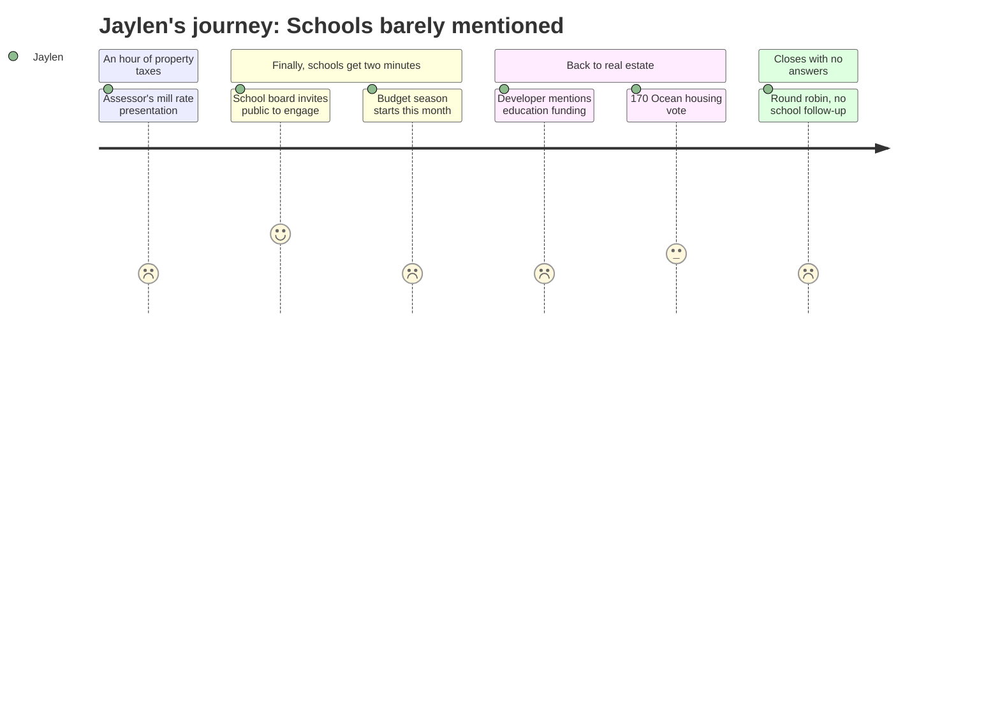

# Interpretation: Jaylen (PERSONA-012)
## Meeting: City Council Regular Meeting -- December 9, 2025 -- 2025-12-09

### Structured Points

#### 1. Budget Season Starting This Month
- **Fact:** School board member Rosemary DeAngelo announced in public comment that "our budget season will begin this month" and urged the public to watch the school department website for meeting postings in order to participate.
- **Source:** [00:43:51–00:44:25] DeAngelo public comment
- **Emotional valence:** negative
- **Threat level:** 4
- **Open question:** true — what programs are on the chopping block, and will it be decided before students can say anything?

#### 2. Superintendent Search Happening Tonight — at South Portland High School
- **Fact:** DeAngelo announced that three recruiting firms — Maine School Management Association (5 PM), New England School Development Council/NESDEC (6 PM), and Zeal Education Group (7 PM) — will present to the school board in the lecture hall at South Portland High School, with the public invited to attend and speak for three minutes.
- **Source:** [00:42:50–00:43:45] DeAngelo public comment
- **Emotional valence:** neutral
- **Threat level:** 3
- **Open question:** true — who gets hired will shape the entire district during the most consequential budget year in recent memory, and no students will be in the room unless they show up themselves.

#### 3. Schools Are 61% of Property Taxes — and the Council Asked Zero Questions
- **Fact:** DeAngelo explicitly stated that schools represent 61% of property taxes — a figure she said she raises "every time" she speaks at council — and immediately moved on. No councilor asked a single follow-up question about schools, the budget, or the superintendent search.
- **Source:** [00:44:15–00:44:25] DeAngelo public comment; meeting flow confirms no council discussion followed
- **Emotional valence:** negative
- **Threat level:** 3
- **Open question:** true — how does the biggest line item in the city budget get two minutes of airtime without a single question?

#### 4. A Real Estate Developer Acknowledged the Education Budget Is Under Pressure
- **Fact:** Developer Casey Prentice, making the case for his 170 Ocean Street housing project, specifically cited "education, funding" and "all of the tough challenges that you all face every budget season" as reasons why his project's tax revenue would benefit the city.
- **Source:** [01:07:09–01:07:15] Prentice presentation
- **Emotional valence:** negative
- **Threat level:** 3
- **Open question:** false — it confirms what Jaylen already suspected: the cuts are real enough that outside parties treat them as background fact.

#### 5. The Public Was Actually Invited to Participate
- **Fact:** DeAngelo explicitly invited both residents and the city council to attend the superintendent search workshop, and told people to watch the school department website for budget meeting postings throughout the process.
- **Source:** [00:43:40–00:44:25] DeAngelo public comment
- **Emotional valence:** positive
- **Threat level:** 1
- **Open question:** false — the door is open; the question is whether Jaylen walks through it.

#### 6. The Underlying Budget Gap Is Severe — 42 Teachers on the Chopping Block
- **Fact:** The district faces a $7.2M structural gap for FY27, with 78 positions proposed for elimination including 42 teachers. A roll-forward budget would require an 18–19% property tax increase; the board ceiling is 6%. None of these figures were discussed at this meeting.
- **Source:** Fiscal Context (FY27 background data)
- **Emotional valence:** negative
- **Threat level:** 5
- **Open question:** true — which teachers, which programs, which schools absorb those 42 cuts?

#### 7. Schools Were Literally a Side Note in a Two-Hour Meeting
- **Fact:** The only discussion of schools in the entire meeting was DeAngelo's approximately two-minute public comment. Schools appeared on no agenda item. The meeting's formal business covered property assessment (roughly 30 minutes), business spotlights, a consent calendar, and extended debate over a zoning amendment for a private housing development.
- **Source:** Meeting structure — DeAngelo appears at [00:42:05–00:44:41]; remainder of meeting is non-school content
- **Emotional valence:** negative
- **Threat level:** 3
- **Open question:** true — where are the actual decisions being made, and how is a student supposed to find them?

---

### Journey Map

---

### Reactions

dude okay so i stayed up watching the city council meeting last night — two full hours — because everyone's been saying they were gonna talk about school stuff. and you know how many times schools actually came up? once. this school board member named Rosemary got up during public comment — not even on the actual agenda, just general public comment — and said two things: one, budget season starts this month. two, tonight there's a superintendent search workshop happening in the lecture hall at SPHS. our school. three different recruiting firms are doing presentations at five, six, and seven pm. and then the council basically said thanks and moved on to the next thing. no questions, nothing.

the thing that actually got me was she said schools are 61% of property taxes in this city — she literally said she brings that up every single time she comes to these meetings — and not one person on the council asked her anything. not one follow-up question. meanwhile they spent like an hour on this apartment building in Mill Creek where the developer kept saying things like "this project will help with education funding and all the tough challenges you face every budget season." so some random real estate guy trying to build apartments knows the school budget is in crisis, and it gets more airtime in his pitch than it does as an actual topic. and i already know from everything that's been going around that they're talking about cutting 42 teachers. none of that came up. not once.

anyway Rosemary said to watch the school department website for budget meeting postings and that tonight's superintendent thing at SPHS is open to the public — three minutes to speak, anyone can come. i testified that one time about the arts cuts, remember — and honestly this feels like the same kind of moment. they're about to pick who's going to be running the district during the year they're cutting teachers, and if i don't show up, who's going to say what it's actually like to be a student there. probably not gonna be anyone else our age. thinking about going tonight.