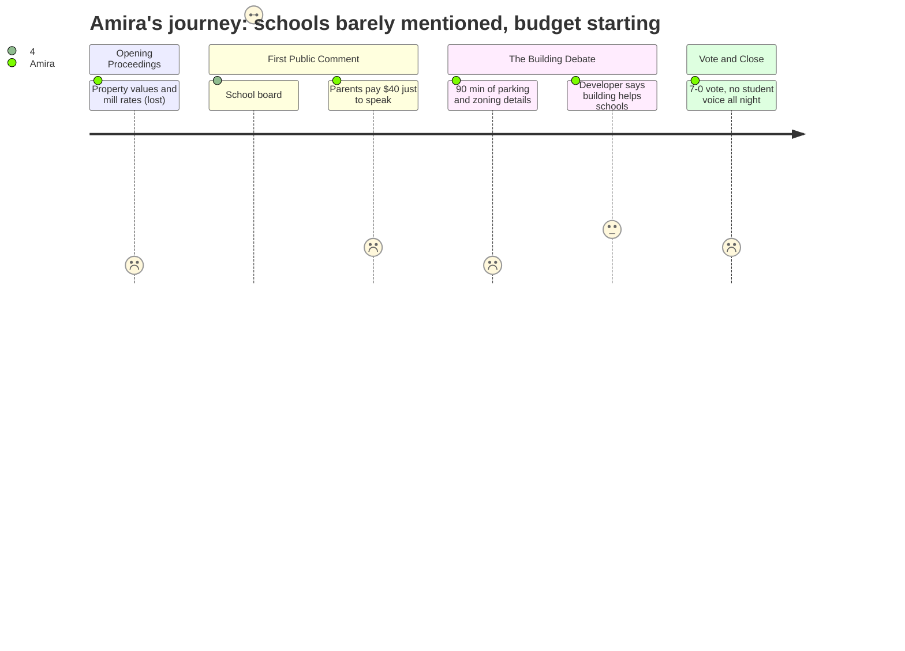

# Interpretation: Amira (PERSONA-013)
## Meeting: City Council Regular Meeting -- December 9, 2025 -- 2025-12-09

### Structured Points

#### 1. School budget season is starting right now
- **Fact:** School board representative Rosemary DeAngelo announced at the public comment podium that "our budget season will begin this month" and invited residents to watch the school department website for meeting postings.
- **Source:** [00:43:40--00:44:25]
- **Emotional valence:** negative
- **Threat level:** 4
- **Open question:** true

#### 2. Schools are 61% of the whole property tax bill
- **Fact:** Rosemary DeAngelo stated — calling it "the second thing I say every time I stand up here" — that the school department represents 61% of South Portland's property taxes. This is the concrete link between Amira's parents' dinner-table tax anxiety and her daily school experience.
- **Source:** [00:43:50--00:44:05]
- **Emotional valence:** neutral
- **Threat level:** 3
- **Open question:** true

#### 3. The district is searching for a new superintendent right now
- **Fact:** DeAngelo announced that three recruiting firms will present to the school board the very next evening, with public invited to attend. An interim superintendent is currently running the district.
- **Source:** [00:42:55--00:43:35]
- **Emotional valence:** negative
- **Threat level:** 3
- **Open question:** true

#### 4. A developer said the new building could help pay for schools
- **Fact:** Developer Casey Prentice argued that the 208-unit apartment project's tax revenue "can help with every single element of this city's budget, whether it be education funding, all of the tough challenges that you all face every budget season."
- **Source:** [01:07:09--01:07:31]
- **Emotional valence:** positive
- **Threat level:** 2
- **Open question:** true

#### 5. Regular parents had to pay $40 just to show up and speak
- **Fact:** Community member Zenya Pantos testified that attending in person with her spouse "is costing us over $40" in babysitter fees, and that without the ability to comment remotely, attending felt impossible. Her spouse Carly Williams echoed this at the same meeting.
- **Source:** [00:38:25--00:40:02]
- **Emotional valence:** negative
- **Threat level:** 2
- **Open question:** true

#### 6. The public is invited to watch school budget meetings
- **Fact:** DeAngelo specifically told the room and anyone watching: "we will invite the public to watch the school department website for the posting of all our meetings and participate in that process."
- **Source:** [00:44:00--00:44:25]
- **Emotional valence:** positive
- **Threat level:** 1
- **Open question:** true

#### 7. The whole council voted yes on the big new building — unanimously
- **Fact:** After roughly 90 minutes of debate about the 208-unit apartment complex at 170 Ocean Street, all seven council members voted in favor of the zoning change. No student or school representative spoke during the building debate.
- **Source:** [02:04:14--02:04:50]
- **Emotional valence:** neutral
- **Threat level:** 2
- **Open question:** true

---

### Journey Map

---

### Reactions

So the main thing from that whole meeting? This school board lady came up near the beginning and announced that the budget process is starting this month — like right now. And she's also the one who said schools are 61% of all the property taxes people pay. Sixty-one percent. That's the part that actually clicked for me, because I never understood why the tax bill is such a big thing at home. It's mostly because of school. I didn't know it was connected like that. She also said they're officially picking a company to help find a new superintendent, which I kind of already knew was happening, but it sounds like it's moving fast.

The other two hours was about this apartment building in Mill Creek — whether it should have more apartments and less parking. Honestly I mostly zoned out. But at one point the developer said the building's tax money could help with "education funding" and all the "tough challenges" the city faces every budget season. So I tried to pay attention. But I couldn't figure out how much money, or when, or if any of it would actually get to Memorial. The whole council voted yes, all seven of them, and everyone seemed happy about it. I just don't know what it means for us.

What I keep thinking about though is that nobody in that entire meeting — two hours — talked about what any of this means for actual students. The school board lady said watch the website, come to meetings. But two parents in that room had to pay $40 for a babysitter just so they could stand up and talk for three minutes. If it costs $40 to be heard, who else isn't there? I found out my ELA teacher was leaving from someone in the hallway, not from school, not from home. I don't want that to be how I find out what's getting cut in the budget this time.