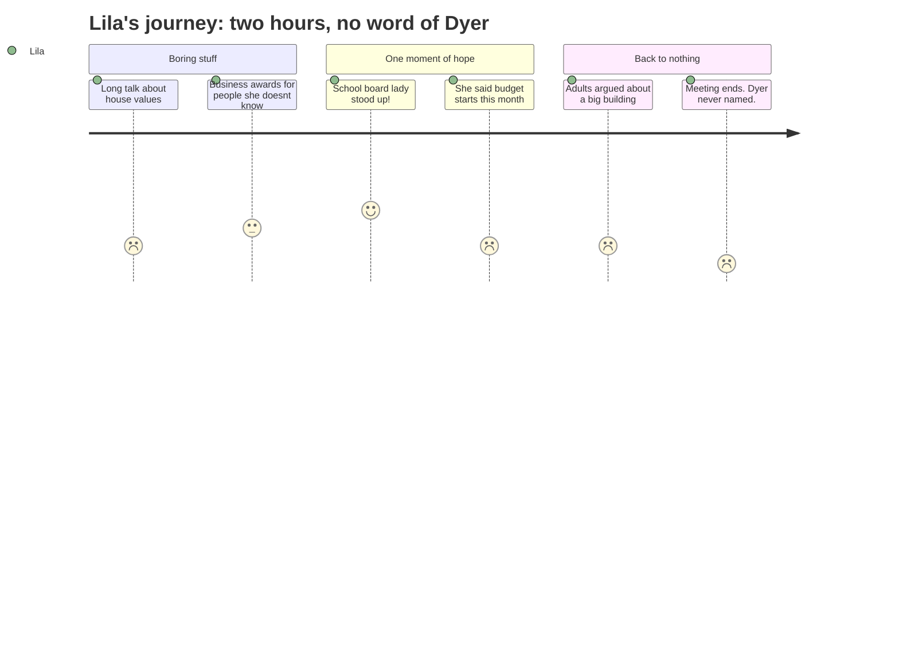

The Mermaid tool isn't authorized in this session, but the diagram is included inline in the output below as required by the format spec.

---

```yaml
schema_version: "1.0"
meeting_id: "2025-12-09-city-council"
persona_id: "PERSONA-014"
persona_name: "Lila"
meeting_date: 2025-12-09
meeting_title: "City Council Regular Meeting -- December 9, 2025"
interpretation_date: 2026-03-17
interpreter_model: "claude-sonnet-4-6"
```

# Interpretation: Lila (PERSONA-014)
## Meeting: City Council Regular Meeting -- December 9, 2025 -- 2025-12-09

---

### Structured Points

#### 1. A school board member came — and said budget season starts NOW
- **Fact:** School board member Rosemary DeAngelo told the city council that the school budget season would begin "this month," and invited the public to watch the school department website for meeting postings where decisions would be made.
- **Source:** [43:29–44:41]
- **Emotional valence:** negative
- **Threat level:** 5
- **Open question:** true

#### 2. They're picking a new school boss while everything is still uncertain
- **Fact:** DeAngelo announced that starting the very next night, the school board would be interviewing three outside recruiting firms to run a search for a new superintendent. The current superintendent, George Entwistle, is interim only.
- **Source:** [42:52–43:29]
- **Emotional valence:** negative
- **Threat level:** 3
- **Open question:** true

#### 3. Schools cost 61 cents of every dollar in property taxes — adults keep saying this
- **Fact:** DeAngelo repeated her standing line that "the schools are 61% of the property taxes," framing it as the reason residents should get involved in the budget process. Later in the meeting, a developer presenting his apartment project said it could help with "education funding" and "all of the tough challenges you all face every budget season."
- **Source:** [44:06–44:18]; [01:07:09–01:07:31]
- **Emotional valence:** neutral
- **Threat level:** 4
- **Open question:** true

#### 4. Dyer was never mentioned. Not once. For two hours.
- **Fact:** No speaker — council member, city official, school board representative, or member of the public — mentioned Dyer Elementary, the proposed school closure, or the elementary reconfiguration plan at any point during the entire meeting.
- **Source:** Full transcript [00:00:16–02:09:24] — sustained absence
- **Emotional valence:** negative
- **Threat level:** 5
- **Open question:** true

#### 5. Parents said it costs money and effort just to show up and be heard
- **Fact:** Two parents testified that attending this meeting required hiring a babysitter, costing them "over $40," and asked the council to restore virtual public comment because parents of young children cannot easily participate in decisions that directly affect them.
- **Source:** [37:56–38:45]; [39:09–40:05]
- **Emotional valence:** negative
- **Threat level:** 2
- **Open question:** false

#### 6. The adults spent most of the night on a seven-story building
- **Fact:** Over an hour of the meeting was devoted to reconsidering a zoning vote for a proposed apartment building at 170 Ocean Street — its height, its parking, its financing deal. The council voted 7–0 to approve the zoning change.
- **Source:** [51:00–02:04:45]
- **Emotional valence:** neutral
- **Threat level:** 1
- **Open question:** false

---

### Journey Map



---

### Reactions

My mom told me she watched the whole city meeting because she wanted to see if they talked about Dyer. It was like two hours long. She said the first guy talked about house prices FOREVER and it was super boring. Then someone got a little award for a restaurant. None of it was about school. I asked her, did anyone say anything about Dyer? And she said, well, there was one lady from the school board.

The school board lady said they were going to pick a new superintendent — that's like the big boss of all the schools. They were already looking at three different groups to help find someone. She also said budget season starts THIS month. That's when they decide stuff. And she said the schools cost 61% of all the taxes, which is what my mom says she hears ALL the time. I don't totally get what 61% means but I know it's supposed to be a lot. But here's the thing — she didn't say anything about Dyer. She said budget season is starting, but she didn't say we're closing OR we're not closing. Just that there would be meetings.

The rest of the time they argued about this big building someone wants to build. I don't even know where it is. My mom said it went on for like an hour and a half. That whole meeting was two hours and like two minutes of it was about school stuff. How is that fair? Our school might be closing and they spent forever talking about a building nobody cares about. I keep asking why is Dyer closing and now I'm also asking why isn't anyone even SAYING the name? It's like we don't exist.