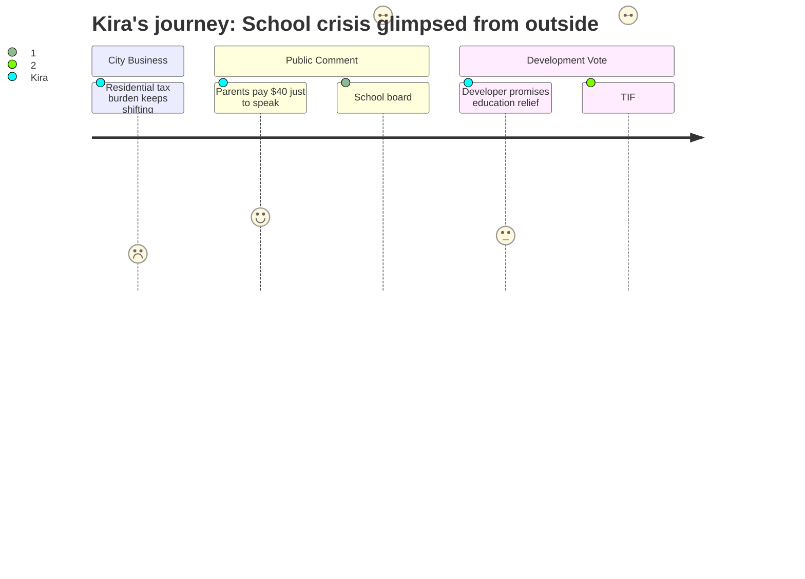

# Interpretation: Kira (PERSONA-015)
## Meeting: City Council Regular Meeting -- December 9, 2025 -- 2025-12-09

### Structured Points

#### 1. School board member announces budget season opens this month
- **Fact:** School board member Rosemary DeAngelo used public comment to announce both that the superintendent search begins the following evening and that "our budget season will begin this month," explicitly noting that schools represent 61% of property taxes and urging the public to engage.
- **Source:** Transcript [42:55–44:41]
- **Emotional valence:** negative
- **Threat level:** 5
- **Open question:** true

#### 2. Superintendent search and budget crisis are running simultaneously
- **Fact:** DeAngelo described a three-firm recruiting process beginning the very next night, with public participation invited — meaning the district will be searching for permanent leadership at the same moment its most consequential budget decisions are made.
- **Source:** Transcript [43:05–44:10]
- **Emotional valence:** negative
- **Threat level:** 4
- **Open question:** true

#### 3. Residential properties absorbing a growing share of the tax burden
- **Fact:** City Assessor Brent Martin presented data showing residential property values rose approximately 3% this year while commercial values dropped roughly 2.5%, continuing a multi-year shift where homeowners bear an increasing proportion of the total tax base — including the school portion.
- **Source:** Transcript [16:55–17:20]
- **Emotional valence:** negative
- **Threat level:** 3
- **Open question:** false

#### 4. Developer explicitly claims project will relieve "education funding" pressure
- **Fact:** Developer Casey Prentice stated that the project's tax revenues "can help with every single element of this city's budget, whether it be education funding, all of the tough challenges that you all face every budget season."
- **Source:** Transcript [01:07:09–01:07:35]
- **Emotional valence:** neutral
- **Threat level:** 2
- **Open question:** true

#### 5. TIF agreement gives developer a 50% tax credit for 30 years
- **Fact:** Councilor West revealed that the city's credit enhancement agreement rebates 50% of property taxes to the developer for 30 years; the assistant city manager confirmed this structure, explaining that communities typically recoup only about half the value of new development anyway due to state education subsidy formulas — but offered no near-term school budget relief.
- **Source:** Transcript [01:49:20–01:56:30]
- **Emotional valence:** negative
- **Threat level:** 4
- **Open question:** true

#### 6. Virtual comment barrier shuts out working parents and shift workers
- **Fact:** Two residents testified that attending this meeting in person required hiring a babysitter at a cost of over $40; one had missed a September committee meeting entirely due to a morning work conflict. They asked the council to reinstate virtual public comment, a practice that ended after Zoom-bombing incidents. The mayor committed to exploring options with the city manager.
- **Source:** Transcript [37:48–42:00], [49:53–50:45]
- **Emotional valence:** negative
- **Threat level:** 2
- **Open question:** true

### Journey Map

### Reactions

So I sat through most of that city council meeting for one reason: I heard Rosemary DeAngelo was going to speak. And she did — she told the council that budget season starts *this month* and that the superintendent search kicks off tomorrow night. She said the 61% number, which she always says, and she's right to keep saying it. Sixty-one percent of every property tax dollar goes to the schools. And the room just sort of absorbed it and moved on. I'm a traveling specialist. I go to three buildings a week. I know what it looks like when a program is about to get cut — you can feel the waiting list growing before anyone announces anything officially. Budget season opening while we're simultaneously looking for a permanent superintendent is not a reassuring combination. That's a lot of vulnerability at once.

The meat of the meeting was a vote on a housing development in Mill Creek — One 70 Ocean. The developer got up and said, genuinely, that the project would help with education funding. And I wanted that to be true. More market-rate housing, more residents, stronger commercial tax base — I understand the logic. But then Councilor West laid it out: the city gave this developer a 50% tax rebate for thirty years. Thirty. The assistant city manager explained why that math made sense from a state formula perspective, and fine, I'll take their word for it. But the net effect is that the revenue promise the developer made at this podium will not materialize for my schools in the next five budget cycles. The kids on my MTSS wait lists right now can't wait until 2055. The unanimous vote passed, and I genuinely hope the development helps the community — but I left with the clear understanding that it is not the relief valve anyone is hoping for in the near term.

The thing that actually got to me emotionally was the two women who paid over forty dollars in babysitting just so they could both make public comment. They were making the case for virtual participation — that you can't expect people who work nights, or have small kids, or have disabilities, to show up in person on a Tuesday evening. I kept thinking: those are exactly the families I work with. The parents who are most stretched, whose kids have the most need, who have the least margin to attend school board meetings, let alone city council meetings. If we're about to make major decisions about school staffing and which buildings stay open, and the families most affected can't be in the room, that's not a community budget process. That's a process that defaults to whoever can afford a babysitter.