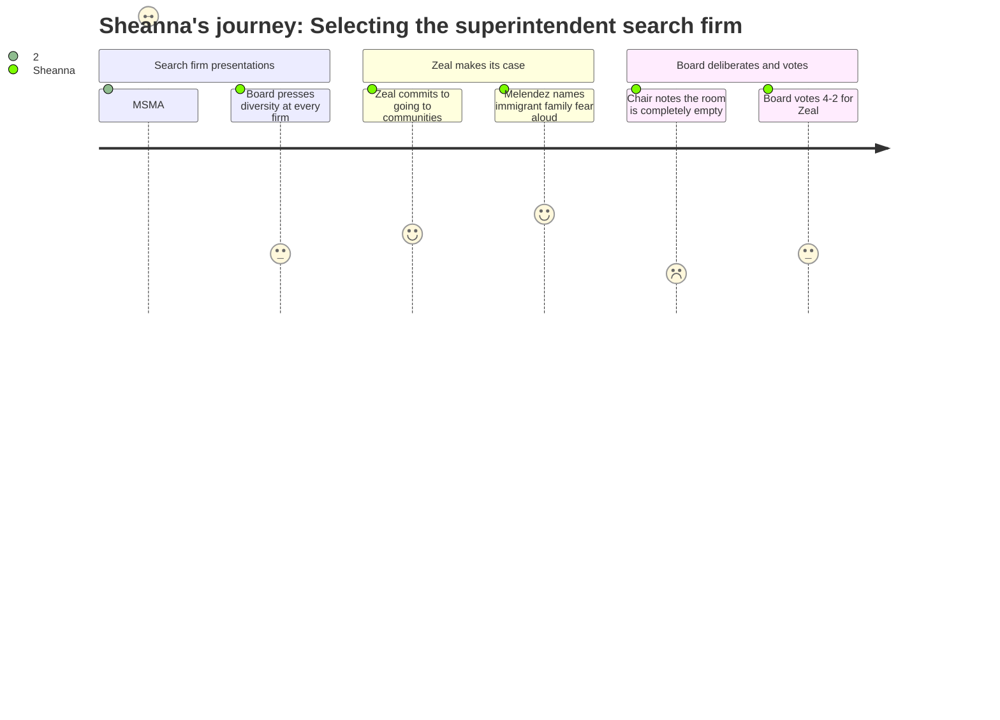

# Interpretation: Sheanna (PERSONA-015)
## Meeting: School Board Workshop -- December 10, 2025 -- 2025-12-10

### Structured Points

#### 1. NSEC proactively recruits through minority educator networks
- **Fact:** NSEC Executive Director David Dusi stated that his organization proactively advertises superintendent openings to the Association for Latino Educators and the Alliance of Black School Educators, in addition to standard platforms like School Spring and AASA.
- **Source:** Transcript [00:56:04–00:56:26]
- **Emotional valence:** positive
- **Threat level:** 1
- **Open question:** true — Does this outreach translate meaningfully in a Maine search context? Will candidates reached through these networks see South Portland as a viable destination, and will the screening process protect their candidacy once they apply?

#### 2. Board members Richardson and DeAngelos push diversity lens at every firm
- **Fact:** Board member Richardson asked each presenting firm how they would attract diverse superintendent candidates and whether they had data on non-white placements; board chair DeAngelos separately pressed MSMA's Eric Waddell directly on the fact that his entire team is white and has "limited lived experience" with equity and diversity issues.
- **Source:** Transcript [00:22:30–00:23:10], [01:13:45–01:14:09], [02:35:55–02:37:10]
- **Emotional valence:** positive
- **Threat level:** 1
- **Open question:** false

#### 3. Zeal commits to week-long in-person community engagement wherever families actually are
- **Fact:** Jeff Melendez of Zeal described going to communities where marginalized stakeholders live and gather — citing a South Carolina search where his team traveled to a Native American reservation — and offered directly to set up engagement at places like Willow Pizza on the west side if that's where South Portland's families would actually come.
- **Source:** Transcript [02:28:25–02:31:05]
- **Emotional valence:** positive
- **Threat level:** 2
- **Open question:** true — Will Zeal follow through on this in South Portland's specific immigrant and multilingual community contexts, and will the board fully fund the community engagement week or negotiate it away to cut costs?

#### 4. Melendez explicitly names immigrant families' fear of entering school buildings
- **Fact:** When board chair DeAngelos raised the west side community and asked whether Zeal would go to marginalized families, Melendez acknowledged without prompting: "some groups don't feel comfortable in schools, right? ... especially with some of the things that are happening, um, they're afraid" — and offered to meet them wherever they are.
- **Source:** Transcript [02:30:05–02:30:25]
- **Emotional valence:** positive
- **Threat level:** 2
- **Open question:** true — Will the superintendent search process actually reach these families, or will their concerns be gathered through thought exchange and then absorbed into a thematic report that the board reads and sets aside?

#### 5. Thought exchange platform operates in 100 native languages
- **Fact:** Zeal's community engagement tool allows respondents to write and read in their native language, translating responses across the community in real time, with a meritocracy-based rating system designed to surface voices that English-only surveys and in-person meetings structurally exclude.
- **Source:** Transcript [02:00:25–02:01:02]
- **Emotional valence:** positive
- **Threat level:** 1
- **Open question:** false

#### 6. Chair notes the workshop room was entirely empty despite deliberate public outreach
- **Fact:** Board chair DeAngelos stated that she personally invited the city council and publicized the meeting, that a separate meeting had just ended in the same room, and that no members of the public stayed or attended — concluding: "if that's the attitude of the public, then we need to make the best decision we can make."
- **Source:** Transcript [03:50:35–03:51:05]
- **Emotional valence:** negative
- **Threat level:** 3
- **Open question:** true — Why were the families most affected by this hiring decision — including families of multilingual learners, students on intervention wait lists, and immigrant families afraid of schools right now — not in this room, and does the chair's framing of their absence as "attitude" misread the actual barrier?

#### 7. Board selects Zeal 4-2 with cost negotiation mandate, two members dissenting on financial grounds
- **Fact:** The board voted to engage Zeal Education Group contingent on reference checks, with board members Rich and Holman dissenting — both citing financial concerns about a $30,000+ commitment during a budget crisis — and the motion including no floor on what services must be preserved during any subsequent cost negotiation.
- **Source:** Transcript [03:51:25–03:52:15], [03:26:55–03:28:05]
- **Emotional valence:** positive
- **Threat level:** 2
- **Open question:** true — Will the chair's negotiation with Zeal protect the multilingual community engagement week and the thought exchange tool, or will those be the first items cut to bring the number down?

---

### Journey Map

---

### Reactions

Three hours of superintendent search discussion and not one word about MTSS wait lists, about the kids waiting months for intervention services across my buildings, about what reconfiguration actually means when you're a specialist traveling between five schools and half your caseload speaks a different language at home. I know the board's job tonight was to pick a firm — not solve the budget crisis. But whoever walks into this job is inheriting a $7 million structural gap and a community where immigrant families right now are scared to walk into schools. I kept waiting for someone to say it as a reason for the search, not just as a diversity talking point. Nobody did. The work I do every day was invisible in that room.

That said — they picked the right firm. I was actually moved when Jeff Melendez said some families are "afraid" to come into school buildings, especially with "some of the things that are happening." He named it, without being asked, in front of a board of elected officials. He's flying to a Men of Color in Education Leadership conference the next morning. His team has two people of color on it. And when Rosemary asked about the west side families who won't show up to South Portland High on a Wednesday night, he said: tell me where they are, I'll go there. Willow Pizza? Fine. A community center? Fine. The thought exchange tool works in a hundred languages — I don't have to translate it, the families don't have to perform English to participate. That's the superintendent search this community actually deserves, and it's the first time I've heard a search firm say it like they meant it.

What's keeping me up is the 4-2 vote. Claire and George dissented mostly on cost, and they're not wrong — we're asking people to do more with less everywhere and here we are at $30,000. I understand the tension. I live inside it. But here's what I know from watching services get cut across three buildings: when the board goes back to negotiate with Zeal, the community engagement week and the multilingual outreach tools are the most expensive line items. They're also the only parts of this process that might reach the families who don't have reliable internet, who are afraid of coming to a school building, who have never once been asked what they want in a superintendent. If we buy the stripped-down version to save $15,000 and we end up with the wrong leader, we will spend that $15,000 and more just managing the first six months. I've watched it happen up close. The empty room tonight is the preview of what happens when you stop doing the expensive part.