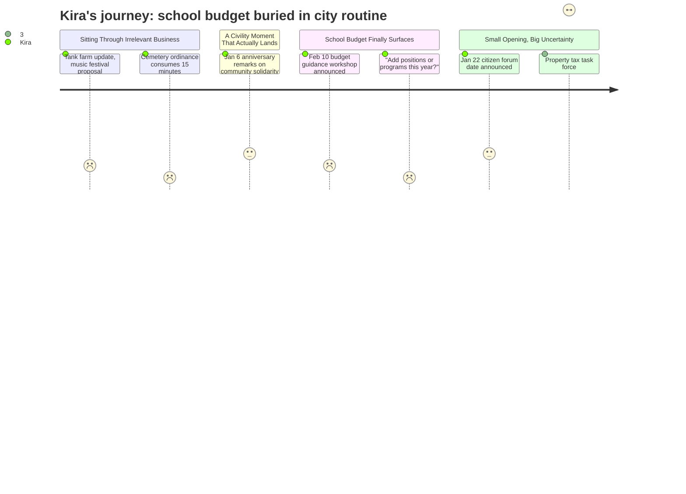

# Interpretation: Kira (PERSONA-015)
## Meeting: City Council Regular Meeting -- January 6, 2026 -- 2026-01-06

---

### Structured Points

#### 1. School budget citizen forum announced for January 22nd
- **Fact:** Mayor Tipton announced, at the request of school board chair DeAngelos, a citizen forum on January 22nd from 6–8 PM (location TBD) framed explicitly as a venue for "ideas and feedback of some potential cost saving measures within the schools."
- **Source:** Transcript [56:59–57:27]
- **Emotional valence:** mixed
- **Threat level:** 2
- **Open question:** true — Will single-building parents dominate this forum with building-closure panic, drowning out the operational equity data that cross-building staff actually hold?

#### 2. February 10th budget guidance workshop: council sets the ceiling
- **Fact:** The city manager announced a joint budget guidance workshop between the city council and school board on February 10th, at which council will provide direction on acceptable tax increases and signal whether this is "a year to add new positions or programs."
- **Source:** Transcript [49:01–50:14]
- **Emotional valence:** negative
- **Threat level:** 4
- **Open question:** true — Will any councilor at that workshop understand what "no new positions" actually means for itinerant and cross-building specialist roles, or will cuts look the same from all angles when you've never traveled between three buildings in a single day?

#### 3. City manager explicitly frames cuts, not investment, as the default question
- **Fact:** City manager Scott named the two questions he expects council to weigh in on at the February 10th workshop: "Is this a year to be looking to add new positions or not? Is it a year to be adding new programs or not?" No framing around equity, existing program protection, or redistricting savings was offered.
- **Source:** Transcript [49:58–50:14]
- **Emotional valence:** negative
- **Threat level:** 5
- **Open question:** true — If the budget conversation starts from "do we add anything?" rather than "what are we already failing to fund equitably?", who advocates for the kids already on MTSS wait lists at understaffed buildings?

#### 4. Mahoney City Center Committee workshop competing for civic attention on January 13th
- **Fact:** The city manager announced that the January 13th council workshop will focus on the Mahoney City Center Committee recommendation — a project the city manager described as carrying a significant dollar tag that has already appeared in the press — with the council being asked for direction on next steps.
- **Source:** Transcript [47:19–47:55]
- **Emotional valence:** negative
- **Threat level:** 3
- **Open question:** true — How much of the city's fiscal and political bandwidth gets consumed by a capital project the week before the school budget citizen forum? Will council come to February 10th already anchored to a different spending priority?

#### 5. School budget relegated to the final three minutes of a 59-minute meeting
- **Fact:** The only school budget content in the entire meeting appeared in the final segment — the mayor's round robin closing remarks. The preceding 50+ minutes covered a tank farm advocacy update, a music festival proposal, a cemetery maintenance ordinance, council rules formatting, and heating oil donations.
- **Source:** Meeting structure, transcript [00:00–56:58] (no school content); school budget first surfaces substantively at [49:01], then again at [56:59]
- **Emotional valence:** negative
- **Threat level:** 3
- **Open question:** false — This is a city council meeting, not a school board meeting. But the signal is real: at the city level, the school budget is a closing item, not the lead.

#### 6. January 6th anniversary — civility and community solidarity language resonates
- **Fact:** Resident Jeff Steinbrink and Councilor West both acknowledged the January 6th anniversary. West read from her own Facebook post: "let's disagree if we need to on individual issues, but let's share our commitment to a community where we can listen to each other, live together, treat each other with respect, and work toward a better quality of life for us all."
- **Source:** Transcript [44:25–56:06]
- **Emotional valence:** positive
- **Threat level:** 1
- **Open question:** false — The "we stood together" framing is exactly what Kira uses when she connects families across buildings. Hearing it from an elected official is validating, not threatening.

#### 7. State property tax relief task force — distant hope, no near-term relief
- **Fact:** Mayor Tipton noted that the legislature has launched a statewide property tax relief task force, with a first report due this month and a final report at year end. She stated that South Portland is "part of the conversation" and that the city is "paying attention."
- **Source:** Transcript [57:33–58:38]
- **Emotional valence:** neutral
- **Threat level:** 2
- **Open question:** true — State funding already covers only a fraction of what it should. Will a task force report change anything before the FY27 budget has to be finalized?

---

### Journey Map

---

### Reactions

So I sat through an entire city council meeting to get three minutes of school budget information at the very end. There was a forty-five minute stretch where they debated cemetery mowing contracts and whether to add page numbers to council rules — which fine, those things matter — and then the city manager finally gets to his communication section and mentions, almost in passing, that February 10th is the budget guidance workshop with the school board. That's the meeting where the council tells the superintendent what's acceptable. That's the meeting that sets the ceiling for everything. And the setup question the city manager described — "Is this a year to add new positions or not? Is it a year to add new programs or not?" — is so far from the actual conversation we need to be having. The question isn't whether to add anything. The question is which of the things we already have are actually reaching every kid equitably. Those are completely different conversations, and if the council walks into February 10th thinking about the first one, we're done.

The mayor also announced a citizen forum on January 22nd — school board is hosting it, asking the public for "cost saving ideas." I have very mixed feelings about that. On one hand, I will absolutely be there, and I'll bring data. I know what our MTSS wait lists look like at each building. I know how many instructional minutes are lost to specialist travel every single week. The boundaries and configurations committee work is sitting there, has been sitting there, and every year we study the problem and don't act. But I also know what these forums look like in practice: you get a room full of parents from one building who are scared about their school closing, and the operational picture — the fact that closing a school without redistricting makes existing inequities worse — gets completely lost. I've watched it happen. The parents I work with at three different buildings don't all show up to the same room.

What actually stayed with me from this meeting was Councilor West reading her own Facebook post about January 6th — "let's disagree if we need to on individual issues, but let's share our commitment to a community where we can listen to each other." That's the language. That's exactly the framing I use when I'm trying to help parents from different buildings see past the "save my school" conversation to the bigger equity question. We did it during the ICE raids — the whole community showed up for each other across neighborhoods. We can do it through a reconfiguration too, if we actually make the case. But someone has to make it, clearly, with evidence, before February 10th. That's what I'm working on right now.