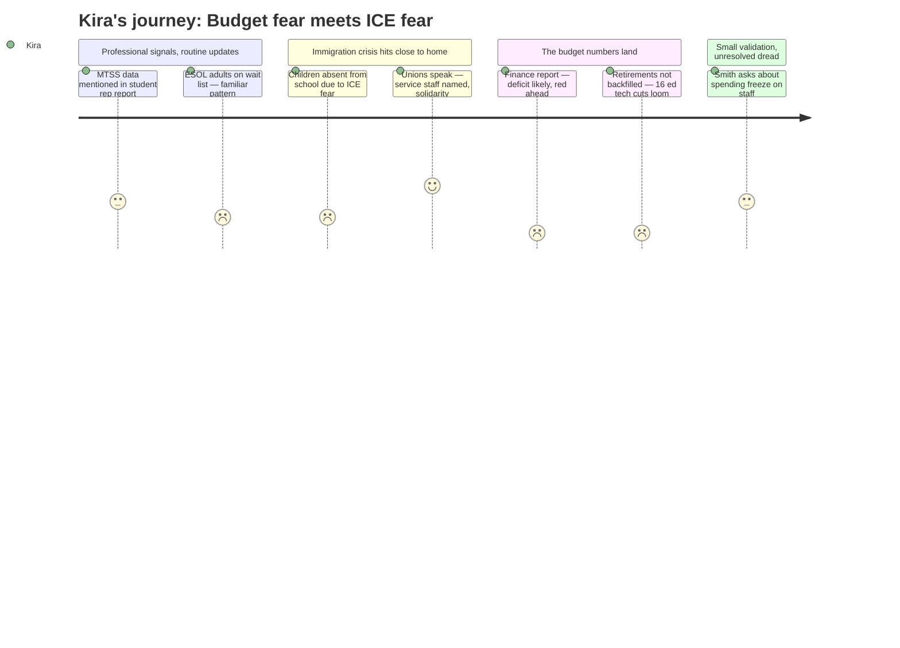

# Interpretation: Kira (PERSONA-015)
## Meeting: School Board Regular Meeting -- January 12, 2026 -- 2026-01-12

### Structured Points

#### 1. MTSS assessments mentioned as cross-district practice — but no depth
- **Fact:** The student representative reported that all elementary schools are conducting January assessments specifically to provide data for "MTSS meetings which guide instructional practice," presented as a uniform district-wide activity.
- **Source:** [00:08:23--00:08:31]
- **Emotional valence:** neutral
- **Threat level:** 2
- **Open question:** true — The report treats MTSS as a tidy checkbox across all buildings. Kira knows from working in multiple schools that access to MTSS services varies dramatically by building — some kids wait weeks for intervention, some get it immediately. Is the board seeing that granularity, or just hearing "all schools are doing assessments"?

#### 2. ESOL adult education wait list signals broader multilingual learner demand
- **Fact:** The adult education director reported 35 students are currently on a wait list for ESOL classes, which run January through May, with hopes of enrolling them by mid-March depending on attendance attrition.
- **Source:** [00:13:44--00:14:21]
- **Emotional valence:** negative
- **Threat level:** 3
- **Open question:** true — If 35 adults from this community are on a wait list for English language classes, what does demand look like on the K–12 side? Kira works directly with multilingual learners across buildings. Are ELL and multilingual learner caseloads getting the same transparency as this adult ed number?

#### 3. Children absent from school due to ICE fear — board member calls for escalated action
- **Fact:** Board member Richardson stated she received reports that multiple children did not attend school on January 12 due to fear of immigration enforcement, and called publicly for accelerated staff training, a clear public statement of district protocol, and a realistic review of whether only two central office administrators can realistically respond to warrant situations across seven buildings simultaneously.
- **Source:** [00:44:55--00:50:50]
- **Emotional valence:** negative
- **Threat level:** 4
- **Open question:** true — The superintendent described a simplified protocol where office staff notify principals who notify central administration. Kira works across multiple buildings. If something happens at one of her schools while she's traveling to another, who's the point of contact for the multilingual families she knows personally? The "keep it simple" protocol doesn't account for itinerant staff or for simultaneous incidents across buildings.

#### 4. Union reps speak — ed tech union specifically names service staff gap in ICE training
- **Fact:** During public comment, ed tech union president Connie DeSanto and teachers association president Sarah Gay both spoke. In her second comment, DeSanto explicitly named that "service employees also need the same immigration enforcement training and guidance that other student-facing staff receive," including bus drivers — noting she wondered during her own commute whether her children's bus driver knew what to do if stopped.
- **Source:** [01:49:57--01:52:02]
- **Emotional valence:** positive
- **Threat level:** 2
- **Open question:** true — Kira heard the union name what she already knows: the training can't stop at the classroom door. But the board didn't respond directly to whether the protocol will be extended to transportation and facilities staff.

#### 5. Budget heading into deficit; 78 positions proposed for elimination including 16 ed techs
- **Fact:** Finance committee chair Holman reported the district is "likely to be in the red" with a projected range of $334K surplus to $1.4M deficit in the current year, and the fiscal context for FY27 shows 78 positions proposed for elimination — including 42 teachers and 16 ed techs — to close a $7.2M structural gap.
- **Source:** [01:05:34--01:07:09]; fiscal context
- **Emotional valence:** negative
- **Threat level:** 5
- **Open question:** true — Sixteen ed tech positions. Kira works alongside ed techs in intervention settings across buildings. Which specialist and intervention positions are in that 78? Are the positions supporting the most vulnerable students — ELL, MTSS, gifted — being evaluated with equity data, or on a blunt cost-per-position basis?

#### 6. Vacancies not automatically backfilled — decisions go through budget process
- **Fact:** When a board member asked whether the six retirements and two resignations listed would be automatically backfilled, the superintendent stated plainly: "We are not automatically refilling those positions" and that decisions will be made through the ongoing budget process.
- **Source:** [01:15:47--01:16:18]
- **Emotional valence:** negative
- **Threat level:** 4
- **Open question:** true — Among the listed retirements is a school counselor at Kaler. Kira knows what happens when a specialist position goes unfilled: kids fall off caseloads, wait lists grow, and the cross-building staff who remain absorb the gap invisibly. Will the board know what instructional and support services are lost when these positions disappear?

#### 7. Board member Smith requests spending freeze impact report from teachers and principals
- **Fact:** Board member Smith asked for a concrete update on the "lived experience" of the spending freeze for principals, teachers, and staff, stating: "We don't want to do that at the expense of this school year." The board chair directed the superintendent to include this in the January 26 budget workshop.
- **Source:** [01:55:38--01:58:04]
- **Emotional valence:** positive
- **Threat level:** 2
- **Open question:** true — Kira would want to be sure that the spending freeze impact report captures what's happening in intervention and specialist services specifically — not just what principals observe in their own buildings, but what staff traveling between buildings are seeing across the system.

---

### Journey Map

---

### Reactions

I was sitting there watching the student rep run through the elementary update and she mentions "assessments for MTSS meetings" like it's just a nice line item. And I'm thinking — okay, I'm literally in three of those buildings every week, and the MTSS experience is not the same in all of them. Not even close. One school, kids wait two weeks to get on the tier 2 schedule. Another one, I'm seeing kids same week they're flagged. That's the thing that never makes it into these meetings. We hear "all schools are doing MTSS" and the board nods and moves on. I need them to understand that "all schools have MTSS" and "all students have equitable access to MTSS" are two completely different statements.

The part that actually got to me — Richardson standing up and saying multiple kids didn't come to school today because they were scared. I work with those families. I see those kids. And I'm driving between buildings thinking about who I'm going to see that day and who I'm not going to see, and why. The union reps did exactly what I hoped they would do — Connie specifically called out that bus drivers need this training too. Because yes. What does a bus driver do if they're stopped on a route? We can't have "simplified protocol" that only covers people inside the building. And then the superintendent walks through this procedure where basically two people at central office are the ones who handle a warrant review for seven schools, and Richardson's asking the right question — you're across town, what happens at Small or Brown? That question didn't get a real answer. I noticed that.

And then we hit the budget numbers and I just felt it in my chest. Sixteen ed tech positions. I know who those people are. I work with them. Those are the people sitting next to kids on my caseload, the ones who know the kids' names, who do the carry-through between what I see in a building and what the classroom teacher needs to do the next day. And the superintendent says, we're not automatically backfilling retirements either — the counselor at Kaler is retiring and that goes through the budget process. The budget process. Like that's supposed to be reassuring. Tyler Smith at least asked the right question about what the spending freeze is actually doing on the ground, and they're going to get a report from principals, which is something. But I really hope that report doesn't just capture what's happening classroom-to-classroom. I need them to see what's happening across buildings, what the system looks like when you're actually moving through all of it the way I am. Because from where I'm sitting, the picture is a lot worse than any one principal can see from their own building.