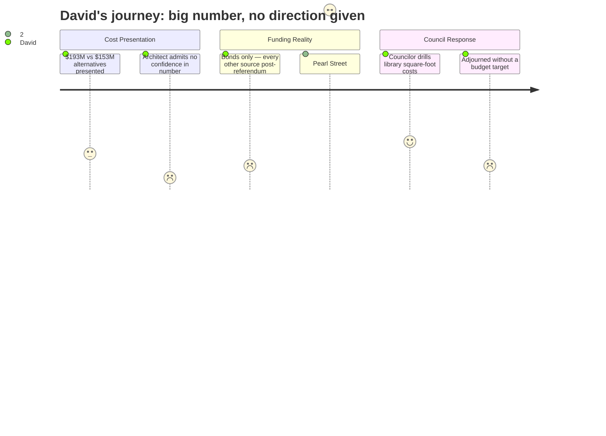

# Interpretation: David (PERSONA-002)
## Meeting: City Council Workshop — January 13, 2026 — 2026-01-13

### Structured Points

#### 1. Architect publicly disavows confidence in the $193M estimate
- **Fact:** When Councilor Matthews asked directly "how confident are you with the unknowns of the 1 93," project architect Craig Piper responded without hedging: "I am not confident." He added that getting to schematic design would reduce unknowns, but that the current estimate could move in either direction — and tariffs or market shifts were beyond anyone's control.
- **Source:** Transcript [01:44:35–01:46:30], Councilor Matthews Q&A with Craig Piper
- **Emotional valence:** negative
- **Threat level:** 5
- **Open question:** true

#### 2. The renovation-in-place comparison is only ~$40M cheaper — but was priced at a much lower level of detail
- **Fact:** SMRT presented a rough comparison: renovating all six facilities at their existing sites would cost approximately $108M in construction and $153M total with soft costs — roughly $40M less than the Mahoney consolidation plan. Piper explicitly cautioned this comparison was done at a "much higher level" than the Mahoney estimate, without drawings, and with unresolved constraints (e.g., no room for parking at expanded City Hall).
- **Source:** Transcript [00:43:37–00:44:59], Craig Piper on renovation baseline; [00:51:35–00:53:30], Colliers on soft cost addition
- **Emotional valence:** positive
- **Threat level:** 2
- **Open question:** true

#### 3. The funding analysis concluded: it is a bond, and essentially only a bond
- **Fact:** Finance Director Ellen Sanborn systematically walked through federal grants, state grants, TIF, tax credits, fundraising, naming rights, property sales, and local option sales tax. Her conclusion: virtually all options would offset debt service after the fact — none could meaningfully reduce the upfront bond ask. The local option sales tax, which she called the best option, would require a state legislative change that a sitting state representative in the room said was extremely unlikely.
- **Source:** Transcript [01:18:03–01:30:57], Ellen Sanborn funding subcommittee presentation; [02:26:33–02:27:05], Rep. Kessler on local option sales tax
- **Emotional valence:** negative
- **Threat level:** 3
- **Open question:** false

#### 4. A separate ~$50M debt obligation for the Pearl Street pump station was quietly surfaced mid-meeting
- **Fact:** Late in the council discussion, Councilor Matthews raised the Pearl Street pump station. The city manager confirmed estimates are "in the high thirties" for the pump station plus another $10M at the plant — roughly $48–50M total. Critically, this is a revenue bond not subject to voter approval, and it does not appear anywhere in the Mahoney project cost comparison. Details on rate impact will come "end of January."
- **Source:** Transcript [02:49:05–02:51:05], City Manager Morelli on Pearl Street revenue bond
- **Emotional valence:** negative
- **Threat level:** 3
- **Open question:** true

#### 5. The project is at ~5% design, won't reach the council's own 70% standard before the referendum
- **Fact:** Piper stated the team just completed "concept design," which he described as "+/- 5% of the design process." He said explicitly that reaching 70% design — the council's own stated standard for a referendum — "I don't see us going to 70% design before the voters have a say." Advancing to schematic design (roughly 20%) would cost another several hundred thousand dollars, all of which becomes sunk cost if voters reject the bond in November.
- **Source:** Transcript [01:13:25–01:15:55], Craig Piper on design phase; [01:50:35–01:51:40], cost to advance to schematics
- **Emotional valence:** negative
- **Threat level:** 4
- **Open question:** true

#### 6. Two major structural cost unknowns are baked in at worst-case — without any testing
- **Fact:** Piper disclosed that Mahoney has unreinforced masonry bearing walls that code would require steel reinforcement throughout, and that foundation load capacity is unknown — "we don't know its bearing capacity" — because testing hasn't been done. He said both are included in the estimate at worst case: "they're in there" so he can "sleep at night." The site was also described as a former dump with poor soils requiring significant preparation. These costs could be reduced but only through additional design work.
- **Source:** Transcript [01:38:35–01:40:45], Craig Piper on structural and foundation unknowns; [01:06:58–01:07:12], site conditions (former dump)
- **Emotional valence:** negative
- **Threat level:** 3
- **Open question:** true

#### 7. The council adjourned without giving the design team a budget ceiling
- **Fact:** Piper explicitly asked for a number: "if there is a budget that we're trying to target, we can come back and tell you what that target is." The council's output after nearly three hours of discussion was: bring back options for Mahoney (with library, without library, and bare bones) to the Mahoney committee on January 27th — with no dollar figure attached to any scenario. No councilor moved to set a ceiling; no vote was taken on scope.
- **Source:** Transcript [01:15:30–01:16:05], Piper requesting a budget target; [04:22:40–04:24:30], council's final direction
- **Emotional valence:** negative
- **Threat level:** 3
- **Open question:** true

---

### Journey Map

---

### Reactions

The headline for me is that the architect stood up there and said, out loud, "I am not confident" in the $193 million number. That's not spin — Councilor Matthews asked him point-blank, and that's what he said. The unknowns driving that number — foundation load capacity, structural reinforcement, site remediation — are all currently priced at worst case because they haven't done the testing. Which means the number is either right, or it's low. And they want to go to a referendum in November based on a concept estimate that the designer himself doesn't trust, at about 5% of the design process.

The finance presentation was actually useful in a grim way: Ellen Sanborn walked through every possible funding mechanism and the answer is basically bonds, full stop. Grants don't cover buildings. TIF is largely tapped. Fundraising is speculative and comes after you build. Local option sales tax would require the legislature, and a sitting state rep in the room said don't hold your breath. So you're looking at a $194M bond — except that number doesn't include the Pearl Street pump station, which the city manager confirmed is another $48 or $50 million in revenue bond debt coming separately. That one doesn't need voter approval, so it's easy to miss if you're only watching the Mahoney discussion. And none of this accounts for what the school department is about to do to property taxes on its own.

The comparison data the architect showed — renovating everything in place for $153M — was genuinely useful. The Mahoney consolidation premium is about $40M for a significantly better outcome. That's a real number worth debating. But the council spent two hours talking in circles and adjourned without giving the design team a single dollar target to work toward. The architect actually asked for one. He said: give us a number and we'll tell you what you get. Nobody gave him a number. They scheduled another committee meeting. Until somebody draws a line and says "here's what we can actually pass in November," the project will keep consuming design fees while the clock runs out on a favorable construction market.