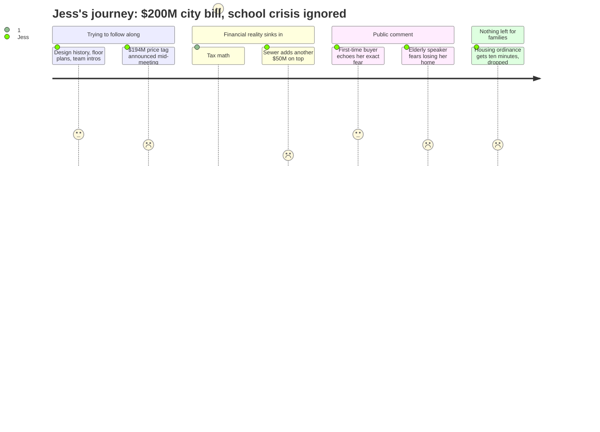

# Interpretation: Jess (PERSONA-003)
## Meeting: City Council Workshop -- January 13, 2026 -- 2026-01-13

### Structured Points

#### 1. Property Taxes Would Jump Over $1,100/Year — and That's Just This One Project
- **Fact:** Finance Director Ellen Sanborn explained that if the city borrowed the full $194 million starting immediately, the property tax rate would increase by $2.26 per $1,000 of assessed value. On the average South Portland residential property assessed at $514,000, that's roughly $1,161 more per year — before any other budget changes are factored in.
- **Source:** Transcript [01:29:55–01:30:44]
- **Emotional valence:** negative
- **Threat level:** 4
- **Open question:** true

#### 2. A Second Major Bill Is Coming — Sewers — Amount Unknown
- **Fact:** City Manager Scott Morelli confirmed that sewer infrastructure work — the Pearl Street pump station and related plant upgrades — would cost "probably just under 50 million dollars," financed through a revenue bond that doesn't require voter approval and would be repaid through sewer rates. The impact on monthly household bills was not calculated at this meeting.
- **Source:** Transcript [02:48:30–02:49:25]
- **Emotional valence:** negative
- **Threat level:** 4
- **Open question:** true

#### 3. The School District Is in Simultaneous Freefall
- **Fact:** The school district faces a $7.2 million structural gap for FY27, with 78 positions proposed for elimination — including 42 teachers and 16 educational technicians. Elementary enrollment has dropped 23% in four years (from 1,401 to 1,080 students), while state funding covers only approximately 20% of actual costs instead of the expected 55%. None of this came up in the city council workshop.
- **Source:** Fiscal Context, FY27 key budget figures
- **Emotional valence:** negative
- **Threat level:** 5
- **Open question:** true

#### 4. A First-Time Homebuyer Voiced Exactly Her Fear
- **Fact:** A resident named Henry Silve, who had just purchased his first home in South Portland in December 2025, told the council that buying in the city as a first-time buyer is already "challenging" and that a projected 18% tax increase "just makes it that much harder." He asked the council to scale back the project to needs rather than a "wishlist."
- **Source:** Transcript [02:16:05–02:17:12]
- **Emotional valence:** neutral
- **Threat level:** 3
- **Open question:** false

#### 5. The Housing Ordinance Discussion Was Effectively Dropped
- **Fact:** The housing ordinance update — the second official workshop topic, covering how new state housing laws affect South Portland policy — was supposed to follow the Mahoney presentation. After nearly four hours of discussion, the council ran so far over time that the mayor essentially told Planning Director Milan Neveda he had ten minutes to present. The transcript contains no substantive council discussion of housing policy changes or their implications for development in the city.
- **Source:** Transcript [03:44:35–03:49:03]; Agenda item 2
- **Emotional valence:** negative
- **Threat level:** 3
- **Open question:** true

#### 6. The Architect Said He Isn't Confident the $193M Number Will Hold
- **Fact:** When Councilor Matthews asked directly how confident the design team was in the cost estimate, lead architect Craig Piper said plainly: "I am not confident, Dickie." He noted the estimate is based on concept-level design, that tariff volatility and construction market uncertainty could push it higher, and that the number would only tighten through additional design phases that would themselves cost hundreds of thousands of dollars more.
- **Source:** Transcript [01:45:17–01:46:09]
- **Emotional valence:** negative
- **Threat level:** 4
- **Open question:** true

#### 7. The Building That Used to Serve Kids Would Become a Government Campus
- **Fact:** The Mahoney project repurposes the former Mahoney school — where multiple generations of South Portland families attended elementary, middle, and high school — into consolidated city offices, a library, and a police station. Councilor Matthews said his mother went to high school there and his own children went to middle school there. This transition was treated as a settled question; no discussion addressed what the conversion means for community access or youth programming.
- **Source:** Transcript [03:51:30–03:52:05]; also [01:45:51]
- **Emotional valence:** neutral
- **Threat level:** 2
- **Open question:** false

#### 8. Four Hours of Debate, No Decision — Just "Come Back in February"
- **Fact:** The council ended the workshop without approving any direction, voting on any scope, or committing to any bond amount. Multiple councilors said they would not support a $194M bond as presented. The design team was directed to bring back revised Mahoney-only scenarios — with and without the library, with and without various features — to the Mahoney Committee meeting on January 27th.
- **Source:** Transcript [03:38:00–03:43:55]
- **Emotional valence:** neutral
- **Threat level:** 2
- **Open question:** true

---

### Journey Map

---

### Reactions

Okay so I finally watched that city council meeting — the one from the neighborhood Facebook group — and I am spiraling a little. Three hours of people arguing about a $200 million plan to turn the old Mahoney school into a new city hall. The one where actual kids went to school. And then the finance director got up and said if they pass this bond, property taxes go up over eleven hundred dollars a year. On the average house. And then — AND THEN — almost at the very end, the city manager casually mentions there's also a $50 million sewer project coming, and they don't even know yet what that's going to add to your bill. Like, separate thing. Not included in the $200 million. I had to pause it twice because I thought I was misunderstanding.

Here's what's keeping me up though. The school budget is completely falling apart at the same time. I've been tracking this since last fall — there's a seven million dollar gap for next year, and they're proposing to cut 42 teachers on top of everything else. Elementary enrollment is down almost a quarter in four years. A quarter! Which means school consolidations, right? Which means by the time Liam starts kindergarten I genuinely don't know which school he'd even go to or whether full-day K still exists. And not one single person in this four-hour meeting mentioned the school budget. They were literally debating whether the new city hall should have a rooftop garden. I'm not saying the city buildings don't need work — some of the stuff about the police and fire stations sounds genuinely bad — but the whiplash of it is insane.

And then the whole reason I stayed up to watch was because the housing ordinance stuff was on the agenda, and I wanted to understand what the new state housing laws mean for neighborhoods like mine, whether more units are coming, what development is going to look like when Liam is in school. They gave it to the planning director and told him he had ten minutes after four hours of city hall renovation talk. There was a guy named Henry who literally just bought his first home in South Portland in December — that's us, basically, we're trying to figure out if we can stay here — and he stood up and said even a projected 18% school tax increase makes it too hard. Nobody really responded to him. I don't know what we're deciding here.