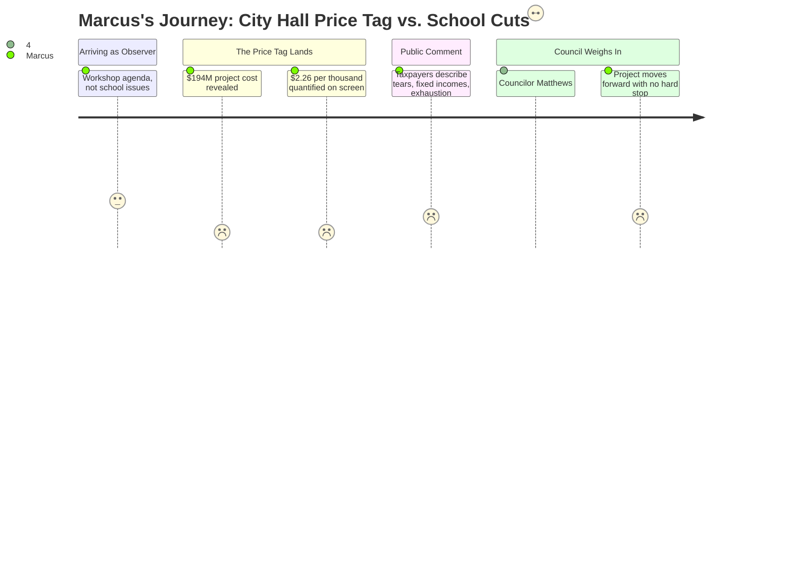

### Structured Points

#### 1. The $194M Number Lands While 42 Teacher Positions Sit on the Chopping Block

**Fact:** SMRT Architects and the project team presented a full project cost of $194M for the Mahoney City Center proposal, with a renovate-in-place alternative at $153M. Both figures draw from the same property tax base that funds the school district — the same tax base Marcus's union is counting on to reverse proposed eliminations.

**Source:** SMRT Architects design presentation, Mahoney City Center scope section; Ellen Sanborn finance presentation on bonding scenarios

**Emotional valence:** Disbelief shading into cold anger. Marcus's first instinct is arithmetic: if the district needs to close a $7.2M structural gap and is proposing to eliminate 42 teacher positions to do it, $194M in city capital spending isn't just a number — it's a political signal about what this community is actually willing to fund.

**Threat level:** Critical

**Open question:** If the city advances a $194M bond in the same fiscal year the school district is cutting teaching positions, what does that tell union members about where educators rank in this community's spending priorities?

---

#### 2. Ellen Sanborn Runs the Tax Math: $2.26/1,000 on Top of Whatever Schools Need

**Fact:** Finance Director Ellen Sanborn presented a tax rate impact of $2.26 per $1,000 of assessed value if the bond is floated all at once — roughly $1,161 per year for a homeowner at the average South Portland property value of approximately $514,000.

**Source:** Ellen Sanborn, finance presentation, bonding impact section

**Emotional valence:** Dread. Marcus does not watch this number as an abstract municipal finance question. He watches it as a teacher who knows the school district already carries 61% of the total property tax load, and who understands that every additional dollar of tax capacity absorbed by a city bond is a dollar that isn't available when voters decide whether to support a school budget.

**Threat level:** Critical

**Open question:** What is the cumulative tax ask — city bond plus school budget increase — that South Portland homeowners will face in 2026, and has anyone in this building done that number?

---

#### 3. A Councilor Calls It: "No Way in Hell This Will Ever Pass"

**Fact:** At approximately the 2:50 mark, a councilor — identified in the session as Councilor Matthews — stated explicitly that the bond as currently scoped would not pass voter approval.

**Source:** Councilor Matthews, council deliberation, approximately 02:50 into the workshop recording

**Emotional valence:** Brief and genuine relief — followed immediately by suspicion. Marcus registers this moment as a rare instance of an elected official saying out loud what teachers have been saying in hallways: voters are tapped out. But the relief doesn't hold, because the council did not stop the project.

**Threat level:** Medium — the acknowledgment is real, but it carries no operational weight unless it produces a scope decision.

**Open question:** If a sitting councilor believes this bond cannot pass, what is the theory of the case for continuing to advance it — and who absorbs the political cost when it fails?

---

#### 4. The Rooftop Garden: $900,000 in an Estimate Presented While Teachers Are Being Cut

**Fact:** The project cost estimate included a rooftop garden feature carrying an approximately $900,000 price tag.

**Source:** SMRT Architects project estimate, Mahoney City Center design

**Emotional valence:** Controlled fury. Marcus teaches at South Portland High School. He knows what $900,000 looks like in a school building: it is roughly 7–8 teacher salaries. It is a science department budget for a decade. It is every supply request that has been denied in the last three years. The rooftop garden is not why the project costs $194M — but it is the number that will circulate on Facebook, and when it does, it will be in the same sentence as "78 school positions cut."

**Threat level:** High — not because of the dollar amount in isolation, but because of what it does to the political optics of the school budget conversation.

**Open question:** When this line item becomes a local news item — and it will — how does the school board explain to parents that teacher positions were eliminated in the same budget year the city was pricing out a rooftop garden at city hall?

---

#### 5. Public Commenters Describe Tax Exhaustion — These Are Marcus's Parents

**Fact:** During the public comment period, multiple community members described real financial stress tied to property tax increases — including references to crying at prior tax assessment notices and concern from residents on fixed incomes.

**Source:** Public comment period, City Council Workshop, January 13, 2026

**Emotional valence:** Grim recognition. Marcus has taught in South Portland long enough to know whose parents show up to city council workshops on a Tuesday night. These are the households he sends newsletters home to. These are the people SPEA needs in order to protect the contract. They are not abstract taxpayers — they are the adults who pack school board meetings or stay home depending on whether they feel heard.

**Threat level:** High

**Open question:** If these residents are already describing their tax burden as unbearable — before either the city bond or the school budget increase is finalized — what does a pro-school-budget organizing campaign look like in this environment?

---

#### 6. School District Gets One Passing Mention: A Geothermal Grant at the Middle School

**Fact:** The school district was referenced once in the finance section — Ellen Sanborn noted a middle school geothermal grant as an example of capital funding received. The district's structural budget gap, the proposed 78 position eliminations, and the FY27 budget crisis received no discussion.

**Source:** Ellen Sanborn, finance presentation

**Emotional valence:** Invisibility. For a teacher whose career and colleagues are directly at risk in the FY27 budget, watching the school district appear in this meeting only as a footnote about a grant — while $194M of city capital spending gets four hours of workshop time — is a data point about institutional prioritization.

**Threat level:** Medium — not an immediate operational threat, but a signal about who gets floor time and who doesn't.

**Open question:** Why is a $194M municipal building getting a four-hour workshop while a $7.2M school budget gap — with 78 human positions attached to it — is being handled on a different track?

---

#### 7. Council Consensus: No Hard Stop, Project Continues

**Fact:** Despite multiple expressions of concern about project cost, bond viability, and taxpayer appetite, the workshop concluded with a council consensus to continue advancing the Mahoney City Center project. No motion to pause, scope down, or table the proposal was adopted.

**Source:** Council deliberation and workshop close

**Emotional valence:** Resignation. Marcus came to this meeting as an observer, not a participant. He leaves it watching a $194M project move forward without a hard stop, knowing that every month it advances is a month of political bandwidth that isn't being spent on school funding advocacy.

**Threat level:** High

**Open question:** Is there any scenario in which the city bond and the school budget both succeed in 2026 — or is this a zero-sum fight for the same finite pool of voter goodwill?

---

### Journey Map

---

### Reactions

I wasn't even supposed to care about this meeting. I pulled up the agenda because someone in our building mentioned something about a city hall proposal and I wanted to know if it was going to show up in a conversation with parents. I figured I'd watch the first hour and tune out. Then Ellen Sanborn put the tax math on the screen — $2.26 per thousand, roughly $1,161 a year for a typical South Portland home — and I stopped tuning out. Because I know what that number means when you put it next to the school budget conversation. That's not a city hall number in isolation anymore. That's $1,161 of taxpayer tolerance that isn't going to be there when the school board needs it. And our budget needs a lot of taxpayer tolerance right now.

The rooftop garden is going to follow me. I know it's not the reason the project costs $194M. I'm not naive. But $900,000 for a rooftop garden — I watched that number go up on a slide, and I immediately started doing the math. That's seven or eight colleagues. That's the salary line for a full science department staffing cycle. I have been watching the district tell us, meeting after meeting, that there is no choice but to cut positions, that the money simply isn't there, that 42 teaching positions are on the table because the structural gap is real and the options are limited. And I sat in a city council workshop and watched a $900,000 rooftop garden presented as a line item in a serious proposal. I am not saying city hall doesn't need attention. I am saying that number is going to end up in a social media post, and when it does, it is going to be next to a screenshot of the FTE elimination list, and someone is going to be very angry, and I don't blame them.

The people who spoke during public comment — I know those people. Not by name, but I know them. They're the parents who email me when their kid is struggling. They're the voters we need in our corner when the school budget comes up. And they stood at a microphone and described crying at their tax assessment notices. They talked about fixed incomes. They talked about not being able to stay in the city they've lived in for thirty years. These are not people who have more to give. And I'm supposed to go out and ask them to support a school budget that protects my colleagues' jobs, knowing that the city is simultaneously advancing a $194M bond. I don't know how we thread that needle. I genuinely don't know.