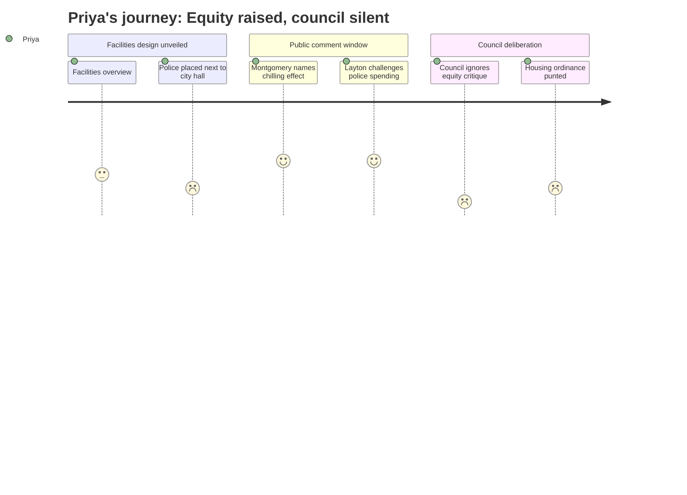

# Interpretation: Priya (PERSONA-005)
## Meeting: City Council Regular Meeting -- January 13, 2026 -- 2026-01-13

### Structured Points

#### 1. Police Station Co-Located With City Hall — Direct Barrier to Marginalized Communities Accessing Services
- **Fact:** The recommended Mahoney conceptual plan places a new police station on the same campus, adjacent to the consolidated city hall and library, where residents would access city services and vote. Community member Olivia Montgomery — a clinical social worker and social work professor — testified that this will "result in the immediate disenfranchisement of large portions of our immigrant community and communities of color who simply will not access or even attempt to access these services because of police proximity," including potential voters using the gym as a polling place.
- **Source:** Olivia Montgomery public comment [01:56:19--01:57:58]; Craig Piper site plan presentation [00:46:55--00:50:20]
- **Emotional valence:** negative
- **Threat level:** 5
- **Open question:** true

#### 2. Council Deliberated for Over an Hour Without Acknowledging the Equity Critique
- **Fact:** Following public comment — which included Montgomery's detailed, professionally grounded argument about police proximity and community access — the council discussed cost, scope, phasing, rooftop gardens, the library addition, and bare-bones options. Not one councilor named police co-location as an equity, access, or vulnerable-population concern. The equity argument raised in public comment was structurally absent from the deliberation.
- **Source:** Council deliberation [02:32:00--04:03:30]
- **Emotional valence:** negative
- **Threat level:** 5
- **Open question:** true

#### 3. Affordable Housing Displaced from Mahoney With a Speculative Replacement Promise
- **Fact:** The South Portland Housing Authority proposed using the Mahoney site for affordable housing, and the concept was publicly discussed through at least April 2024. The council ultimately directed the site toward consolidated city facilities, with the rationale that vacating city hall, the Hamlin building, and the library would "open up those three other sites" for housing — including possible affordable units. No affordability requirements, community land trust frameworks, or timelines were attached to those future sites.
- **Source:** City Manager Scott Morelli background [00:09:20--00:11:20]; Q&A on housing option [00:24:10--00:25:05]
- **Emotional valence:** negative
- **Threat level:** 4
- **Open question:** true

#### 4. Housing Ordinance Updates — The Substantive Equity Housing Policy Item — Were Postponed
- **Fact:** The housing ordinance updates were the second workshop agenda item, described in the opening as a presentation by city planning director Milan Nevada covering housing and state law updates. The mayor noted at the opening that it would be postponed if the Mahoney discussion "goes long enough." At approximately 10:15 PM, after the Mahoney discussion consumed more than three hours, the housing ordinance presentation was formally pushed to a future meeting.
- **Source:** Mayor Tipton opening remarks [00:03:40--00:04:05]; City Council Agenda, January 13, 2026; postponement discussion [03:45:35--03:48:25]
- **Emotional valence:** negative
- **Threat level:** 3
- **Open question:** true

#### 5. $27 Million Police Station Budget Challenged as a Resource Allocation Choice
- **Fact:** The police station component of the Mahoney project was budgeted at approximately $27 million. Community member Shelby Layton publicly contested this in terms of opportunity cost: "How many people could we feed for the amount that we're spending on a fitness center for the police?" and urged the council to "right size our police department and renovate the existing building for a future where we have less policing, not more policing." No councilor responded to this framing.
- **Source:** Shelby Layton public comment [02:11:15--02:12:05]; Craig Piper cost breakdown [01:09:10--01:10:17]
- **Emotional valence:** neutral
- **Threat level:** 3
- **Open question:** true

#### 6. "Community-Centered Design" Guiding Principle Contained No Equity or Vulnerable-Population Metrics
- **Fact:** Architect Craig Piper presented the project's guiding principles, which included "community-centered design," "safe, accessible, and healthy" buildings, and "integrated city functions." Community engagement was quantified through email subscribers, survey completions, and building crawl visits. No guiding principle named equity, culturally responsive service delivery, access for undocumented residents, multilingual outreach, or outcomes disaggregated by race, income, or immigration status.
- **Source:** Craig Piper guiding principles presentation [00:37:35--00:41:50]; outreach metrics [00:19:55--00:21:00]
- **Emotional valence:** negative
- **Threat level:** 3
- **Open question:** true

#### 7. Tax Burden Impact Modeled for the Average Homeowner, Not Renters or Low-Income Households
- **Fact:** Finance Director Ellen Sanborn presented tax impact scenarios built around an average residential property value of $514,000, with an estimated $2.26 per-thousand additional millage rate impact. No analysis was presented for below-median-income households, renters who bear tax costs passed through via rent increases, or residents on fixed incomes. Several public commenters identified themselves as fixed-income residents or described neighbors at risk of losing their homes, but this population was not incorporated into the formal fiscal analysis.
- **Source:** Ellen Sanborn funding presentation [01:29:50--01:31:05]; public comments from Jack Prosal and Ed Cobb [02:13:00--02:23:35]
- **Emotional valence:** negative
- **Threat level:** 3
- **Open question:** true

---

### Journey Map

---

### Reactions

The moment that's going to stay with me from this meeting is Olivia Montgomery walking up to that mic. She's a clinical social worker and a social work professor — she knows exactly what she's talking about — and she laid it out precisely: you cannot put a police station next to city hall and expect immigrant families, undocumented residents, people with outstanding warrants, anyone who has any reason to be afraid of police contact, to walk through that campus to get a permit or renew a license or vote. She wasn't asking them to defund anyone. She was asking them to put the buildings in different locations. And then the council deliberated for over an hour about rooftop gardens and whether to include the library, and not one of them said a word about what she raised. Not one. That's not oversight. That's erasure. And I want us to name it that way when we follow up.

Here's what's underneath all of this for me: Mahoney was on the table as an affordable housing site. The South Portland Housing Authority came to the council with a real proposal. The council chose city facilities instead, and then offered what I can only describe as a promissory note — "those other sites will open up someday" — with no affordability covenant, no timeline, no commitment to prevent market-rate flip. And then the actual housing ordinance update, the policy work that could affect real people's tenancy rights right now, got bumped at 10:15 at night because the facilities discussion ate the whole evening. If you want to understand how equity gets structurally pushed out of institutional processes, that's the entire story in one meeting.

Before the next public hearing on this project, I'm pulling the public records on the community engagement data. Five hundred twenty-six survey respondents, building crawls, email subscribers — I want the demographic breakdown. Which zip codes participated? Was outreach conducted in Somali, Portuguese, Spanish? Were the surveys available in languages other than English? Because "community-centered design" on a slide means nothing if the communities most directly harmed by the design decision were never in the room. And I'm going to be at whatever meeting they reschedule the housing ordinance presentation for, because that's where the work that actually affects people's lives is going to happen.