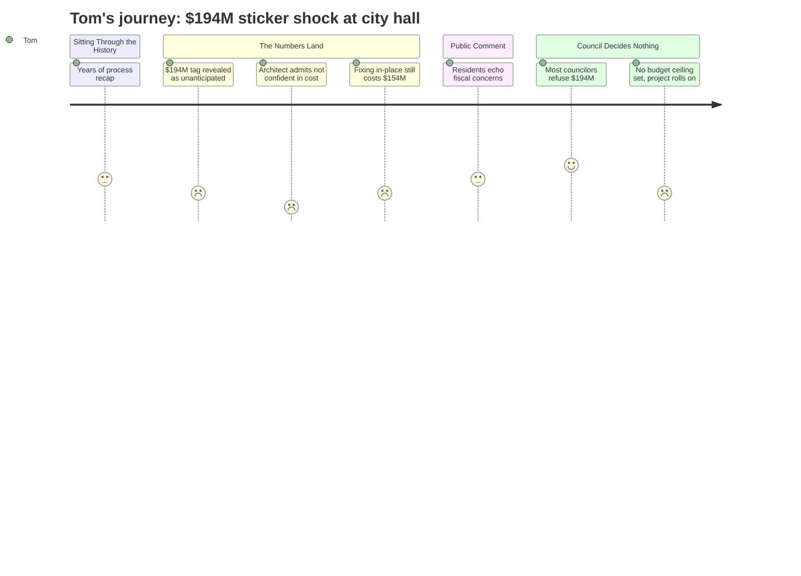

# Interpretation: Tom (PERSONA-006)
## Meeting: City Council Workshop -- January 13, 2026 -- 2026-01-13

---

### Structured Points

#### 1. The price tag: $194 million — roughly $1,160 more per year on the average home
- **Fact:** Finance Director Ellen Sanborn stated that the current mil rate is $13.65 per thousand assessed value. Borrowing the full $194 million all at once would add $2.26 per thousand — approximately $1,160 more per year on a home assessed at the city's published average of $514,000. She noted that the "worst case" scenario of borrowing it all immediately is unlikely, but presented it as the baseline for comparison.
- **Source:** Ellen Sanborn presentation, approximately [01:29:35--01:31:00]
- **Emotional valence:** negative
- **Threat level:** 5
- **Open question:** true

#### 2. The architect said he is "not confident" the number is right — and it could go higher
- **Fact:** When Councilor Matthews asked directly how confident he was in the $193 million estimate, project architect Craig Piper replied: "I am not confident, Dickie." He cited unresolved structural unknowns in the Mahoney building, potential tariff impacts, and construction market volatility as factors that could push costs upward. His colleague from Colliers confirmed the number would tighten only through further expensive design phases.
- **Source:** Counselor Q&A section, approximately [01:44:25--01:46:50]
- **Emotional valence:** negative
- **Threat level:** 5
- **Open question:** true

#### 3. Staying put and renovating in-place would still cost $153-154 million
- **Fact:** The design team presented a comparison scenario: renovating all six facilities at their current sites without the Mahoney consolidation. Total project cost including soft costs came to approximately $153–154 million. The architect cautioned this estimate was based on square-footage math with no drawings, and excluded practical constraints like loss of all parking at the library and City Hall sites.
- **Source:** Craig Piper presentation, approximately [00:43:35--00:45:00]
- **Emotional valence:** negative
- **Threat level:** 4
- **Open question:** true

#### 4. The sewer bill is coming regardless — Pearl Street pump station adds another ~$50 million in rate increases
- **Fact:** City Manager Scott Morelli confirmed that a Pearl Street wastewater pump station upgrade — with construction estimates "in the high thirties" plus approximately $10 million in plant work — totals roughly $50 million. Unlike the Mahoney bond, this is a revenue bond requiring no voter approval. It will raise sewer rates. A revenue analysis consultant is due to report at the end of January.
- **Source:** Council discussion at approximately [02:49:25--02:50:30]
- **Emotional valence:** negative
- **Threat level:** 4
- **Open question:** true

#### 5. The city has already spent $780,000 on design — with another $400–500K needed before a referendum
- **Fact:** Of a $5 million design allocation (funded through ARPA and TIF), approximately $780,000 has been spent to date. The design team indicated another $400,000–$500,000 in schematic design fees would be needed just to reach a June council review. Councilor Matthews confirmed these would all become sunk costs if the November bond referendum fails.
- **Source:** Exchange between Councilor Matthews and City Manager, approximately [01:49:15--01:51:30]
- **Emotional valence:** negative
- **Threat level:** 3
- **Open question:** true

#### 6. The council gave no clear direction and set no cost ceiling — the project continues
- **Fact:** After three-plus hours of presentations and debate, the council reached no vote, imposed no budget cap, and did not authorize or halt further spending. They asked the design team and Mahoney committee to return by January 27 with alternative phasing options and multiple scope tiers — including a version without the library and a "bare bones" Mahoney conversion — but specified no target number.
- **Source:** Council discussion, approximately [03:24:30--03:39:00]; Councilor Walker's framing of the charge at approximately [03:38:00]
- **Emotional valence:** neutral
- **Threat level:** 3
- **Open question:** true

#### 7. Residents at the microphone said exactly what Tom would say — with numbers
- **Fact:** Ed Cobb, who has lived in South Portland since 1993, told the council his taxes started at $1,600 per year and could reach $6,000 with this project layered on top of recent increases. David Bertoni calculated that a $194 million bond, paid with interest over 30 years, totals approximately $300 million — "bordering on $10,000 per household" of debt taken on. Lawrence Pirro called the project "grandiose and egregious" given residents already struggling with rising costs.
- **Source:** Ed Cobb public comment at approximately [02:13:40--02:15:15]; David Bertoni public comment at approximately [01:59:45--02:01:30]; Lawrence Pirro public comment at approximately [02:07:35--02:09:05]
- **Emotional valence:** positive
- **Threat level:** 1
- **Open question:** false

#### 8. Most of the council would not vote for $194 million — but one councilor strongly would
- **Fact:** Councilor Walker was the only member to explicitly endorse the full $194 million plan, saying the price tag did not change her direction. Every other councilor who spoke — West, Scott, Pride, Matthews, and Coleman — said the number was not politically viable for a referendum, called for significant scope cuts, and in some cases said they would not vote yes on a bond of this size. Councilor West stated: "I will not agree to go to the ballot with $194 million bond issue. That is simply a non-starter for me."
- **Source:** Council discussion, approximately [03:03:00--03:44:00]; Councilor West at approximately [03:11:30--03:12:00]
- **Emotional valence:** positive
- **Threat level:** 2
- **Open question:** true

---

### Journey Map

---

### Reactions

Look, I want to be clear about what happened at that meeting last night. They've been working on this Mahoney project for years — years — and they finally came in with a price tag. A hundred and ninety-four million dollars. And here's the kicker: the architect himself, when a councilor asked him straight up how confident he was in that number, said — I'm not making this up — "I am not confident." That was his answer. He said tariffs could push it higher, said there are unknowns in the building they haven't figured out yet. So that's not a real number. That's a floor. And the floor is $194 million.

And it doesn't stop there. The finance director told them the sewer pump station on Pearl Street is going to be another fifty million, and that one doesn't even go to voters — they can just do it. So we're stacking bills here. The school budget is already a disaster — eighteen, nineteen percent tax increase just to hold the line there. Now add the city buildings. Add the sewer. Ed Cobb got up at that meeting and said his taxes were $1,600 a year when he moved here in 1993 and now he's looking at $6,000. That's me. That's a lot of us. And there was a guy, a lawyer, who did the math on what a $194 million bond costs with interest over thirty years: $300 million. Roughly $10,000 per household of debt, sitting on top of everything else.

Now here's the thing that keeps me up: they didn't stop it. They asked for more options. They want to see a "bare bones" version, a version without the library, maybe phasing police and fire separately. That's fine, maybe something comes back that's half the size. But nobody put a number on it. Nobody said we can afford X and not a dollar more. The design team is still running the clock, still billing — they've already spent $780,000 and need another $400-500K just to get to June. If this goes to a referendum in November and fails, that money is gone. What I want to know is: when does somebody in that room say what this city can actually afford, instead of asking the same team to reshuffle the deck?