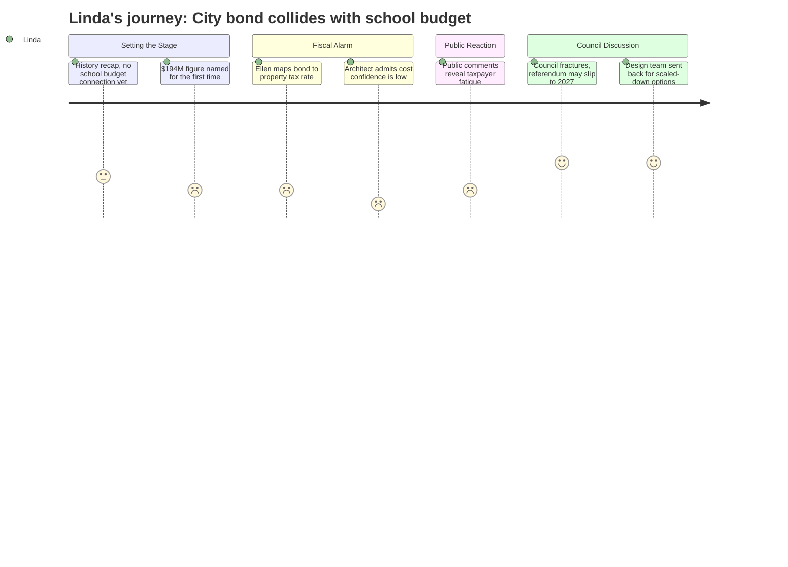

# Interpretation: Linda (PERSONA-003)
## Meeting: City Council Regular Meeting -- January 13, 2026 -- 2026-01-13

### Structured Points

#### 1. Mahoney Bond Referendum Targeting November 2026 — Same Window as School Budget Validation
- **Fact:** City manager Scott Morelli confirmed the project would require a general obligation bond referendum, and committee chair Mike Halsey stated the bond question is "tentatively scheduled for this November" — meaning November 2026 — contingent on council approving the design path by summer.
- **Source:** [00:18:30--00:18:45] Morelli remarks; [00:26:36--00:26:52] Halsey presentation on referendum timeline
- **Emotional valence:** negative
- **Threat level:** 5
- **Open question:** true

#### 2. Bond Would Add $2.26 Per $1,000 to Property Tax Rate — Stacked Directly on Top of School Budget Increase
- **Fact:** Finance director Ellen Sanborn stated the current city tax rate is $13.65 per $1,000 and that borrowing the full $194 million at once would add $2.26 per $1,000 in year one — representing a roughly 16.5% increase on the city's share of the tax rate, applied against the same property tax bill already absorbing projected school budget pressure.
- **Source:** [01:30:07--01:31:00] Sanborn finance presentation; fiscal context notes school tax comprises 61% of total property taxes and a roll-forward school budget alone would require an 18--19% increase
- **Emotional valence:** negative
- **Threat level:** 5
- **Open question:** true

#### 3. Design Team Architect Admits No Confidence in the $193M Figure
- **Fact:** When Councilor Matthews asked directly how confident the design team was in the $193 million estimate, architect Craig Piper responded plainly, "I am not confident, Dickie" — adding that unknowns around structural reinforcement, soil conditions, and market escalation could push costs higher before any referendum.
- **Source:** [01:45:09--01:46:05] Piper exchange with Councilor Matthews on cost confidence; [01:46:50--01:47:25] owner's representative Anthony concurs on uncertainty
- **Emotional valence:** negative
- **Threat level:** 3
- **Open question:** true

#### 4. Pearl Street Pump Station Adds ~$50M in Parallel Borrowing — Cumulative Property Owner Exposure Understated at Tonight's Meeting
- **Fact:** City manager Morelli confirmed to Councilor Coleman that the Pearl Street pump station upgrade — a separate revenue bond not requiring voter approval — is estimated at "probably just under 50 million," and that detailed sewer rate impact analysis is not yet complete. No speaker tonight aggregated this alongside the Mahoney GO bond to give a full cumulative borrowing picture.
- **Source:** [02:48:30--02:49:25] Morelli answer to Coleman on Pearl Street; [03:12:45--03:13:30] Coleman follow-up questions on combined impact
- **Emotional valence:** negative
- **Threat level:** 3
- **Open question:** true

#### 5. Council Fracture Makes November 2026 Referendum Increasingly Unlikely — A Meaningful Reprieve for School Budget Timing
- **Fact:** By the close of council discussion, multiple councilors explicitly declined to support the $194M package as presented, and the body directed the design team to return with scaled-back Mahoney-only scenarios for the January 27 committee meeting. City manager Morelli acknowledged that meaningful scope changes would likely push referendum readiness past the July--August council deadline required for a November 2026 ballot placement.
- **Source:** [03:05:45--03:06:05] Walker asks about missing 2026 referendum; [03:10:05--03:10:25] Morelli on deadline and sunk costs; [03:38:05--03:38:40] West and Walker directing pause on police/fire work
- **Emotional valence:** positive
- **Threat level:** 1
- **Open question:** true

#### 6. City's Outstanding General Obligation Debt Is ~$90M — Property Owners Already Carrying This Load Before Any New Bond
- **Fact:** Finance director Sanborn confirmed the city's current total outstanding GO debt is approximately $90 million, with $46 million reflected on the tax rate after state reimbursement for the middle school project. The recently approved athletic field bond adds additional near-term debt service. This is the baseline taxpayers carry before any Mahoney referendum is contemplated.
- **Source:** [03:05:25--03:06:10] Sanborn answers public commenter Jack Proposal's question on current bond debt; [02:21:50--02:22:10] Morelli on outstanding design funds ($748K spent to date of $5M allocated)
- **Emotional valence:** neutral
- **Threat level:** 2
- **Open question:** false

---

### Journey Map

---

### Reactions

Okay, so I watched the city council workshop tonight and I've been thinking through what it means for us. The short version: the $194 million bond referendum they were targeting for November 2026 is probably not happening in November 2026 anymore — the council is clearly not aligned, the architect said on the record he's "not confident" in that number, and they sent the design team back to do a scaled-down Mahoney-only analysis for a committee meeting on the 27th. That's significant. Because if that bond slips to spring or fall 2027, it's not on the same ballot as whatever we end up putting in front of voters for the school budget validation. That matters a lot. Putting a $194M city bond and a school tax increase on the same November ballot was going to be a disaster for us — property owners would have gotten hit from every direction at once, and our ask would have been an easy target.

What I'm still chewing on is the cumulative tax picture. Ellen Sanborn laid out that borrowing $194M adds $2.26 per thousand in year one — on top of the current $13.65 rate. Then there's the Pearl Street pump station, which nobody totaled up tonight, but city manager said "probably just under $50 million" for that sewer work. That's coming through rate increases, not a GO bond, so it doesn't need voter approval, but homeowners are still going to feel it. And that's all before we even get to our budget. If we're presenting a 6% school tax increase — which is what we're trying to get to after cutting 78 positions — voters who are already getting squeezed on sewer rates and watching a $194M city bond on the horizon are not going to be sympathetic. The fiscal environment is brutal regardless of what the city council decides to do.

My immediate next step is to loop in our finance director and flag this for the superintendent before our next finance committee meeting. We need to be modeling the combined property tax impact — city, school, sewer — so we understand what the cumulative picture looks like when we're making our own budget arguments. I also want to watch what comes out of the January 27 Mahoney committee meeting, because if they come back with a scaled-down ask — something in the $80--100M range as a few councilors were floating — that could still get scheduled for 2026 referendum. And if it does, we need to be talking to the mayor's office about timing. Our validation vote has to clear in June 2026 first; the bond question is a separate November issue. But the public perception of South Portland as a high-tax community is shared, and every vote that fails — whether it's our school budget or their bond — makes the next one harder.