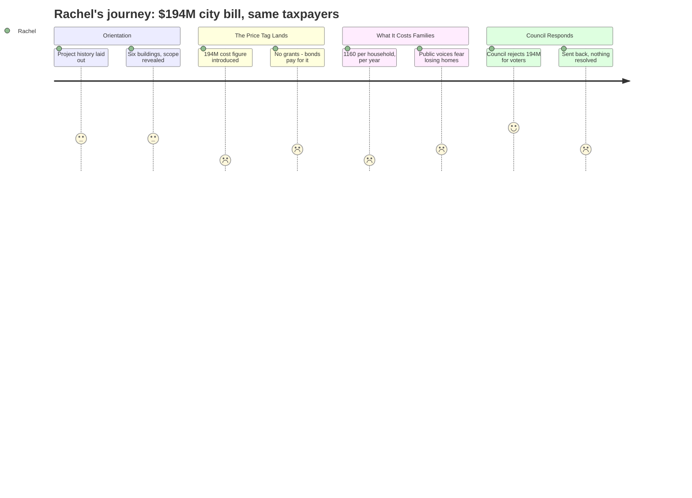

# Interpretation: Rachel (PERSONA-008)
## Meeting: City Council Regular Meeting -- January 13, 2026 -- 2026-01-13

### Structured Points

#### 1. The $194 Million Number Is Real — and It Will Land on Property Taxpayers
- **Fact:** The Mahoney City Center project — covering six buildings including the converted Mahoney school, a new police station, and a new central fire station — came in at an estimated $193–194 million total project cost. Committee chair Mike Halsey framed the council's guidance question specifically around "whether or not the unanticipated price tag of 194 million changes the direction the council wishes to take."
- **Source:** [00:22:26--00:22:34] (Halsey, committee guidance questions); [01:10:01--01:10:17] (Piper, cost summary)
- **Emotional valence:** negative
- **Threat level:** 4
- **Open question:** true — How much further could property taxes rise, stacked on top of what the school budget already requires?

#### 2. For the Average South Portland Homeowner, This Is $1,100+ a Year
- **Fact:** Finance Director Ellen Sanborn presented a scenario in which the city borrows $194 million at once, modeled against the average residential property value of $514,000. She stated the current tax rate of $13.65 per thousand would rise by $2.26, translating to roughly $1,160 in additional annual taxes for an average household in year one of the bond.
- **Source:** [01:30:39--01:30:55] (Sanborn, tax rate impact slide)
- **Emotional valence:** negative
- **Threat level:** 5
- **Open question:** true — When stacked against projected school tax increases to address the $7.2M structural gap, how many families in South Portland can actually absorb this combined burden?

#### 3. No Magic Grants — This Is Going on the Tax Bill
- **Fact:** Sanborn reviewed every potential funding source — federal grants, state grants, tax credits, fundraising, naming rights, TIF districts, and proceeds from selling vacated properties — and concluded that bonds paid by property taxpayers would be "the primary funding source." She explained that federal grants for building city halls essentially don't exist, and that most other tools would only help reduce debt service years after construction, not reduce the upfront $194M ask.
- **Source:** [01:19:45--01:21:25] (Sanborn, funding sources overview) and [01:29:35--01:29:55] (Sanborn, conclusion slide)
- **Emotional valence:** negative
- **Threat level:** 3
- **Open question:** false

#### 4. The Building at the Center of This Is a Former School — and Councilors Know It Personally
- **Fact:** The entire project pivots on converting the former Mahoney School building into consolidated city services. Councilor Matthews noted that his mother attended high school there and his children attended middle school there. Architect Craig Piper called Mahoney a building with "a second chapter" that "our grandkids will enjoy for hundreds of years." The committee's recommendation was presented as the best use of a structurally sound former school.
- **Source:** [03:51:25--03:52:10] (Matthews, personal remarks); [01:53:15--01:54:35] (Piper, case for preservation)
- **Emotional valence:** neutral
- **Threat level:** 2
- **Open question:** true — Why is a former school being repurposed for city services while the district serving current kids is cutting 42 teachers and 78 positions? What does it say about community priorities that the school building gets saved but the school budget doesn't?

#### 5. Most Councilors Refused to Send $194M to Voters — For Now
- **Fact:** Multiple councilors stated clearly they would not support sending a $194 million bond to referendum. Mayor Tipton called it "a non-starter for me." Councilor Matthews said "there's no way I'll send it to the voters" without changes. Even councilors who supported the project concept — like Councilor Walker — said the price tag requires a rethink before going to the ballot.
- **Source:** [03:36:05--03:36:15] (Tipton); [03:52:45--03:53:00] (Matthews); [03:34:05--03:34:20] (Walker)
- **Emotional valence:** positive
- **Threat level:** 1
- **Open question:** false

#### 6. Public Speakers Named the Real Risk: Families Losing Their Homes
- **Fact:** Multiple community members at the podium described the cumulative tax burden as unsustainable. One speaker, Jack Proposal, referenced the recent tax revaluation: "some of you witnessed people in tears right here at this podium, wondering how they were going to afford to keep their homes." He then listed the school athletic field bond, and this $194M project as compounding pressures on the same families. Ed Cobb noted his taxes had tripled over decades and said he "would never vote for this in a million years" at this price.
- **Source:** [02:21:15--02:22:25] (Jack Proposal); [02:13:25--02:14:05] (Ed Cobb)
- **Emotional valence:** negative
- **Threat level:** 4
- **Open question:** false

#### 7. Over $748,000 Already Spent — With More Committed Before Any Vote
- **Fact:** The city manager confirmed that approximately $748,000 of the $5 million allocated for design work has already been spent — from project inception through this meeting. If the council directs the design team to continue refining the Mahoney-only alternatives, SMRT estimated another $400,000–$500,000 or more would be needed before a June recommendation. All of this is sunk cost if the bond ultimately fails at referendum.
- **Source:** [00:26:07--00:26:15] (city manager, spending to date); [01:49:35--01:50:05] (Matthews/city manager exchange on continued spending)
- **Emotional valence:** negative
- **Threat level:** 2
- **Open question:** true — At what point does continued design spending become impossible to justify without a clear path to passage?

#### 8. Council Sent Everything Back — Nothing Decided Tonight
- **Fact:** After nearly four hours, the council's direction was: pause all work on police and fire; ask the design team and Mahoney committee to return by January 27th with three alternative Mahoney-only scenarios (full plan, without library, and a bare-bones version). No vote was taken. No bond amount was approved. Councilor Walker explicitly worried the delay risked missing the November 2026 referendum window, but the council determined it needed options before committing further.
- **Source:** [03:38:25--03:44:15] (council consensus discussion); [04:00:25--04:01:05] (Walker, referendum risk)
- **Emotional valence:** neutral
- **Threat level:** 2
- **Open question:** true — If the timeline slips past November 2026, what happens to the school budget in the meantime, and what does continued uncertainty mean for taxpayers already planning around potential increases?

---

### Journey Map

---

### Reactions

So I watched basically the whole city council meeting tonight — the one about the Mahoney project. Nearly four hours. And I know this isn't technically a school meeting, but I've been trying to understand the full picture of what's about to hit our taxes, because it's all connected. The headline is $194 million. That's what they're proposing to spend converting the old Mahoney school building into city hall, plus building a new police station in the field next to it, plus eventually a new fire station. The finance director got up and walked through every possible way to fund it — federal grants, state grants, naming rights, leasing out the auditorium — and basically concluded that none of it makes a meaningful dent upfront. It's going to be a general obligation bond, paid by property taxes, over thirty years. For the average house in South Portland, which they said is worth $514,000, that's over $1,100 a year in higher taxes, right away.

What got me, and I can't stop thinking about it: that building they're arguing over was a school. Councilor Matthews talked about how his mother went to high school there, how his kids went to middle school there. The architect called it a building that deserves "a second chapter." And I sat there thinking — a second chapter as city hall, while the district is cutting 42 teachers. The same community that can't fund its current schools is now being asked to spend $194 million to give city employees a new workspace in a building where previous generations of kids learned. I know the city facilities genuinely need work. I'm not saying nothing should happen. But the optics of that are really hard to sit with. And a man at the podium tonight pointed out exactly what I was thinking: this is the same taxpayers. The people at the revaluation two years ago who were crying at this very podium afraid they'd lose their homes — those are the same families the school is asking for more, the same families the city is asking for more, and now there's apparently a $50 million sewer upgrade coming too.

The one thing that kept me from completely spiraling: most of the council said no. Mayor Tipton literally called $194 million a "non-starter." Councilor Matthews said he'd never send it to voters at this price. They sent the architects back to come up with cheaper options — just the Mahoney building itself, not the police and fire — with three tiers including a bare-bones version. They want it back by January 27th. So nothing was decided tonight. They've already spent $748,000 just on design work, with more coming. And there's now a real risk they miss the November ballot entirely if this keeps getting reworked. I'm relieved the council pumped the brakes. But I also know that every month this drags out, the school budget question doesn't wait, and our kids' teachers aren't coming back while the city figures out what kind of lobby tiles it can afford.