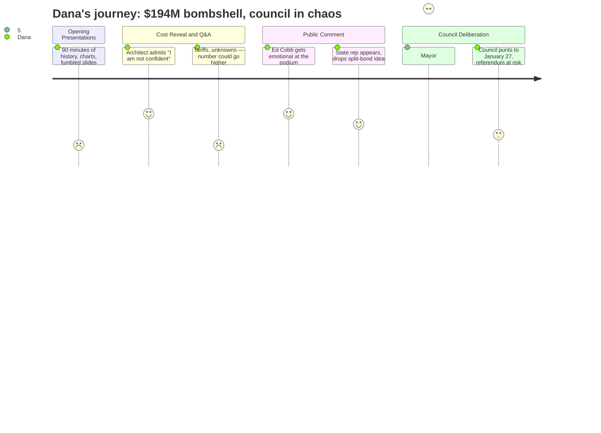

# Interpretation: Dana (PERSONA-009)
## Meeting: City Council Workshop -- January 13, 2026 -- 2026-01-13

### Structured Points

#### 1. The $194 Million Price Tag Lands — and Stuns the Room
- **Fact:** The Mahoney City Center project — consolidating city hall, library, police station, and fire station across six buildings — came in at $193–194 million, a figure described by committee chair Mike Halsey as "unanticipated" and by city manager Scott Morelli as "surprising even to the design team itself." The cost breakdown: roughly $70M for Mahoney/city hall, $14M in site work, $27M for police, $32M for fire.
- **Source:** [00:22:24–00:22:40] (Halsey presenting the two questions to council); [01:09:25–01:12:30] (Piper presenting cost breakdowns); [00:37:35–00:37:55] (Morelli: "even though the number was surprising, even to the design team itself")
- **Emotional valence:** negative
- **Threat level:** 4
- **Open question:** true — The architect explicitly said the number could go higher; no floor was established.

#### 2. The Architect Admits: "I Am Not Confident"
- **Fact:** When Councilor Matthews pressed architect Craig Piper directly — "how confident are you with the unknowns of the $193 [million]?" — Piper answered: "I am not confident, Dickie." His Colliers partner added that tariffs and fuel costs could drive the number up further, while noting the current bidding market is unusually favorable. Both said more design work (at a cost of hundreds of thousands more) is needed to tighten the estimate before a bond referendum.
- **Source:** [01:44:00–01:46:35] (Matthews questioning Piper; Piper's "I am not confident" statement; Colliers partner on market volatility and tariff risk)
- **Emotional valence:** negative
- **Threat level:** 5
- **Open question:** true — If the city bonds for $194M and costs rise, there is no clear mechanism to cover the gap short of a second referendum or project cuts mid-construction.

#### 3. Mayor Tipton Declares $194M "A Non-Starter"
- **Fact:** In the council deliberation segment, Mayor Tipton stated: "I will not agree to go to the ballot with $194 million bond issue. That is simply a non-starter for me." She proposed splitting the project sequentially — Mahoney-only phase first, public safety buildings later — arguing that a successful Mahoney bond would free up three other city-owned properties for sale, generating revenue to fund police and fire construction next.
- **Source:** [02:43:00–02:46:30] (Tipton council discussion; her phasing proposal)
- **Emotional valence:** negative
- **Threat level:** 4
- **Open question:** true — What number *would* pass muster with the mayor and enough voters? The council closed without agreeing on a target.

#### 4. Residents at the Mic: "I Might Have to Leave My Home"
- **Fact:** Multiple public speakers invoked the specter of longtime residents being priced out of South Portland. Ed Cobb (Romano Road) said his taxes had risen from $1,600/year in 1993 and projected they'd exceed $6,000 with this bond — and got visibly emotional at the podium. A separate speaker, Jack, described watching residents "in tears right here at this podium" during a prior property revaluation, warning fixed-income homeowners would not survive additional burden. First-time homebuyer Henry Silve (Second Street, bought his house in December) said an 18 percent tax increase already makes his purchase feel precarious.
- **Source:** [02:13:35–02:15:50] (Ed Cobb, Romano Road); [02:20:35–02:23:30] (Jack Proposal, 195 Walnut); [02:15:52–02:17:25] (Henry Silve, Second Street)
- **Emotional valence:** negative
- **Threat level:** 3
- **Open question:** false — Community sentiment is documented and on the record; it does not require resolution to be reportable.

#### 5. Social Worker: Police Station Next to City Hall Will Deter Immigrants and Communities of Color
- **Fact:** Olivia Montgomery, a clinical social worker and social work professor who lives on Ocean Street, told the council that co-locating the police station adjacent to the Mahoney City Center would cause "the immediate disenfranchisement of large portions of our immigrant community and communities of color" who would avoid accessing city services — including voting — because of police proximity. She explicitly praised the South Portland PD's stated commitment to not cooperating with ICE while arguing that proximity alone would undo that goodwill.
- **Source:** [01:56:43–01:58:17] (Olivia Montgomery, Ocean Street, public comment)
- **Emotional valence:** negative
- **Threat level:** 3
- **Open question:** true — The council never directly responded to this concern during deliberations; the police station's placement remains unresolved within the phasing discussion.

#### 6. A State Representative Showed Up and Suggested Splitting the Bond
- **Fact:** Chris Kessler, identified as a Maine state representative who lives on Stanley Street, appeared during public comment. He endorsed the Mahoney concept but urged the council to consider splitting the bond referendum — Mahoney as one question, police and fire as another — to give voters modular choices. He also warned that local option sales tax legislation (which the finance director identified as the best possible funding offset) is "extremely difficult" to pass given partisan gridlock in Augusta.
- **Source:** [02:24:28–02:26:55] (Chris Kessler, Stanley Street, public comment; his split-bond proposal and local option sales tax warning)
- **Emotional valence:** neutral
- **Threat level:** 2
- **Open question:** true — The state rep's split-bond idea was not formally adopted; the council's own deliberation ended with a directive to focus only on Mahoney alternatives, leaving the police/fire phasing unsettled.

#### 7. Council Pumps the Brakes — Design Work on Police and Fire Stops Now
- **Fact:** After extended deliberation, a council majority directed the design team to cease further work on the police station and fire station components and instead bring back multiple scaled-down options for the Mahoney building alone — to the full Mahoney committee by January 27. Councilor Walker explicitly warned that delay risks missing the 2026 November referendum window entirely.
- **Source:** [03:28:00–03:31:00] (Council directing pause on police/fire: "Can we agree as a council… to ask the team not to do anything more on the police and fire until the matter comes back to us?"); [03:05:37–03:05:55] (Walker on referendum deadline risk)
- **Emotional valence:** neutral
- **Threat level:** 3
- **Open question:** true — The design team indicated it can bring back alternatives, but warned that stripping major scope may compound unknowns rather than reduce them; the January 27 Mahoney committee meeting becomes the next pressure point.

### Journey Map

### Reactions

The lede is the architect. Craig Piper, South Portland resident, designed the whole thing — when Councilor Matthews asked him straight up how confident he was in the $193 million number, Piper just said, "I am not confident, Dickie." That's at roughly the one-hour-forty-five-minute mark. And that's the segment: roll that clip, cut to Mayor Tipton at around two-forty-three calling $194 million "simply a non-starter," and you've got two lines from the same meeting that tell the whole story. The anchor intro basically writes itself — city hires firm to design $194 million civic complex, firm says it can't vouch for its own estimate, mayor calls it dead on arrival. We might get two minutes on this one.

Best human story from public comment is Ed Cobb on Romano Road — been there since 1993, taxes were $1,600 when he moved in, now looking at over $6,000 if this passes, and he basically said he'd have to leave. He said he was getting emotional and you could hear it in his voice. I also want to talk to Henry Silve — just bought his first home in December, showed up to say this makes it nearly impossible for young people to put down roots. You've got both ends: the old-timer who built his whole life in South Portland, and the young couple who just got in the door. Those are your two walk-and-talks. B-roll: residential street in South Portland, mixed-age neighborhood, for-sale signs. The social worker who said the police station placement will deter immigrants from accessing city services is the more challenging angle — less visual, more editorial — but if the council ever moves on that, that clip from Olivia Montgomery is already in the can.

Here's what I want to flag for budget season: this $194 million is landing on top of a school budget that's projecting an 18-to-19 percent property tax increase and 42 teacher layoffs. Nobody in that chamber said both numbers out loud in the same sentence, but they're hitting the same property tax bill. That's the story I want to hold for when the school board goes back to referendum — find a homeowner who can talk about both at once, because that's when this gets impossible to ignore for viewers. For now: the January 27 Mahoney committee meeting is a phone call, not a crew. The real trigger for a follow-up crew is the June council vote on whether to send anything to referendum at all.