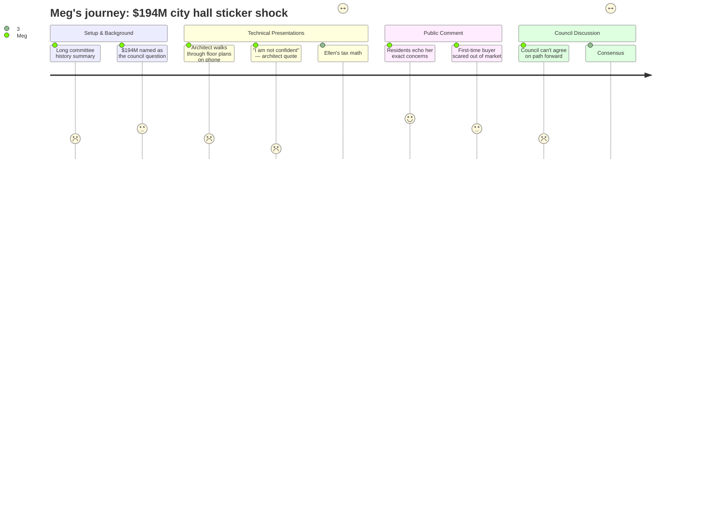

# Interpretation: Meg (PERSONA-011)
## Meeting: City Council Workshop — January 13, 2026 — 2026-01-13

### Structured Points

#### 1. The $194 Million Price Tag
- **Fact:** The Mahoney City Center committee recommended a project combining a new police station, a rebuilt central fire station, and a consolidated city hall and library — all at an estimated $194 million. Committee chair Mike Halsey described the price as "unanticipated" and asked the council directly whether that number "changes the direction the council wishes to take on this project."
- **Source:** Transcript [00:22:27–00:22:43], Mike Halsey presentation
- **Emotional valence:** negative
- **Threat level:** 4
- **Open question:** true

#### 2. The Tax Math on an Average Home
- **Fact:** Finance Director Ellen Sanborn presented a tax impact scenario: the current tax rate is $13.65 per thousand. Borrowing the full $194 million immediately would add $2.26 per thousand — roughly $1,162 per year on a home assessed at the city average of $514,000. Sanborn was clear this is a worst-case scenario and phasing would reduce the hit.
- **Source:** Transcript [01:30:19–01:30:55], Ellen Sanborn presentation
- **Emotional valence:** negative
- **Threat level:** 4
- **Open question:** true

#### 3. The Architect Said He's "Not Confident" in the Number
- **Fact:** When Councilor Matthews asked Craig Piper (SMRT Architects) directly how confident he was in the $193 million estimate, Piper replied: "I am not confident." He cited ongoing unknowns including poor soil conditions at the former dump site, structural reinforcement requirements in the 1925 Mahoney building, and construction escalation risk. The project is currently at only 5% design completion.
- **Source:** Transcript [01:44:52–01:46:40], Councilor Matthews Q&A
- **Emotional valence:** negative
- **Threat level:** 3
- **Open question:** true

#### 4. Doing Nothing Would Also Cost $153–154 Million
- **Fact:** SMRT presented a comparison: renovating all six affected buildings in place (without Mahoney consolidation) would cost approximately $153–154 million in construction plus soft costs. The presenter cautioned this estimate is higher-level and comes with practical limitations like no parking at an expanded city hall.
- **Source:** Transcript [00:43:36–00:45:11], Craig Piper presentation
- **Emotional valence:** neutral
- **Threat level:** 2
- **Open question:** false

#### 5. Police and Fire Are in Worse Shape Than Most People Know
- **Fact:** City Facilities Director Dawn Hopkins stated that police and fire are "definitely the highest priority" and "in worst condition the city has." Fire Chief confirmed the current central station has flooding issues in the basement, no decontamination facility, no drive-through bays, and is a 1950s-era building still operating as a 1950s building. Attendees who toured the building in the building crawl were consistently shocked.
- **Source:** Transcript [03:31:45–03:33:55], Dawn Hopkins; [03:28:00–03:29:00], Fire Chief
- **Emotional valence:** negative
- **Threat level:** 3
- **Open question:** false

#### 6. Council Won't Send $194M to Voters — Scaled-Back Mahoney-Only Version Is Coming
- **Fact:** Every councilor who spoke said $194 million is not viable as a bond question. The rough consensus: pause all work on police and fire, bring back three Mahoney-only cost options to the January 27 committee meeting — version as proposed, version without the library addition, and a bare-bones version. The council must decide by early August to make the November ballot.
- **Source:** Transcript [02:34:00–03:41:00], council discussion; "you have to make that decision in July, early August so that it can get on the ballot" [01:51:13–01:51:39]
- **Emotional valence:** neutral
- **Threat level:** 2
- **Open question:** true

#### 7. Dog Hours at Willard Beach: Proposal Failed
- **Fact:** Councilor Coleman requested a workshop to change Willard Beach off-leash hours from the current May 1–September 30 window back to Memorial Day–Labor Day, and to allow dog toys from Beach Street to Fort Preble. The request received only two council votes and failed to advance.
- **Source:** Transcript [03:55:00–04:01:20], workshop proposal section
- **Emotional valence:** negative
- **Threat level:** 1
- **Open question:** false

---

### Journey Map

---

### Reactions

Ok I watched the whole thing. Main story: the city is proposing a $194 million project to consolidate city hall, the library, a new police station, and a rebuilt fire station at the Mahoney site. That's the number. Finance director confirmed it would add **$2.26 per thousand** to the tax rate — on a home assessed at $514K (that's the city average they used), that's about **$1,162 more per year**. She was careful to say that's if you borrow it all at once, which probably won't happen, but that's the baseline. The slides are attached to the city meeting packet on BoardDocs if anyone wants the specifics.

Here's the thing I wanted to nail down before posting: someone at the meeting asked the architect directly how confident he was in the $193M figure. His answer, verbatim: **"I am not confident."** He said they're only at 5% design — the building is sitting on an old dump with unknown soil conditions, and the 1925 masonry structure needs structural reinforcement they haven't fully scoped yet. So yes, the number could go up. Also worth knowing: SMRT showed that renovating all the same buildings on their current sites would cost **$153–154 million** anyway — so the "just fix what we have" option isn't dramatically cheaper and comes with parking problems.

No one on the council is sending $194M to voters. Multiple councilors said some version of "not going to happen." The actual outcome tonight: pause work on police and fire, bring back Mahoney-only options (with or without the library, and a bare-bones version) to the **Mahoney committee meeting January 27**. They have to decide by early August if it goes to a November vote. Keep this in mind alongside the school budget situation — that's a separate set of numbers that are also still unresolved, and the school tax is already 61% of what we pay in property taxes. Both of these are moving at the same time. Also: the dog-hours-at-Willard-Beach proposal didn't get enough council votes to even schedule a workshop, in case anyone was hoping for that one.