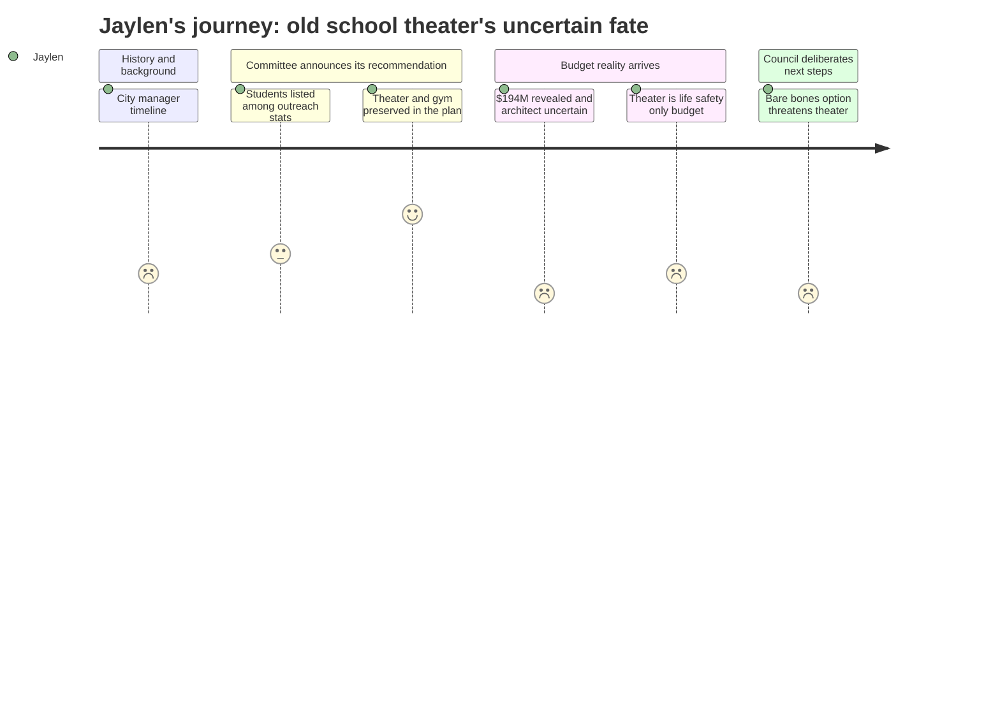

# Interpretation: Jaylen (PERSONA-012)
## Meeting: City Council Workshop — January 13, 2026 — 2026-01-13

### Structured Points

#### 1. Committee voted to keep the theater and gym — because of "public input"
- **Fact:** The Mahoney City Center Committee chose the most expensive of three design options — the one preserving both the theater and gymnasium — over cheaper alternatives that dropped one or both. The chair stated the committee selected it specifically because of "significant public input supporting the preservation of the theater and gymnasium."
- **Source:** [00:21:28--00:21:46] Mike Halsey, Mahoney Committee Chair
- **Emotional valence:** positive
- **Threat level:** 2
- **Open question:** true

#### 2. "Dozens of high school and middle school students" — one bullet in a list of fourteen
- **Fact:** Among fourteen community outreach statistics the committee chair presented — including 380 email subscribers, 526 survey respondents, 19 news flash posts, and 25 FAQ items — student engagement was listed as a single line: "dozens of high school and middle school students provided input."
- **Source:** [00:20:36--00:20:38] Mike Halsey, Mahoney Committee Chair
- **Emotional valence:** neutral
- **Threat level:** 1
- **Open question:** true

#### 3. The $194 million price tag has the council looking for an exit
- **Fact:** When asked directly how confident he was in the $194 million estimate, the project architect replied: "I am not confident." Multiple councilors stated they would not send that number to voters. The city manager described the price as "surprising, even to the design team itself."
- **Source:** [01:44:34--01:46:25] Craig Piper (SMRT Architects) responding to Councilor Matthews; [00:37:37--00:37:45] Scott Morelli, City Manager
- **Emotional valence:** negative
- **Threat level:** 4
- **Open question:** true

#### 4. The theater renovation budget covers "life safety only" — not a real upgrade
- **Fact:** The architect specified that the theater's renovation scope was deliberately "targeted at the lower end," covering only life safety code requirements, accessible seating, a handful of new lights, and airflow improvements. He acknowledged renovating a theater "can be a big gap" and that they chose not to close it.
- **Source:** [01:08:23--01:08:32] Craig Piper, SMRT Architects
- **Emotional valence:** negative
- **Threat level:** 2
- **Open question:** true

#### 5. Council's "bare bones" discussion explicitly puts the theater and gym at risk
- **Fact:** During deliberations on reducing project costs, Councilor Pride explicitly named "without an update to the gym and auditorium" as one scenario for the design team to price out, alongside options that remove the library or reduce the overall scope. The council directed the team to return with stripped-down Mahoney alternatives before any further spending on design.
- **Source:** [04:00:55--04:01:11] Councilor Pride; [03:37:00--04:05:49] Council deliberation section
- **Emotional valence:** negative
- **Threat level:** 5
- **Open question:** true

#### 6. The November referendum: the community decides — but Jaylen cannot vote
- **Fact:** The full project, if approved by council, would go to a voter bond referendum in November 2026. The committee chair stated this was a requirement for any general obligation bond of this magnitude, and the city manager confirmed voter approval is mandatory under the city charter.
- **Source:** [00:18:26--00:18:31] Mike Halsey; [00:26:37--00:26:52] Scott Morelli, City Manager
- **Emotional valence:** negative
- **Threat level:** 2
- **Open question:** false

#### 7. A community member raised the police-proximity problem — the council did not engage with it
- **Fact:** Olivia Montgomery, who identified herself as a clinical social worker and professor, argued at the public comment podium that placing a police station immediately adjacent to city services would prevent immigrant communities and communities of color from accessing those services — and potentially from voting at the site. No councilor substantively responded to this concern during the subsequent discussion.
- **Source:** [01:56:19--01:57:43] Olivia Montgomery, public comment
- **Emotional valence:** neutral
- **Threat level:** 1
- **Open question:** true

---

### Journey Map

---

### Reactions

So basically, you know that old Mahoney School building on Broadway — the one that's been empty forever? The city has been doing this whole process trying to figure out what to do with it. The plan is to turn it into a new city hall with the library inside, and put a new police station and fire station on the property too. There's been this committee working on designs for months, and last night they had a big workshop with the city council. I watched part of it because I heard they were deciding about the theater and the gym. And actually — the committee picked the option that keeps both. They said the reason was "significant public input." They even listed "dozens of high school and middle school students" as part of the community outreach. So in theory our voices got included. Which, okay, fine. I'm in that list somewhere between the 526 people who filled out a survey and the 19 news flash posts on the project website.

Except the rest of the meeting was basically everyone panicking about money. The whole project — Mahoney, new police building, new fire station, the library, everything — comes out to $194 million. And when a councilor pushed the architect and asked how confident he actually was in that number, the guy literally said "I am not confident." So the number that's already scaring everyone might actually be even bigger. And here's what got me: even in the version the committee approved — the good version, the one with the theater — the renovation budget for the theater is basically just enough to keep it from being a fire hazard. The architect said they went with "the lower end," covering life safety requirements and some accessible seating and a handful of new lights. Not like a real theater upgrade. And by the end of the night, councilors were talking about a "bare bones" approach to cutting costs that would specifically skip doing anything to the theater or gym. So the thing the committee voted to preserve might just get stripped out anyway once the money stuff gets sorted out.

The whole project goes to a voter referendum in November. The community decides. I'll be 17. I can't vote. There was also this woman who came up during public comments — she's a social worker — and she said that putting a police station right next to city hall is going to scare off immigrant families and communities of color from using the building, maybe even from voting there when it becomes a polling place. It was honestly the most real thing anyone said all night, and none of the councilors actually addressed it when they started their discussion. That stuck with me. Four hours of parking lot stormwater calculations and TIF financing and "soft cost ratios," and something like that gets three minutes and then they move on. I've testified at a board meeting before and this felt like that — you show up, your input gets counted in a bullet point somewhere, and then the real decisions happen in a room where you're not invited.