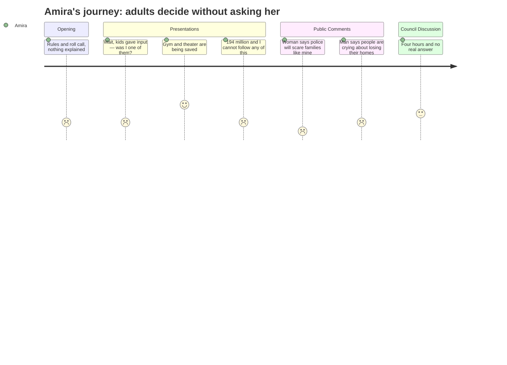

# Interpretation: Amira (PERSONA-013)
## Meeting: City Council Regular Meeting -- January 13, 2026 -- 2026-01-13

### Structured Points

#### 1. They said kids gave input — but which kids?
- **Fact:** The Mahoney committee chair reported that "dozens of high school and middle school students provided input" as part of the project's community outreach efforts.
- **Source:** [00:20:36–00:20:37]
- **Emotional valence:** negative
- **Threat level:** 2
- **Open question:** true

#### 2. A police station next to city hall could keep immigrant families away
- **Fact:** Community member Olivia Montgomery, introduced as a clinical social worker and social work professor, warned the council that placing a new police station adjacent to the city center would "immediately disenfranchise large portions of our immigrant community and communities of color who simply will not access" city services because of police proximity. She also specifically praised South Portland PD's "commitment to not working with ICE."
- **Source:** [01:56:43–01:58:17]
- **Emotional valence:** negative
- **Threat level:** 5
- **Open question:** true

#### 3. The gym and theater are being kept — at least for now
- **Fact:** The Mahoney committee voted in December to choose the option preserving both the theater and the gymnasium, even though it cost 2.6% more than tearing them out, citing "significant public input supporting the preservation" of those community spaces.
- **Source:** [00:21:22–00:21:46]
- **Emotional valence:** positive
- **Threat level:** 1
- **Open question:** false

#### 4. This project would add over a thousand dollars a year to property taxes
- **Fact:** City Finance Director Ellen Sanborn described a worst-case scenario in which borrowing the full $194 million immediately would raise the tax rate by $2.26 per thousand, adding roughly $1,152 per year to a typical homeowner's bill on top of existing taxes. Multiple public speakers cited this number at the microphone.
- **Source:** [01:30:26–01:30:51]; public comment [02:21:25–02:21:57]
- **Emotional valence:** negative
- **Threat level:** 3
- **Open question:** false

#### 5. Long-time residents said they might lose their homes over taxes
- **Fact:** A speaker at the microphone described people showing up to a previous city council meeting "in tears" over property tax increases, warning that residents born and raised in South Portland could be forced to sell and leave. A separate speaker said his own taxes had effectively doubled since 1993 and were heading past $6,000 a year.
- **Source:** [02:20:41–02:22:00]; [02:13:00–02:13:25]
- **Emotional valence:** negative
- **Threat level:** 3
- **Open question:** true

#### 6. The architect admitted he's "not confident" in the $193 million price tag
- **Fact:** When Councilor Matthews directly asked how confident the design team was in the estimate, architect Craig Piper replied: "I am not confident." He cited unknowns including soil conditions, tariffs, and structural surprises in the building, and said more work would be needed before June.
- **Source:** [01:45:34–01:46:08]
- **Emotional valence:** neutral
- **Threat level:** 2
- **Open question:** true

#### 7. Schools never came up — not once in four hours
- **Fact:** The entire workshop was focused on converting a former school building (Mahoney) into city offices, police station, and fire station. The school district, school budgets, school programs, and student needs were not mentioned at any point in the agenda, presentations, or public comment.
- **Source:** Agenda (full meeting scope); workshop topics as announced by the mayor [00:01:26–00:01:48]
- **Emotional valence:** negative
- **Threat level:** 2
- **Open question:** true

### Journey Map

### Reactions

So I watched like two hours of this before I had to stop, and the part I keep thinking about is when this woman got up — she said she was a social worker — and she told the council that if they put the police station right next to city hall, people from immigrant communities just won't go there. Like they will physically avoid the building. She even said she was glad South Portland police promised not to work with ICE. I kept thinking about Hooyo. Would she be scared to go pay a water bill or whatever if a police station is right outside? Probably. And the council basically just... kept talking about parking. Nobody said "wait, you're right, that's a real problem." They just moved on. That felt so wrong to me.

The other thing is they said "dozens of middle school and high school students gave input" on this Mahoney project. Which students? Nobody at Memorial ever told me I could do that. I've never heard of it. Did they go to one school? Did they just ask the kids who sign up for everything anyway? Because I care about this stuff, and I didn't know it was happening, and neither did anyone I talked to. They keep saying it was a community process but it feels like they mean a specific part of the community.

I couldn't follow most of the money stuff, honestly. There was so much — one-ninety-four million, thirty-two million for fire, twenty-seven million just for a police station — but I kept thinking about how Baba was stressed about property taxes last month. This woman at the microphone said people literally cried at a city meeting because they couldn't afford their houses anymore, and another man said his taxes had like doubled since he moved here. And then the finance director said this project could add over a thousand dollars more every year. For four hours they talked about old buildings and numbers I don't understand. Schools came up zero times. They're turning an old school into city offices and nobody mentioned the schools that are still open and still have kids in them. That part felt really lonely.