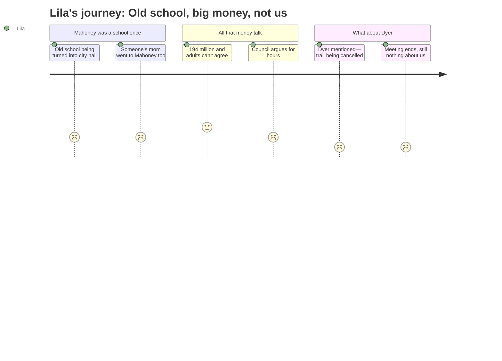

# Interpretation: Lila (PERSONA-014)
## Meeting: City Council Regular Meeting -- January 13, 2026 -- 2026-01-13

### Structured Points

#### 1. Dyer School Gets Mentioned — But Only Because Something Is Being Cancelled
- **Fact:** Near the end of the meeting, the city manager noted that the bike-ped committee had previously asked for a workshop to acquire land rights for a formal trail from Bonnie Brooks Terrace to Dyer School — and that the committee was now asking for that item to be removed from the workshop list entirely.
- **Source:** Transcript [04:01:33–04:01:52]
- **Emotional valence:** negative
- **Threat level:** 3
- **Open question:** true — Why is the trail to Dyer being removed? Does this mean something is changing at the school? Does it mean it won't be there much longer?

#### 2. Mahoney Used to Be a School — and Then It Closed
- **Fact:** The entire meeting centered on the old Mahoney school building, which closed as a school years ago and has sat empty. Councilor Matthews told the council: "My mom went to high school there. I went to elementary, middle school there. My children went to middle school there." The architect also noted that "when it was a school, there was a different use" of the building's parking and entrances.
- **Source:** Transcript [02:51:28–02:51:41]; [00:46:11–00:46:15]
- **Emotional valence:** negative
- **Threat level:** 4
- **Open question:** true — Is this what happens to schools after they close? Will Dyer sit empty for years and then get turned into something else while people argue about what to do with it?

#### 3. Adults Spent Four Hours on Mahoney — Zero Minutes on School Closures
- **Fact:** The two official workshop topics were the Mahoney City Center project and Housing Ordinance Updates (which wasn't reached). In over four hours of presentations, public comment, and council debate, no speaker — resident, councilor, or staff — mentioned the school budget, the proposed closure of Dyer Elementary, or where displaced students would go.
- **Source:** City Council Agenda — January 13, 2026; transcript throughout
- **Emotional valence:** negative
- **Threat level:** 5
- **Open question:** true — If the people who run the city spent an entire evening on an old school building but said nothing about what's happening to children at Dyer right now, does anyone know? Does anyone care?

#### 4. Someone Asked to Protect the Old Fire Station Because It "Gives People a Sense of Place"
- **Fact:** A member of the Historic Preservation Committee asked the council to schedule a workshop to prevent the demolition of Central Fire Station, built in 1955. He described it as "a beautiful historic building in a highly visible location" that "gives residents a sense of place and history and is worthy of preservation," and formally requested "that this city does not demolish the original 1955 fire station building."
- **Source:** Transcript [03:49:55–03:51:05]
- **Emotional valence:** negative
- **Threat level:** 2
- **Open question:** true — Adults are fighting to preserve a building because it's part of where they come from. Who is going to say that about Dyer — that it gives kids a sense of place, that it's worthy of preservation?

#### 5. The Architect Said This Is an Investment "Our Grandkids Will Enjoy for Hundreds of Years"
- **Fact:** Architect Craig Piper, making the case for the Mahoney renovation, told the council: "We are investing in an asset that the community has and will enjoy, our grandkids will enjoy for hundreds of years."
- **Source:** Transcript [02:54:33–02:54:53]
- **Emotional valence:** negative
- **Threat level:** 2
- **Open question:** true — The adults kept talking about future kids and grandkids enjoying this building. Are Lila and her classmates part of that future? Is anyone investing in something for them?

#### 6. The Adults Couldn't Agree on Anything and the Meeting Went Until Midnight
- **Fact:** After nearly three hours of presentations and public comment, the council gave sharply conflicting responses to the Mahoney committee's two questions. Councilor Walker fully supported the $194 million plan; the mayor called it "a non-starter" at that price; Councilor West proposed stripping out the library and police station; Councilor Scott wanted a "bare bones" version. They ended without a vote, directing the committee and design team to return with revised scenarios by January 27th.
- **Source:** Transcript [02:32:00–03:44:00]
- **Emotional valence:** negative
- **Threat level:** 3
- **Open question:** true — If adults can't figure out what to do about an old empty building after years of planning, how are they going to figure out what happens to Dyer kids before next fall?

---

### Journey Map

---

### Reactions

Okay so my parents went to that long city meeting last night. Like FOUR HOURS long — they didn't get home until almost midnight. I heard them come in so I went to the top of the stairs and asked my mom right away if they talked about Dyer. She said not really. But then I made her tell me everything and she said they DID say Dyer once, and I was like WHAT, TELL ME. And she said it was about a bike path that was supposed to go to our school, except now they're not doing it anymore, they cancelled it. So the one time our school got mentioned at this big important meeting it was to say something was being taken away. That felt really bad.

The whole meeting was about this old building called Mahoney. It used to be a school a really long time ago and then it closed and it's just been empty. And now they want to spend a hundred and ninety-four million dollars to turn it into city hall and a library and stuff. My dad said that's more money than you can even count and people were fighting about it the whole time because some people thought it was too much. This one guy at the meeting — he's actually an architect who lives here — said the building is for "our grandkids to enjoy for hundreds of years." And I was just like, okay, but what about ME. What about my class. Nobody said anything about that.

The thing I keep thinking about is someone got up and asked the city to protect this old fire station because it's, like, beautiful and part of where people are from, and they don't want to knock it down. And I thought — that's how I feel about Dyer. That's MY place. My brother is in first grade there. I've been there since kindergarten. I know which bathroom doesn't have the weird smell and which lunch table is by the window. And nobody at that whole meeting — not one single person — said anything like that about Dyer or about where we're going to go.