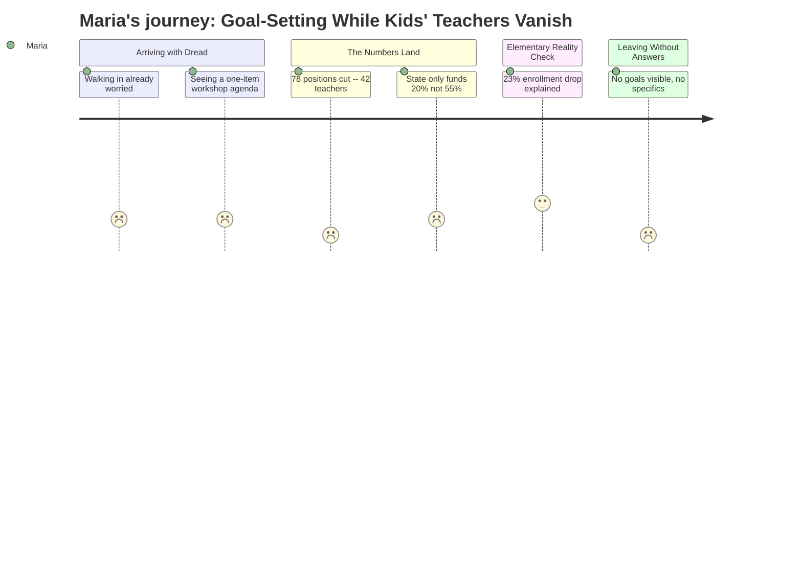

# Interpretation: Maria (PERSONA-001)
## Meeting: City Council Regular Meeting -- January 15, 2026 -- 2026-01-15

---

### Structured Points

#### 1. This Was a Goal-Setting Workshop — Not a Budget Hearing
- **Fact:** The January 15 meeting was a City Council goal-setting workshop, not a school board session or budget vote. The entire public agenda consisted of one item — an annual goal-setting discussion — with an attachment that was not published in the available materials.
- **Source:** City Council Goal Setting Workshop Agenda — January 15, 2026 [agenda]
- **Emotional valence:** negative
- **Threat level:** 3
- **Open question:** true — Did the city council's goals include any explicit commitment to school funding or property tax relief? Maria cannot tell from the public agenda.

---

#### 2. 42 Teachers on the Chopping Block
- **Fact:** The proposed FY27 budget includes the elimination of 42 teaching positions — the largest single category among 78 total staff cuts representing 12% of the entire workforce.
- **Source:** Fiscal Context — FY27 budget figures
- **Emotional valence:** negative
- **Threat level:** 5
- **Open question:** true — Which schools? Which grade levels? Are any of those 42 teachers at her children's school? The fiscal summary provides no school-by-school breakdown.

---

#### 3. Ed Techs and Support Staff Also on the List
- **Fact:** Beyond teachers, 16 ed tech positions are proposed for elimination, along with 14 facilities, food, and transportation roles.
- **Source:** Fiscal Context — FY27 budget figures
- **Emotional valence:** negative
- **Threat level:** 4
- **Open question:** true — Ed techs in South Portland schools frequently support students with IEPs and learning differences. Eliminating 16 positions could directly affect which children receive one-on-one support in Maria's children's classrooms.

---

#### 4. State Funding Is Covering Less Than Half of What It Should
- **Fact:** State funding currently covers approximately 20% of actual school costs. By the district's own reckoning, it should be covering 55% — meaning the state is effectively under-delivering by roughly $15–16M annually, based on the overall budget scale.
- **Source:** Fiscal Context — FY27 budget figures
- **Emotional valence:** negative
- **Threat level:** 4
- **Open question:** true — Who is responsible for closing this gap, and has the city council or school board formally demanded corrective action from state legislators?

---

#### 5. Elementary Enrollment Has Fallen 23% in Four Years
- **Fact:** Elementary enrollment dropped from 1,401 to 1,080 students over four years — a loss of 321 students, or 23%.
- **Source:** Fiscal Context — FY27 budget figures
- **Emotional valence:** neutral
- **Threat level:** 3
- **Open question:** true — For Maria this cuts two ways. It partially explains why cuts are coming, but it also raises an alarm: if the community is that much smaller, what's happening to the neighborhood? And does a declining enrollment justify eliminating specialist teachers (art, music, PE) who serve all remaining kids?

---

#### 6. South Portland Spends More Per Pupil Than Any Comparable District
- **Fact:** The per-pupil cost is $26,651 — described as the highest among comparable districts.
- **Source:** Fiscal Context — FY27 budget figures
- **Emotional valence:** negative
- **Threat level:** 3
- **Open question:** true — Maria would immediately wonder: does "highest per-pupil cost" mean programs are well-funded, or does it mean administrative bloat? She would want to know how Scarborough or Cape Elizabeth spend their money differently — and whether those districts are cutting teachers too.

---

#### 7. The Fund Balance Is Gone — No Soft Landing Available
- **Fact:** The district's fund balance (its savings reserve) is essentially depleted, meaning there is no financial cushion to phase in cuts gradually or absorb a one-time shortfall.
- **Source:** Fiscal Context — FY27 budget figures
- **Emotional valence:** negative
- **Threat level:** 4
- **Open question:** false — This is a clear, alarming fact. The implication for Maria: if the cuts happen, they happen all at once. There is no "we'll restore positions next year." Whatever is cut in FY27 is gone.

---

### Journey Map

---

### Reactions

Okay so I went tonight, and honestly? I almost didn't. It wasn't even a real budget meeting — it was some kind of city council goal-setting thing, one item on the whole agenda, with an "attachment" that wasn't posted anywhere I could find. So we just sat there while they did... whatever that was. I still have no idea what goals they actually set. And meanwhile, I *know* from everything that's been circulating that they're looking at cutting 42 teachers. Forty-two. I just keep thinking about Mrs. D and whether she's one of them, and I can't even find out because nobody's saying which schools get hit.

The number that really got me — and I texted Jenn about this on the way home — is that the state is only covering 20% of school costs when it's supposed to be covering 55%. Fifty-five percent! So where has that money been going? Because if it were actually coming to South Portland, we probably wouldn't be here. That's not a school board failure, that's Augusta failing our kids, and I don't hear anyone talking about that loudly enough. I also looked up what Scarborough and Cape Elizabeth spend per student, because of course I did, and now I have more questions than answers because apparently we're the highest, and I don't know if that means our programs are actually good or if it means there's money going somewhere weird.

The thing keeping me up right now is the ed techs. They want to cut 16 of them. Those aren't teachers you can kind of replace with a bigger class size. Those are the adults who sit next to the kids who need extra help, the ones my kids' friends with IEPs rely on every single day. And the savings reserve is gone — there's nothing to ease this in. Whatever happens this spring just... happens. I'm going to post in the group tomorrow and see if anyone else has more details, but tonight I feel like I went to a meeting and watched people make plans in a room I wasn't allowed into.