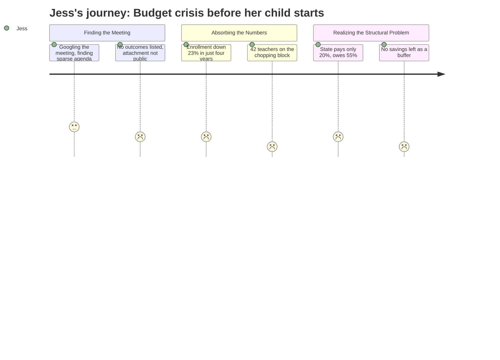

# Interpretation: Jess (PERSONA-jess)
## Meeting: City Council Goal Setting Workshop — January 15, 2026

### Structured Points

#### 1. 42 teachers proposed for elimination
- **Fact:** Of 78 total positions flagged for cuts, 42 are teachers — the single largest category in a proposed 12% reduction of all district staff.
- **Source:** Fiscal Context / FY27 Budget Overview
- **Emotional valence:** negative
- **Threat level:** 5
- **Open question:** true

#### 2. Elementary enrollment down 23% in four years
- **Fact:** Elementary enrollment fell from 1,401 students to 1,080 between the prior four-year period — a decline of over 300 students, or nearly one in four kids.
- **Source:** Fiscal Context / FY27 Budget Overview
- **Emotional valence:** negative
- **Threat level:** 4
- **Open question:** true

#### 3. Fund balance essentially depleted — no cushion remains
- **Fact:** The district's reserve savings have been spent down and cannot absorb further shocks or bridge gaps in the coming years.
- **Source:** Fiscal Context / FY27 Budget Overview
- **Emotional valence:** negative
- **Threat level:** 4
- **Open question:** false

#### 4. State covers only 20% of costs — should be covering 55%
- **Fact:** State education funding covers roughly 20% of actual per-pupil costs in South Portland, against a target of 55% — leaving a structural shortfall that the city alone cannot close.
- **Source:** Fiscal Context / FY27 Budget Overview
- **Emotional valence:** negative
- **Threat level:** 4
- **Open question:** true

#### 5. Board capped tax increase at 6%, forcing $7.2M in cuts
- **Fact:** A status-quo budget would require an 18–19% property tax increase; the board imposed a 6% ceiling, creating a ~$7.2M gap that must be eliminated through reductions.
- **Source:** Fiscal Context / FY27 Budget Overview
- **Emotional valence:** neutral
- **Threat level:** 3
- **Open question:** true

#### 6. Per-pupil cost is the highest among comparable districts
- **Fact:** South Portland spends $26,651 per student — the highest among comparable districts — a figure cited in the budget discussion without clarity on whether it reflects program quality or structural inefficiency.
- **Source:** Fiscal Context / FY27 Budget Overview
- **Emotional valence:** neutral
- **Threat level:** 2
- **Open question:** true

#### 7. Meeting was goal-setting only — no decisions, no attachment content visible
- **Fact:** The published agenda for this City Council workshop contains a single discussion item ("Annual Goal-Setting Session") with a noted attachment, but no agenda detail, no action items, and no disclosed outcomes.
- **Source:** City Council Goal Setting Workshop Agenda, January 15, 2026
- **Emotional valence:** negative
- **Threat level:** 3
- **Open question:** true

---

### Journey Map

---

### Reactions

So I finally went down the rabbit hole on this South Portland school budget stuff that someone shared in my moms' Facebook group, and honestly I kind of wish I hadn't because now I can't stop thinking about it. They are talking about cutting *forty-two teachers*. Forty-two. My daughter starts kindergarten in two years and the district is planning to eliminate 12% of its staff. I have no idea which grades, which schools, which programs — the agenda from this January meeting was literally one line that said "Annual Goal-Setting Session" with an attachment I can't even read. So they had this whole city council workshop and I don't know what goals they set or what they decided.

The enrollment number is what really got me though. Elementary enrollment dropped from 1,401 kids down to 1,080 in four years. That's 300 kids just... gone. I keep running the math in my head — if the district keeps shrinking at that rate, what does it look like when Mia's class actually shows up? Are they going to close her neighborhood school? Are they going to consolidate? Nobody is saying anything about that and this feels like exactly the kind of decision that gets made quietly and then by the time you find out it's already done.

The thing that made me genuinely angry is that apparently the *state* is supposed to be covering 55% of per-pupil costs and it's only covering 20%. That's not a South Portland problem, that's Augusta completely abandoning these schools, and somehow the city is absorbing the hit with a property tax that's already 61% of the whole tax bill. I'm sitting here trying to figure out if we should stay in South Portland long-term and the answer I'm getting is: the people making decisions right now are choosing between bad and worse, the safety net is already empty, and nothing about any of this is going to be fixed before my kid walks through those doors.