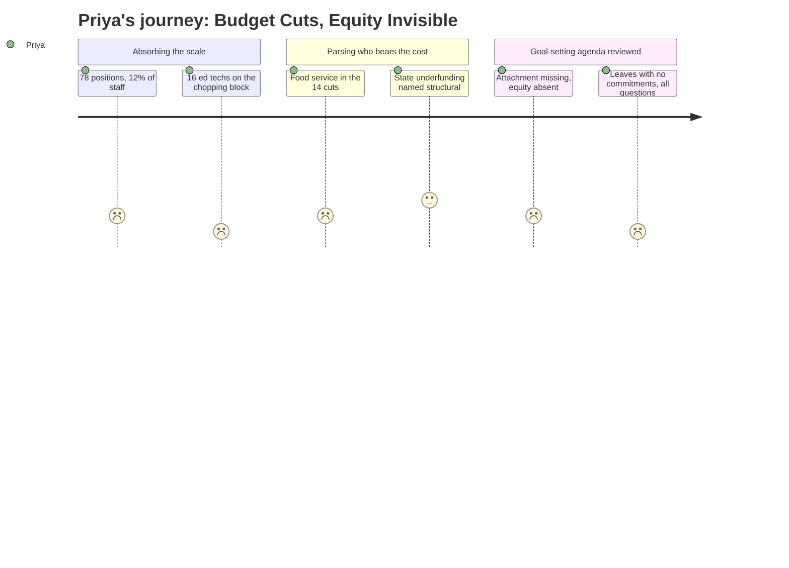

# Interpretation: Priya (PERSONA-005)
## Meeting: City Council Goal Setting Workshop — January 15, 2026 — 2026-01-15

### Structured Points

#### 1. 16 Ed Tech Positions Proposed for Elimination
- **Fact:** Of the 78 proposed position eliminations, 16 are education technicians — the frontline staff who most directly support students with IEPs and the highest-need learners in daily classroom settings. This job class functions as disability equity infrastructure, and its elimination is not framed as such.
- **Source:** Fiscal Context, FY27 Budget Figures
- **Emotional valence:** negative
- **Threat level:** 5
- **Open question:** true

#### 2. Food Service and Transportation Included in 14 Facilities Cuts
- **Fact:** Fourteen positions across facilities, food service, and transportation are proposed for elimination. Food service cuts reduce access to school meals — a primary food source for students experiencing poverty and food insecurity.
- **Source:** Fiscal Context, FY27 Budget Figures
- **Emotional valence:** negative
- **Threat level:** 4
- **Open question:** true

#### 3. State Funding Covers Only 20% of Costs — Should Be 55%
- **Fact:** The district's structural gap is substantially driven by state underfunding: state aid covers approximately 20% of actual costs against a 55% target. This shortfall is a structural inequity embedded in Maine's school funding formula, not a local management failure.
- **Source:** Fiscal Context, FY27 Budget Figures
- **Emotional valence:** negative
- **Threat level:** 4
- **Open question:** true

#### 4. No Equity Framing Visible in the Goal-Setting Agenda
- **Fact:** The sole substantive item on the City Council goal-setting workshop agenda is "Annual Goal-Setting Session," with a referenced attachment not included in the publicly available agenda. No equity commitments, strategic plan language, or mention of underserved student populations appears in the visible record.
- **Source:** Agenda, City Council Goal Setting Workshop, January 15, 2026
- **Emotional valence:** negative
- **Threat level:** 3
- **Open question:** true

#### 5. 42 Teacher Positions Eliminated — Composition Unknown
- **Fact:** Teachers represent the largest single category of the 78 proposed eliminations at 42 positions. Without a breakdown by school, grade level, subject, or ELL endorsement status, it is impossible to assess the equity implications of this cut.
- **Source:** Fiscal Context, FY27 Budget Figures
- **Emotional valence:** negative
- **Threat level:** 4
- **Open question:** true

#### 6. 23% Enrollment Decline — No Demographic Disaggregation
- **Fact:** Elementary enrollment dropped 23% over four years (from 1,401 to 1,080 students), but no breakdown by demographic group, school building, or neighborhood is available. Whether this decline is concentrated among particular student populations — English learners, students in poverty, students of color — remains unknown.
- **Source:** Fiscal Context, FY27 Budget Figures
- **Emotional valence:** neutral
- **Threat level:** 3
- **Open question:** true

#### 7. Staffing Grew by 82 Positions While Enrollment Fell by 300
- **Fact:** Staff grew by 82 positions during the same period that enrollment declined by approximately 300 students. The composition of that growth — whether in special education, counseling, administration, or other areas — is not specified, making it impossible to evaluate whether equity-serving roles expanded or contracted.
- **Source:** Fiscal Context, FY27 Budget Figures
- **Emotional valence:** neutral
- **Threat level:** 3
- **Open question:** true

#### 8. Per-Pupil Cost Highest Among Comparable Districts at $26,651
- **Fact:** South Portland's per-pupil expenditure of $26,651 is described as the highest among comparable districts. This figure, without school-level or program-level disaggregation, cannot confirm whether high-need students are the primary beneficiaries of that spending or whether costs are driven by factors unrelated to equity outcomes.
- **Source:** Fiscal Context, FY27 Budget Figures
- **Emotional valence:** neutral
- **Threat level:** 2
- **Open question:** true

---

### Journey Map

---

### Reactions

The number I kept coming back to is sixteen. Sixteen ed tech positions. These are the people sitting next to kids with IEPs all day, keeping them in the classroom instead of pulled out, running the interventions that make inclusion mean something beyond a policy word. And they're lumped into the same elimination list as facilities staff and food service workers — like they're interchangeable overhead rather than the actual delivery mechanism for the district's disability equity commitments. That framing alone tells me a lot about where this is going.

I'm not letting the district off the hook just because the state is underfunding them — though the state absolutely is, and that 20% versus 55% gap is a scandal that nobody in Augusta seems to be in any hurry to fix. But the district still gets to decide *who absorbs the cuts*. Forty-two teacher positions is the biggest category, and I have no idea which teachers, which schools, which kids. The City Council's goal-setting agenda from last night told me exactly nothing — "Annual Goal-Setting Session" with an attachment I can't see. That's not transparency. That's a placeholder dressed up as governance.

Here's what I'm doing this week: public records request for the position elimination list broken down by school building, job class, and program. And I want the facilities cuts mapped to specific schools — because deferred maintenance and staffing distribution across buildings is where you see the real equity map, the one the district doesn't publish. The per-pupil cost being the highest in the region *should* be good news, but if it's not reaching kids experiencing poverty or students learning English or students with disabilities, then we're paying a premium to maintain a system that was never built for them in the first place.