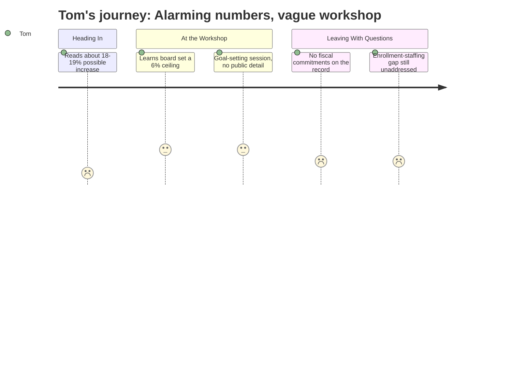

# Interpretation: Tom (PERSONA-006)
## Meeting: City Council Goal Setting Workshop — January 15, 2026

### Structured Points

#### 1. Without cuts, the tax hit would have been 18–19 percent
- **Fact:** The district's structural gap is large enough that a roll-forward budget — simply maintaining current operations — would have required an 18–19% property tax increase before any deliberate restraint was applied.
- **Source:** Fiscal Context, FY27 Budget Figures
- **Emotional valence:** negative
- **Threat level:** 5
- **Open question:** true

#### 2. The board capped the increase at 6 percent
- **Fact:** The school board set a 6% property tax increase as a ceiling, forcing approximately $7.2M in cuts to close the structural gap. This was a deliberate policy restraint, not a natural outcome of the numbers.
- **Source:** Fiscal Context, FY27 Budget Figures
- **Emotional valence:** positive
- **Threat level:** 2
- **Open question:** true

#### 3. Enrollment fell 23 percent while staffing grew by 82 positions
- **Fact:** Elementary enrollment dropped from 1,401 to 1,080 students over four years — a 23% decline — while the district added 82 staff positions over the same period. The two trend lines move in opposite directions.
- **Source:** Fiscal Context, FY27 Budget Figures
- **Emotional valence:** negative
- **Threat level:** 4
- **Open question:** true

#### 4. South Portland's per-pupil cost is the highest among comparable districts
- **Fact:** The district spends $26,651 per pupil, which is identified as the highest among comparable districts — meaning South Portland taxpayers are getting the least efficient return on their school dollar relative to peers.
- **Source:** Fiscal Context, FY27 Budget Figures
- **Emotional valence:** negative
- **Threat level:** 4
- **Open question:** true

#### 5. The state is covering 20 percent when it should be covering 55
- **Fact:** State aid currently covers approximately 20% of actual school costs despite a funding formula that implies 55% state responsibility, leaving the gap to fall directly on South Portland property owners.
- **Source:** Fiscal Context, FY27 Budget Figures
- **Emotional valence:** negative
- **Threat level:** 4
- **Open question:** true

#### 6. The fund balance is gone — no cushion remains
- **Fact:** The district's fund balance (reserves) has been essentially depleted. There is no financial buffer to absorb a future shock or smooth a transition year.
- **Source:** Fiscal Context, FY27 Budget Figures
- **Emotional valence:** negative
- **Threat level:** 4
- **Open question:** true

#### 7. The goal-setting workshop produced no visible fiscal commitments on the public record
- **Fact:** The January 15 meeting was structured as a City Council goal-setting workshop. The public agenda lists only an "Annual Goal-Setting Session" with an attached document — no public deliberation, motions, or fiscal commitments are recorded in the available evidence.
- **Source:** City Council Goal Setting Workshop Agenda, Jan 15, 2026
- **Emotional valence:** neutral
- **Threat level:** 3
- **Open question:** true

---

### Journey Map

---

### Reactions

I'll tell you what got my attention right away — eighteen to nineteen percent. That's what they were looking at before anybody put the brakes on. Eighteen to nineteen percent increase in the school portion of my property tax. I'm already paying more than I should be and now they're telling me the baseline math points to nearly a fifth more? At least somebody on the board said no and capped it at 6. I'll give them that. But 6 is still above inflation and when the school tax is 61 cents of every property tax dollar, that adds up fast on a fixed income.

Here's the thing that really gets under my skin. Enrollment in the elementary schools dropped 23 percent in four years. Three hundred fewer kids. You'd think that means you need fewer teachers, fewer buses, smaller buildings. Instead, the district added 82 staff positions. Eighty-two. How does that happen? And now we've got the highest per-pupil cost of any comparable district — $26,651 — and they want to come back to the taxpayers like they're the ones being squeezed. They spent down the entire fund balance too. There's nothing left in the tank.

And then there's Augusta. The state formula says the state should cover 55 percent of school costs. They're covering 20. So the state passes mandates, sets requirements, and then sticks South Portland homeowners with 80 cents of every dollar. That's not a South Portland problem — that's Augusta passing the bill and letting us fight about it at the local level. I went to this goal-setting workshop hoping to hear the council get loud about that. I didn't see much on the agenda. I'm going to be watching closely when the budget referendum comes up — that's the one vote I actually have.