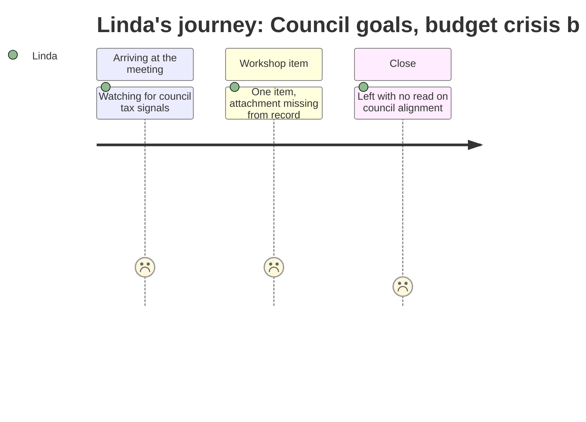

# Interpretation: Linda (PERSONA-003)
## Meeting: City Council Workshop — Goal Setting — January 15, 2026

### Structured Points

#### 1. Council goal-setting workshop running concurrent with budget crisis
- **Fact:** The city council held an annual goal-setting workshop on January 15, 2026 — the same period in which the school district is carrying a $7.2M structural budget gap and facing a forced reduction of 78 positions.
- **Source:** Agenda ("CITY COUNCIL WORKSHOP (Goal Setting) - Jan 15, 2026"); Fiscal Context (structural gap, positions at risk)
- **Emotional valence:** negative
- **Threat level:** 4
- **Open question:** true — Did the council's goal-setting session address the school budget situation at all, or did it proceed in a parallel track without acknowledging the district's fiscal state?

#### 2. Workshop included an unreviewable attachment
- **Fact:** The single substantive agenda item — the annual goal-setting discussion — is noted as containing an attachment, but that attachment is not available in the meeting record provided.
- **Source:** Agenda ("This Agenda Item Contains an Attachment")
- **Emotional valence:** negative
- **Threat level:** 3
- **Open question:** true — What goals did the council adopt, and do any of them intersect with the school budget, property tax policy, or the upcoming validation vote?

#### 3. School tax represents 61% of total property tax burden
- **Fact:** The school tax constitutes 61% of total property taxes paid by South Portland residents, making the school budget the dominant driver of property tax increases and politically the most exposed line item the council will scrutinize.
- **Source:** Fiscal Context
- **Emotional valence:** negative
- **Threat level:** 4
- **Open question:** false — Linda already knows this. It's the number she has to defend in every public forum.

#### 4. An 18–19% property tax increase would result without board-imposed cuts
- **Fact:** A roll-forward budget — no programmatic changes — would require an 18–19% property tax increase. The board has imposed a 6% ceiling, requiring approximately $7.2M in reductions including 42 teacher positions.
- **Source:** Fiscal Context
- **Emotional valence:** negative
- **Threat level:** 5
- **Open question:** true — Does the city council's goal-setting session signal any tolerance for tax increases above 6%, or has the council independently set a lower threshold that would further constrain the board?

#### 5. State funding covers approximately 20% of actual costs — half of what the formula implies
- **Fact:** State aid covers roughly 20% of actual per-pupil costs despite the EPS formula implying approximately 55% coverage. This gap is the structural cause of the local funding pressure and is not within the board's control to resolve.
- **Source:** Fiscal Context
- **Emotional valence:** negative
- **Threat level:** 5
- **Open question:** true — Did the council's goal-setting discussion include any advocacy posture toward the legislature on the EPS subsidy shortfall, or is the state funding problem being left entirely for the school board to absorb locally?

---

### Journey Map

---

### Reactions

I'll be honest — I walked away from this one with more questions than I came in with. This is the council's annual goal-setting session, which in any other year I'd skim and move on from. But we're sitting here with a $7.2M hole, 78 positions on the table, and a validation vote coming. What the council decides their priorities are right now matters enormously for whether we have political cover — or a headwind — when this goes to the public. And the substantive part of that meeting, the actual goal document, is in an attachment I can't get to. That's frustrating. I need to know if school budget impact shows up anywhere in their goal language, or if they treated this like it was an unrelated session.

What I keep coming back to is the 61% number. The school budget is 61 cents of every property tax dollar in this city. There is no scenario where a city council goal-setting conversation about fiscal responsibility or resident affordability doesn't eventually land on us. If the council went into that room and set goals around "keeping taxes low" without any awareness of what the EPS subsidy shortfall is doing to us, then we're going to have a very hard spring. We've already done the hard thing — the board set a 6% ceiling and we've proposed eliminating 78 positions, including 42 teachers. That is a painful, responsible decision. What I need from the council is an understanding of *why*, not a second round of "can you cut more."

And the state piece — that's the thing I wish more people would take seriously right now. We're covering 35 cents of every dollar the state formula says it should be paying. That's not a school board failure, that's a legislature failure. If the council's goal-setting session included any kind of advocacy stance toward Augusta, that would be genuinely useful. But I have no way to know because I can't see the attachment. That's my homework before the next meeting — get that document and read it before anyone else starts framing the narrative.