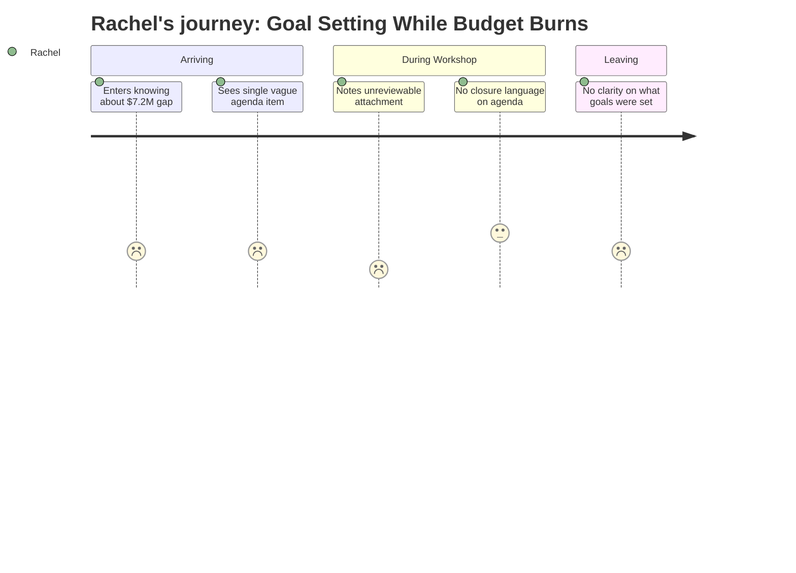

# Interpretation: Rachel (PERSONA-008)
## Meeting: City Council Regular Meeting -- January 15, 2026 -- 2026-01-15

---

### Structured Points

#### 1. City Council enters the room during a budget emergency
- **Fact:** The City Council held a formal goal-setting workshop on January 15, 2026 — at exactly the moment the district faces a $7.2M structural budget gap requiring either an 18-19% tax increase or major cuts.
- **Source:** Agenda, "City Council Goal Setting Workshop — January 15, 2026"; Fiscal Context
- **Emotional valence:** negative
- **Threat level:** 3
- **Open question:** true

#### 2. The only agenda item has an unreviewable attachment
- **Fact:** The single substantive agenda item — "Annual Goal-Setting Session" — explicitly notes it contains an attachment, the contents of which are not documented in the available meeting evidence.
- **Source:** Agenda, "Annual Goal Setting Session — This Agenda Item Contains an Attachment"
- **Emotional valence:** negative
- **Threat level:** 4
- **Open question:** true

#### 3. Elementary enrollment has dropped 23% in four years
- **Fact:** Elementary enrollment fell from 1,401 to 1,080 students — a decline of 321 children — over a four-year span. This is the specific data point administrators typically cite as the structural rationale for school consolidation or closure.
- **Source:** Fiscal Context
- **Emotional valence:** negative
- **Threat level:** 5
- **Open question:** true

#### 4. 78 positions proposed for elimination, including 42 teachers
- **Fact:** The district's proposed budget includes eliminating 78 positions (12% of total staff), among them 42 classroom teachers and 16 ed techs — a reduction that would materially alter class sizes and school programming at every level.
- **Source:** Fiscal Context
- **Emotional valence:** negative
- **Threat level:** 4
- **Open question:** true

#### 5. No explicit mention of school closures appears on the agenda
- **Fact:** The City Council workshop agenda contains no language referencing school closures, grade-level consolidations, or redistricting of any kind.
- **Source:** Agenda, "City Council Goal Setting Workshop — January 15, 2026"
- **Emotional valence:** neutral
- **Threat level:** 2
- **Open question:** true

#### 6. Per-pupil cost is highest among comparable districts
- **Fact:** At $26,651 per pupil, South Portland's per-student spending is the highest among comparable districts — a figure that administrators and city officials regularly invoke when making the case for structural reorganization.
- **Source:** Fiscal Context
- **Emotional valence:** negative
- **Threat level:** 4
- **Open question:** true

#### 7. State is funding only 20% of costs instead of the expected 55%
- **Fact:** State aid covers approximately 20% of actual district costs against an expected 55% — a $25M+ shortfall that is structural, long-standing, and entirely outside local control. This gap forces local decision-makers to absorb a problem they did not create.
- **Source:** Fiscal Context
- **Emotional valence:** negative
- **Threat level:** 3
- **Open question:** false

---

### Journey Map

---

### Reactions

"This wasn't even a school board meeting — it was a City Council goal-setting session, which should tell you how far up the chain this budget thing has gone. And the whole agenda was basically one item: 'Annual Goal-Setting Session.' That's it. One item. And there's an attachment — they literally say 'this agenda item contains an attachment' — but I can't find what's actually in it anywhere. So the City Council is sitting down to formally set their goals for the year, with a document I can't read, and nobody put the word 'school' anywhere on the public agenda. That is not reassuring to me. That is the opposite of reassuring."

"What I keep coming back to is that 23% enrollment number. Three hundred and twenty-one fewer kids at the elementary level in four years. That is *the* number they always cite right before someone starts drawing new maps. And now there's a $7.2M hole, 42 teachers potentially gone, and the highest per-pupil cost in the region. Every single one of those data points is something someone could stand up and say 'this is why we need to consolidate.' I've seen this pattern before in other districts. You don't announce a closure at the goal-setting meeting — you build the case quietly and then you announce it later like it's the only logical conclusion."

"I need to see that attachment. Like, that's my entire focus right now. What did the City Council put in writing as their goals for 2026? Because if one of them is 'right-size the school portfolio' or 'align facilities with enrollment trends' — that's a school closure dressed up in bureaucratic language. I'm not overreacting. I'm reading the room."