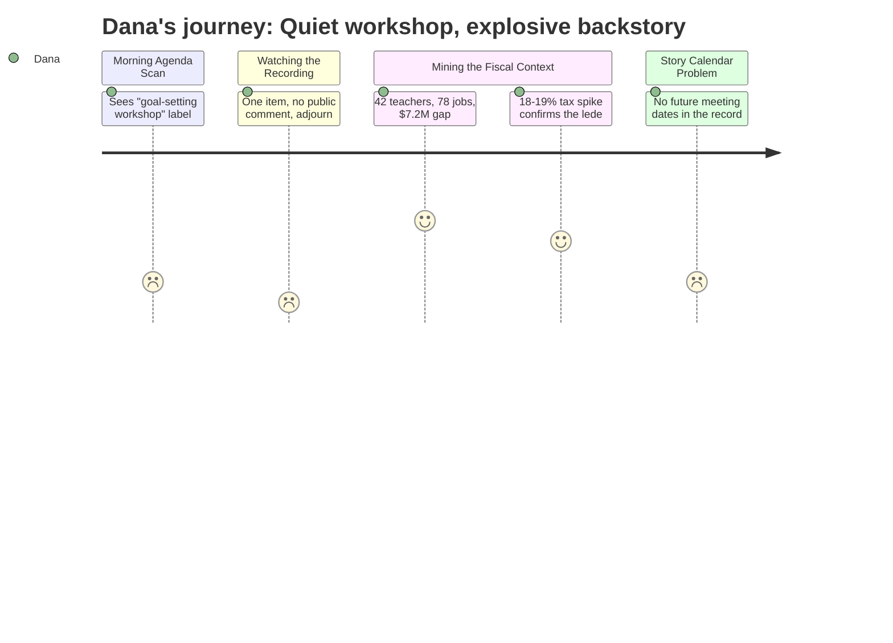

# Interpretation: Dana (PERSONA-009)
## Meeting: City Council Workshop (Goal Setting) — January 15, 2026

---

### Structured Points

#### 1. This was a procedural skip — no usable moment was produced
- **Fact:** The January 15 session was a goal-setting workshop with a single substantive agenda item ("Annual Goal-Setting Session") and immediate adjournment. The agenda lists no public comment period, no scheduled vote, no presentations on the budget crisis.
- **Source:** City Council Goal Setting Workshop Agenda — January 15, 2026 [agenda]
- **Emotional valence:** negative
- **Threat level:** 2
- **Open question:** true

#### 2. Forty-two teachers proposed for elimination — the human story is right there
- **Fact:** The fiscal backdrop for this budget cycle includes a proposal to cut 78 total positions (12% of all staff), with 42 of those being classroom teachers and 16 ed techs. These are the faces of the story.
- **Source:** Fiscal Context
- **Emotional valence:** negative
- **Threat level:** 5
- **Open question:** true

#### 3. Property taxes could spike 18–19% without cuts — the lede writes itself
- **Fact:** A roll-forward budget would require an 18–19% property tax increase. The board has capped acceptable increases at 6%, forcing roughly $7.2M in cuts to close the gap. Every homeowner in South Portland is the audience.
- **Source:** Fiscal Context
- **Emotional valence:** negative
- **Threat level:** 5
- **Open question:** false

#### 4. State is paying 20 cents on the dollar when it should pay 55 — the counter-narrative
- **Fact:** State aid covers approximately 20% of South Portland's actual school costs against a funding formula that should deliver roughly 55%. This is the angle that pushes back against any framing that blames local decisions alone.
- **Source:** Fiscal Context
- **Emotional valence:** negative
- **Threat level:** 4
- **Open question:** true

#### 5. The savings cushion is gone — no buffer, no delay, no softening
- **Fact:** The district's fund balance is essentially depleted. There is no reserve to absorb cuts gradually or push difficult decisions past the current cycle.
- **Source:** Fiscal Context
- **Emotional valence:** negative
- **Threat level:** 4
- **Open question:** false

#### 6. Enrollment fell 23% while staffing grew — the "how did we get here" story
- **Fact:** Elementary enrollment dropped from 1,401 to 1,080 students over four years while staffing grew by 82 positions. South Portland now spends $26,651 per pupil — highest among comparable districts. This is the accountability angle.
- **Source:** Fiscal Context
- **Emotional valence:** neutral
- **Threat level:** 3
- **Open question:** true

#### 7. No future decision dates are visible from this record
- **Fact:** The January 15 workshop agenda contains no reference to upcoming public hearings, budget votes, or referendum timelines. There is no "next meeting" timestamp in the evidence to anchor a follow-up assignment.
- **Source:** City Council Goal Setting Workshop Agenda — January 15, 2026 [agenda]
- **Emotional valence:** negative
- **Threat level:** 3
- **Open question:** true

---

### Journey Map

---

### Reactions

"So this one's a hard skip — it was a goal-setting workshop, one agenda item, and they adjourned. Nothing. But the backstory is genuinely explosive and I need to figure out when the real meeting happens. Seventy-eight positions on the chopping block, forty-two of them teachers. That's not a budget story, that's a people story. I find one of those teachers, I find a parent whose kid is about to be in a class that just doubled in size — we're done. That's the segment. I don't even need the superintendent on camera for that.

The tax angle is also right there. Eighteen to nineteen percent if they do nothing? Every homeowner in South Portland is the audience. That's a lead story, not a B-block. And here's the wrinkle nobody's going to volunteer: the state is supposed to be covering fifty-five percent of these costs and they're covering twenty. If I just go with 'schools overspent,' I'm parroting the district's framing. If I call a state rep and ask why Augusta is leaving South Portland short by something like thirty-five cents on the dollar, that's a different story. That's where I want the follow-up question to land on camera.

The thing actually keeping me up is the calendar. This workshop gave me nothing on timing. I don't know when the public hearing is, I don't know when the vote is, I don't know which room is going to have a parent crying at the microphone. I need to call someone on the board tonight — find out when the next real session is and whether it's going to get contentious. Because the math in this district is unambiguous: the money is gone, the savings are gone, forty-two teachers are on the list. Somebody is going to lose it at a meeting soon. I just need to be there when they do."