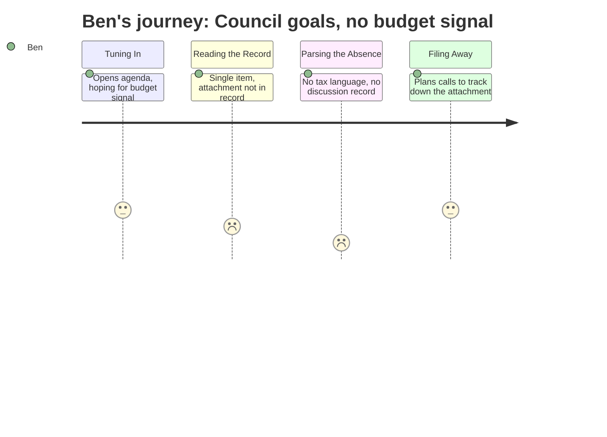

# Interpretation: Ben (PERSONA-010)
## Meeting: City Council Goal Setting Workshop — January 15, 2026 — 2026-01-15

### Structured Points

#### 1. Workshop format limits what's on the record
- **Fact:** The January 15 meeting is structured as a workshop — not a regular council meeting — with a single listed item and no other business. Workshop formats typically generate less formal public documentation than regular meetings.
- **Source:** Agenda header — "CITY COUNCIL WORKSHOP (Goal Setting) - Jan 15, 2026"
- **Emotional valence:** negative
- **Threat level:** 3
- **Open question:** true

#### 2. The only substantive item has an invisible attachment
- **Fact:** The agenda notes "This Agenda Item Contains an Attachment" for the Annual Goal-Setting Session, but that attachment does not appear in the available public record.
- **Source:** Agenda, Item 1 — "Annual Goal-Setting Session. This Agenda Item Contains an Attachment."
- **Emotional valence:** negative
- **Threat level:** 4
- **Open question:** true

#### 3. No school budget or tax language anywhere on the agenda
- **Fact:** Despite the school tax representing 61% of South Portland's total property tax burden, and the district facing a structural gap that would require an 18–19% tax increase on a roll-forward budget, the council's annual goal-setting workshop agenda contains no explicit reference to school finances, taxes, or the pending budget situation.
- **Source:** Agenda (absence); Fiscal context — school tax = 61% of total property taxes; roll-forward scenario = 18–19% increase
- **Emotional valence:** negative
- **Threat level:** 3
- **Open question:** true

#### 4. Workshop timing falls at the opening of budget season
- **Fact:** The workshop is dated January 15 — early in the public-facing phase of the FY27 budget process — placing it at a moment when council priorities and appetite for tax rate tolerance could signal real constraints to the school board before its final proposal takes shape.
- **Source:** Agenda date; Fiscal context — $7.2M structural gap, board-imposed 6% tax increase ceiling
- **Emotional valence:** neutral
- **Threat level:** 2
- **Open question:** true

#### 5. No transcript, no minutes, no record of actual discussion
- **Fact:** The available meeting evidence consists solely of the agenda. There is no transcript, no summary of discussion, and no documented exchange between council members — making it impossible to know what was said, decided, or signaled during the session.
- **Source:** Meeting evidence — agenda only
- **Emotional valence:** negative
- **Threat level:** 4
- **Open question:** true

#### 6. The origin of the 6% ceiling is unaccounted for
- **Fact:** The district is operating against a 6% tax increase ceiling — a constraint that directly produced the $7.2M cut target and the proposed elimination of 78 positions. A goal-setting workshop held by the city council in January is exactly the kind of setting where such a ceiling could have been established or affirmed, but there is no record of whether this was addressed.
- **Source:** Fiscal context — board set 6% ceiling, driving $7.2M in cuts and 78 position eliminations; Agenda — no reference to any such constraint
- **Emotional valence:** negative
- **Threat level:** 4
- **Open question:** true

---

### Journey Map

---

### Reactions

OK so I watched the city council's goal-setting workshop — or tried to — and the entire public record is one line: "Annual Goal-Setting Session. This Agenda Item Contains an Attachment." That's it. No transcript, no minutes, no sense of what goals were actually set or whether anyone said a word about the school budget. The attachment is the whole ballgame here and it's not in anything I can get to. This is exactly the kind of meeting where someone could have locked in or confirmed the 6% tax ceiling — the number that's driving literally every cut on the table, all 78 positions, the 42 teachers, the ed techs, the facilities staff. If the council set that ceiling in this room on January 15, that's a story. But I can't tell you one way or the other from what I have.

What's gnawing at me is the arithmetic. The school tax is 61% of what South Portland homeowners pay. Sixty-one percent. And the city council's annual goal-setting session — the one where they set the direction for the whole year — produces no visible public record, no reference to schools, no stated position on a situation where a do-nothing budget would mean an 18 or 19% tax increase. Either they addressed it in that invisible attachment, or they didn't address it at all, or I'm missing something. Any of those is a problem for a reader trying to understand how a decision this big actually gets made. First call tomorrow is the city manager's office — that attachment is a public document and I need to see it.

For the piece, the angle that's forming is about where the real decisions happen. The district is proposing to cut 42 teachers and 16 ed techs, and right now I can't trace the 6% ceiling back to any public moment — not a board vote, not a council resolution, nothing I can point a reader to. Somebody set that number. This workshop might be part of that story, or it might not. That's exactly the problem.