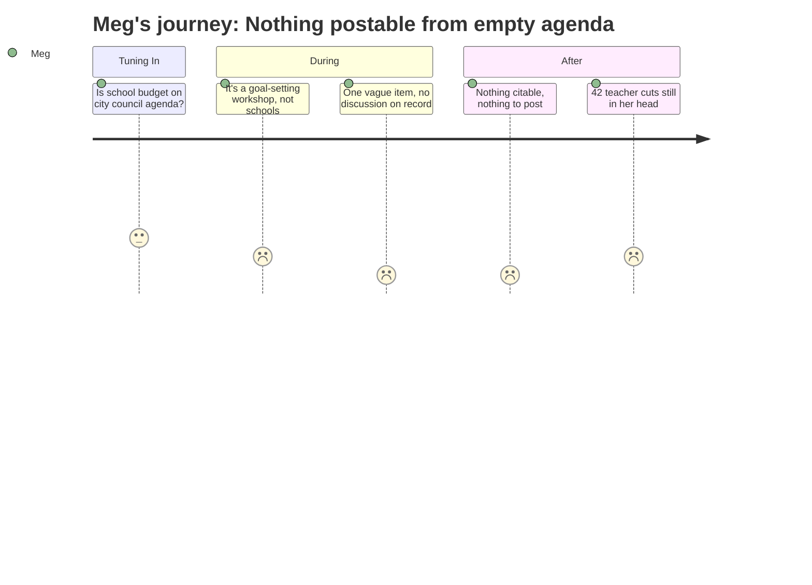

# Interpretation: Meg (MEG)
## Meeting: City Council Goal Setting Workshop — January 15, 2026

---

### Structured Points

#### 1. Wrong Meeting — This Is City Council, Not School Board
- **Fact:** The January 15 session is a City Council Goal Setting Workshop, not a school board meeting. The full agenda contains exactly one substantive item: "Annual Goal-Setting Session," with a notation that it contains an attachment that is not reproduced in the available evidence.
- **Source:** City Council Goal Setting Workshop Agenda — January 15, 2026
- **Emotional valence:** negative
- **Threat level:** 2
- **Open question:** true

#### 2. Zero Recorded Discussion — Nothing Citable
- **Fact:** No testimony, no board member statements, no vote counts, and no specific decisions appear in the available meeting record. The entire documented content is the agenda header and two lines: the session item and "ADJOURNMENT."
- **Source:** City Council Goal Setting Workshop Agenda — January 15, 2026
- **Emotional valence:** negative
- **Threat level:** 3
- **Open question:** true

#### 3. 78 Positions On the Chopping Block — 42 of Them Teachers
- **Fact:** Background budget documents show 78 positions proposed for elimination — 42 teachers, 16 ed techs, 14 facilities/food/transport, 2 administrators, and 4 non-bargaining staff. That is 12% of the district's entire workforce.
- **Source:** Fiscal Context, Key budget figures for FY27
- **Emotional valence:** negative
- **Threat level:** 5
- **Open question:** true

#### 4. The Gap Is $7.2M and the Tax Ceiling Is 6%
- **Fact:** A roll-forward (no-cuts) budget would require an 18–19% property tax increase to close a $7.2M structural gap. The board has set a hard ceiling of 6%, which mathematically requires cutting approximately $7.2M — there is no middle path in these documents.
- **Source:** Fiscal Context, Key budget figures for FY27
- **Emotional valence:** negative
- **Threat level:** 4
- **Open question:** false

#### 5. State Is Paying 20% — It's Supposed to Be 55%
- **Fact:** State aid covers roughly 20% of actual district costs. The expected statutory share is approximately 55%. The gap between those two numbers is a major driver of the local funding crisis and is not something the school board or city council can fix unilaterally.
- **Source:** Fiscal Context, Key budget figures for FY27
- **Emotional valence:** negative
- **Threat level:** 4
- **Open question:** true

#### 6. Elementary Enrollment Down 23% — Staffing Went Up 82 Positions
- **Fact:** Elementary enrollment fell from 1,401 students to 1,080 over four years — a 23% decline of 321 kids. In that same window, district staffing grew by 82 positions. Budget documents cite this mismatch as a structural driver of the current shortfall.
- **Source:** Fiscal Context, Key budget figures for FY27
- **Emotional valence:** neutral
- **Threat level:** 3
- **Open question:** true

---

### Journey Map

---

### Reactions

Okay heads up: I have nothing to give you from this one. The January 15 meeting wasn't even the school board — it was a City Council goal-setting workshop. The whole agenda was literally one line: "Annual Goal-Setting Session, this item contains an attachment." That's it. No discussion on record, no votes, no names, no numbers from the meeting itself. There's an attachment that was apparently part of it, but it's not in anything I have access to. I'm not posting something I can't point to, so I've got nothing from this session.

What I *can* tell you — because it's in the budget documents, not from this meeting — is that the situation is bad and hasn't changed. 78 positions are on the table for elimination. Forty-two of those are teachers. The district has a $7.2M hole and the board already locked in a 6% tax increase cap, which means they cannot tax their way out of this. Cuts are coming. And on top of that, the state is covering about 20% of actual costs when the formula says it should be 55% — so that shortfall is baked in and it's not a South Portland problem to solve alone.

The number that keeps bugging me is the elementary enrollment. Four years ago: 1,401 kids. Now: 1,080. That's 321 fewer elementary students — 23% gone. And in those same four years the district added 82 staff positions. I don't know which of those hires were justified by programs or special ed caseloads or whatever, but that's the math the board is working with. If you want to know what meeting actually matters, it's not this one. Keep an eye on the school board calendar — that's where this is going to land.