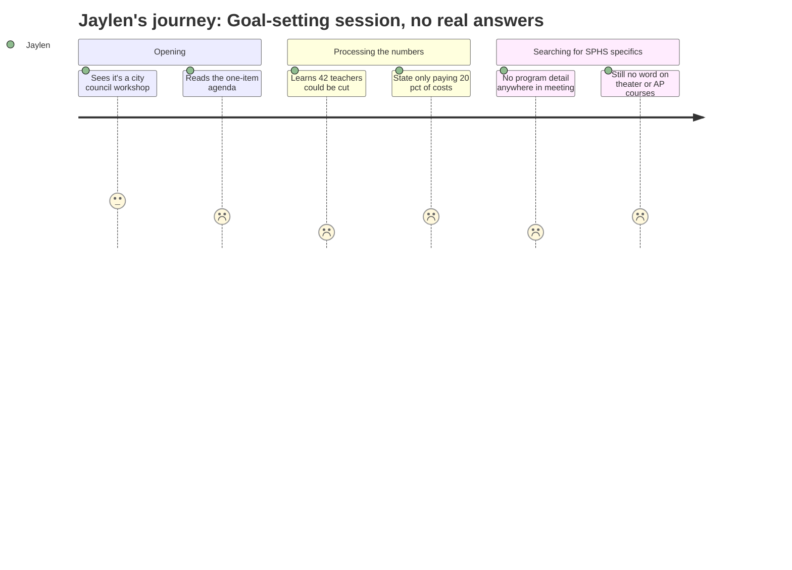

# Interpretation: Jaylen (PERSONA-jaylen)
## Meeting: City Council Workshop (Goal Setting) — January 15, 2026

---

### Structured Points

#### 1. 42 teachers proposed for elimination
- **Fact:** The fiscal context for FY27 identifies 42 teachers as part of a proposed 78-position elimination — 12% of total district staff.
- **Source:** Fiscal Context (FY27 budget figures)
- **Emotional valence:** negative
- **Threat level:** 5
- **Open question:** true — Jaylen has no way to tell from this meeting whether any of those 42 teachers are at SPHS, or whether they include theater, AP, or athletics-adjacent staff.

#### 2. The actual meeting is a closed goal-setting session with no visible student content
- **Fact:** The January 15 agenda lists a single substantive item — "Annual Goal-Setting Session" — with only a note that it contains an attachment. No public testimony, no program-level discussion, no student voices are reflected in the agenda.
- **Source:** Agenda, Item 1
- **Emotional valence:** negative
- **Threat level:** 2
- **Open question:** true — What goals were actually set? Were schools even discussed? Jaylen has no way to know.

#### 3. District savings are completely gone
- **Fact:** The fund balance — the district's financial cushion — is described as essentially depleted, meaning there is no reserve left to soften any of the proposed cuts.
- **Source:** Fiscal Context (FY27 budget figures)
- **Emotional valence:** negative
- **Threat level:** 4
- **Open question:** false — This makes the cuts feel inevitable and irreversible, not hypothetical.

#### 4. The state is funding schools at roughly half of what it's supposed to
- **Fact:** State funding covers approximately 20% of actual district costs, against a formula that should deliver 55%. That gap is a major driver of the $7.2M shortfall.
- **Source:** Fiscal Context (FY27 budget figures)
- **Emotional valence:** negative
- **Threat level:** 3
- **Open question:** true — Why isn't anyone talking about fixing the state formula instead of cutting teachers? Who is pushing back on Augusta?

#### 5. The tax ceiling forces the full $7.2M to come from cuts, not revenue
- **Fact:** The board set a 6% property tax increase ceiling, which means the entire $7.2M structural gap must be closed through spending cuts rather than additional revenue.
- **Source:** Fiscal Context (FY27 budget figures)
- **Emotional valence:** negative
- **Threat level:** 4
- **Open question:** true — Who decided 6%? Was there a real debate about whether a slightly higher rate could have saved more programs?

#### 6. South Portland spends more per student than comparable districts — but Jaylen doesn't know where that money goes
- **Fact:** Per-pupil cost is $26,651, identified as the highest among comparable districts — a figure that will almost certainly be used to justify cuts without breaking down what students actually receive for it.
- **Source:** Fiscal Context (FY27 budget figures)
- **Emotional valence:** neutral
- **Threat level:** 2
- **Open question:** true — Does that number include theater? AP programs? Sports? Or is it inflated by administration and facilities costs that have nothing to do with what students experience?

#### 7. Enrollment dropped 23% but staffing grew — and students will be blamed for the mess
- **Fact:** Elementary enrollment fell from 1,401 to 1,080 students (a 23% decline) over four years, while staffing grew by 82 positions during the same period. District leadership framed this mismatch as a driver of the crisis.
- **Source:** Fiscal Context (FY27 budget figures)
- **Emotional valence:** neutral
- **Threat level:** 3
- **Open question:** true — Does the enrollment decline affect SPHS at all, or is this entirely an elementary school problem? High school enrollment trends were not broken out.

---

### Journey Map

---

### Reactions

Okay so I tried to watch the city council meeting because my mom said it was about the school budget, and it was basically nothing — like literally the agenda was "goal setting session" and then they adjourned. That's it. There's an "attachment" that nobody posted publicly. So that was a waste.

But the actual budget numbers that are floating around are genuinely scary. Forty-two teachers. They want to cut forty-two teachers out of this district, and nobody will tell me if any of them are at SPHS. My theater director could be on that list. My AP Chem teacher could be on that list. The cross-country coach isn't a full teacher so maybe he's one of the sixteen "ed techs" they're cutting? I don't know, because the way they describe this stuff — "object codes," "position eliminations," "FTE reductions" — makes it literally impossible to figure out what it means for an actual student at an actual school. Like, tell me what room is going dark. Don't tell me about "support services staffing ratios."

The thing that actually made me the most angry: the state is supposed to pay 55% of what it costs to run the schools and it's only paying 20%. That's not a South Portland problem, that's Augusta failing us, and nobody at that meeting was apparently talking about it — they were just sitting around setting goals while the administration figures out whose job to cut. I'm going to bring this up at the next board meeting. The per-pupil cost being "the highest in comparable districts" is going to be the thing they use to justify everything, and I need to be ready for that, because that number could mean anything. It could mean we have great arts and sports and AP offerings — or it could mean we have a bloated admin budget. Nobody's breaking it down for students.