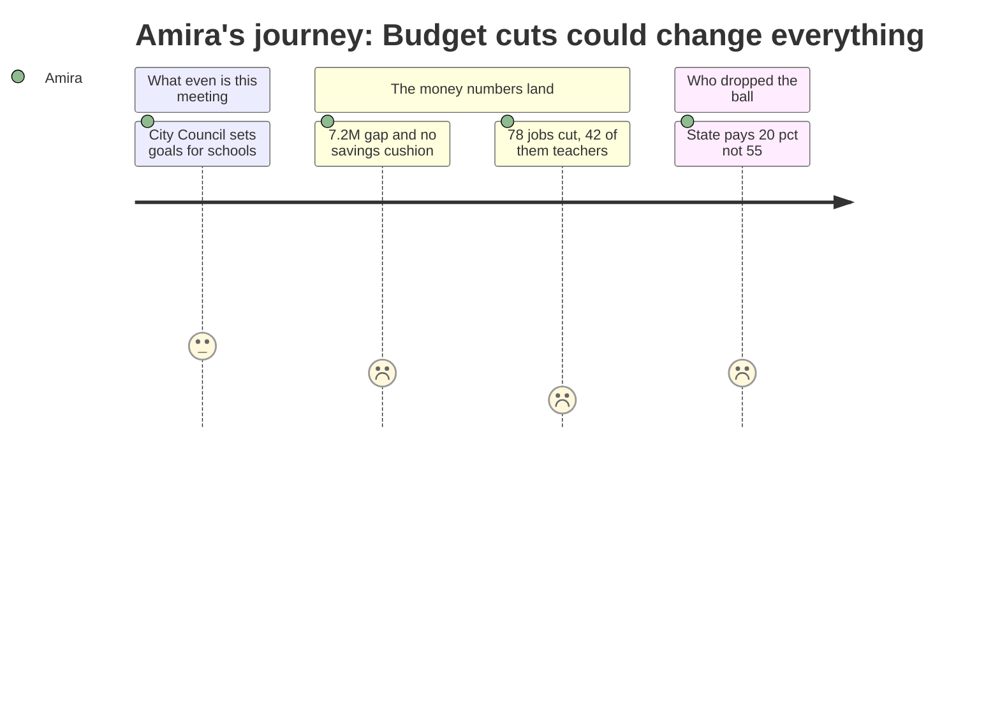

# Interpretation: Amira (PERSONA-013)
## Meeting: City Council Workshop (Goal Setting) -- January 15, 2026 -- 2026-01-15

---

### Structured Points

#### 1. Forty-Two Teachers Could Lose Their Jobs
- **Fact:** Of the 78 staff positions proposed for elimination, 42 are teachers — roughly one in eight people teaching in the district right now.
- **Source:** Fiscal Context (Key Budget Figures for FY27) — "78 positions (12% of staff) are proposed for elimination: 42 teachers, 16 ed techs..."
- **Emotional valence:** negative
- **Threat level:** 5
- **Open question:** true — Is my ELA teacher one of the 42? What about my band director?

#### 2. The District Has a $7.2 Million Hole and No Savings Left
- **Fact:** The district faces a $7.2M gap between what things cost and what's coming in — and the fund balance (the savings account) is essentially depleted, meaning there's nothing to fall back on.
- **Source:** Fiscal Context — "$7.2M structural gap" and "fund balance is essentially depleted — no cushion remains"
- **Emotional valence:** negative
- **Threat level:** 3
- **Open question:** true — This is the number my parents hear about at dinner. How did it get this bad?

#### 3. The State Is Paying Far Less Than It's Supposed To
- **Fact:** State funding covers only about 20% of actual school costs — but it's supposed to cover 55%. That's more than half the expected funding just... not showing up.
- **Source:** Fiscal Context — "State funding covers only ~20% of actual costs (should be 55%)"
- **Emotional valence:** negative
- **Threat level:** 4
- **Open question:** true — Why is nobody making the state pay what it promised? Who's in charge of that?

#### 4. Twelve Percent of All District Staff Could Be Gone
- **Fact:** The proposed cuts would eliminate 12% of the district's entire workforce — ed techs, facilities staff, food workers, and transportation workers, not just classroom teachers.
- **Source:** Fiscal Context — "78 positions (12% of staff) are proposed for elimination"
- **Emotional valence:** negative
- **Threat level:** 4
- **Open question:** true — That's not just teachers. That's the people who run the cafeteria. The bus drivers. What happens to school if all of them leave?

#### 5. The People Making These Decisions Are the City Council, Not Anyone at School
- **Fact:** This is a City Council goal-setting workshop — not the school board, not the principal, not anyone Amira has ever seen in a hallway. The people deciding her school's future are meeting in a room she's probably never been in.
- **Source:** Agenda — "CITY COUNCIL WORKSHOP (Goal Setting) - Jan 15, 2026"
- **Emotional valence:** neutral
- **Threat level:** 2
- **Open question:** true — How do I even reach these people? Does writing them a letter work better than writing the principal, or is it the same form response?

#### 6. Enrollment Has Dropped by Hundreds of Students — Including Kids Like Amira's Friends
- **Fact:** Elementary enrollment in the district has dropped 23% in four years — from 1,401 students down to 1,080. That's more than 300 children who left or never enrolled.
- **Source:** Fiscal Context — "Elementary enrollment declined 23% in four years (1,401 to 1,080 students)"
- **Emotional valence:** neutral
- **Threat level:** 2
- **Open question:** true — Where did those kids go? Are families leaving South Portland? Is that why they're cutting teachers — or is something else happening?

---

### Journey Map

---

### Reactions

So okay, I was trying to understand what this whole budget thing actually is, and it's like — the city council, not even the school board, is sitting in a room doing "goal setting" for our schools? I didn't even know the city council was in charge of that. And the whole meeting is basically just "here's an agenda, bye." There's no video of what they said, no notes, nothing. It's like the actual conversation happened behind a closed door and we're just supposed to trust that they figured it out.

But the numbers they're working with are terrifying. They want to cut 78 people, and 42 of them are teachers. Forty-two. That's not like cutting one position from each school — that's a huge chunk of everyone who teaches us. And the state is supposed to be paying more than half of what school costs, but they're only paying like a fifth of it? That's not a small mistake, that's just not doing what you said you'd do. Someone decided the state gets to pay way less than its share and now our teachers are the ones who lose their jobs? That feels really wrong. Who decided that was okay?

And what I keep thinking about — nobody in that room is a student. Nobody asked us if we could tell which teachers matter, or what programs we actually use, or what would make us want to stay at this school instead of somewhere else. My mom asks me why I love Memorial and I always say it's because of my teachers and because of band. Those are the exact things that feel most at risk right now. I don't want to find out in September that half my school has changed because some people I've never met made decisions in January and no one told me until it was already done.