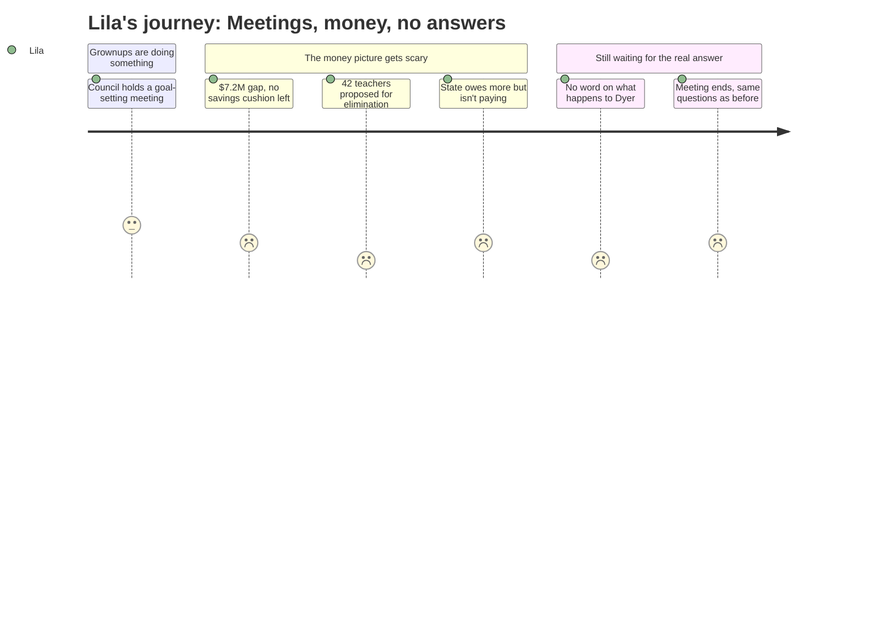

# Interpretation: Lila (PERSONA-LILA)
## Meeting: City Council Goal Setting Workshop — January 15, 2026 -- 2026-01-15

### Structured Points

#### 1. Adults Are Having Meetings, But Not About Her School
- **Fact:** The January 15 City Council meeting was a goal-setting workshop. The agenda lists a single discussion item with an attachment; no specific discussion of Dyer Elementary or school closures is documented in the public record.
- **Source:** City Council Workshop Agenda, January 15, 2026
- **Emotional valence:** negative
- **Threat level:** 3
- **Open question:** true

#### 2. A Huge Number of Teachers Might Be Gone Next Year
- **Fact:** The FY27 budget proposal includes eliminating 42 teacher positions — part of a total cut of 78 district staff, representing 12% of all district employees.
- **Source:** Fiscal Context, FY27 Budget Background
- **Emotional valence:** negative
- **Threat level:** 5
- **Open question:** true

#### 3. Fewer Kids Is the Reason Being Given for Closing Schools
- **Fact:** Elementary enrollment fell 23% over four years, from 1,401 to 1,080 students. The school reconfiguration proposal — which includes Dyer — is grounded in this decline.
- **Source:** Fiscal Context, FY27 Budget Background
- **Emotional valence:** negative
- **Threat level:** 4
- **Open question:** true

#### 4. It's Not Dyer's Fault — the State Isn't Paying What It Owes
- **Fact:** State funding covers only about 20% of actual school costs, against a benchmark of 55%. This shortfall is a major cause of the district's $7.2M budget gap — a gap that exists even without anything being wrong with any individual school.
- **Source:** Fiscal Context, FY27 Budget Background
- **Emotional valence:** negative
- **Threat level:** 3
- **Open question:** true

#### 5. There Is No Money Left to Soften Any of This
- **Fact:** The district's fund balance — its emergency savings cushion — is essentially depleted. There is no financial buffer available to delay or reduce the impact of cuts on schools or students.
- **Source:** Fiscal Context, FY27 Budget Background
- **Emotional valence:** negative
- **Threat level:** 4
- **Open question:** false

#### 6. Even Keeping Things the Same Would Cost Families a Lot More
- **Fact:** A roll-forward budget with no changes would require an 18–19% property tax increase. The City Council capped increases at 6%, meaning approximately $7.2M must be cut — and the school tax is 61% of total property taxes, so schools bear the weight.
- **Source:** Fiscal Context, FY27 Budget Background
- **Emotional valence:** negative
- **Threat level:** 3
- **Open question:** true

#### 7. Grownups Are in Meetings, But the Big Question Has No Answer Yet
- **Fact:** The City Council convened a formal goal-setting session during the same period the school budget crisis is the dominant public issue. The session included an attachment not captured in the public agenda; no resolution or outcome specific to school closures or Dyer is documented.
- **Source:** City Council Workshop Agenda, January 15, 2026
- **Emotional valence:** neutral
- **Threat level:** 2
- **Open question:** true

---

### Journey Map

---

### Reactions

My mom and dad went to a city council meeting last night and when they got home they were SO quiet. I asked them if they talked about Dyer and my mom kind of sighed and said it wasn't really that kind of meeting — they were just making a list of goals or whatever. I don't get why you have to make a list of goals when there's like a HUGE problem happening. Just fix the problem. Why does everything take so long.

The stuff I keep hearing is really scary. There's this giant money problem — like seven million dollars — and they want to cut forty-two teachers. FORTY-TWO. I don't even know how many teachers are at Dyer but that's a really big number. And my teacher, the one I've had since third grade, I don't know if she's on that list or not. Nobody will tell me. My dad said the state is supposed to pay for more of the school stuff but they're not doing it right, which means it's not even Dyer's fault we don't have enough money. That actually made me feel a little better? Like Dyer didn't do anything wrong. But then I still don't know why Dyer is the one that has to close.

I keep asking the same questions and nobody gives me real answers. Me and my sister both go to Dyer and I don't know where we're going to go next year or if we'll be at the same school or if any of my friends will be there. My friend Emma says she heard a kid say we're going somewhere else but she doesn't know where. I just want somebody to tell me the truth about what's going to happen. The grownups keep going to meetings and coming home all stressed and quiet and I feel like I'm waiting for something really bad but nobody will say when.