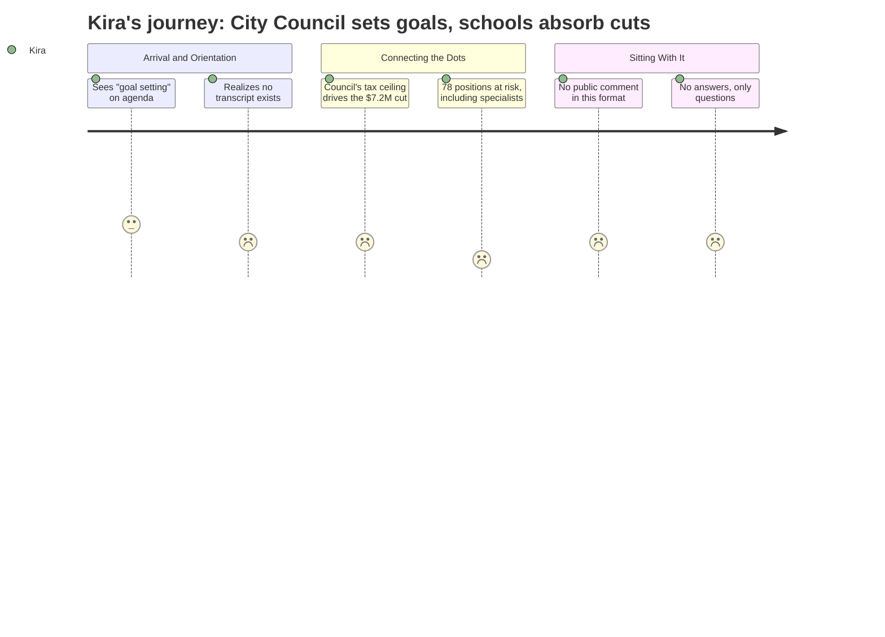

# Interpretation: Kira (PERSONA-015)
## Meeting: City Council Goal Setting Workshop — January 15, 2026

> **Interpreter's Note:** The documented meeting content for this session consists solely of the workshop agenda — one item, "Annual Goal-Setting Session," with an attached document not reproduced in the evidence. No transcript, no public comment, no board discussion, and no vote record are available for this meeting. The structured points below draw on that agenda and the FY27 fiscal background context provided. Where a point references fiscal data, it is sourced to that background context, not to anything said or decided in this meeting. Points cannot be made about what was discussed, because the record does not show it.

---

### Structured Points

#### 1. City Council is Setting Goals — While Schools Face a $7.2M Cliff
- **Fact:** This January 15 city council session is a goal-setting workshop, convened while the district is projecting a $7.2M structural budget gap that would require an 18–19% property tax increase under a roll-forward scenario.
- **Source:** City Council Workshop Agenda, Jan 15, 2026 [agenda]; FY27 Budget Fiscal Context
- **Emotional valence:** negative
- **Threat level:** 4
- **Open question:** true

#### 2. The Tax Ceiling the Council Sets is the Constraint That Drives the Cuts
- **Fact:** The school board has set a 6% property tax increase ceiling — a constraint that generates the ~$7.2M in required cuts and the proposed elimination of 78 positions. The city council's goal-setting posture directly shapes the fiscal envelope schools must operate within.
- **Source:** FY27 Budget Fiscal Context
- **Emotional valence:** negative
- **Threat level:** 5
- **Open question:** true

#### 3. The Meeting Agenda Reveals Almost Nothing
- **Fact:** The public agenda for this workshop contains a single item — "Annual Goal-Setting Session" — with a notation that it "contains an attachment." No attachment text, no agenda sub-items, and no documentation of what goals were proposed or discussed appear in the record.
- **Source:** City Council Workshop Agenda, Jan 15, 2026 [agenda]
- **Emotional valence:** negative
- **Threat level:** 3
- **Open question:** true

#### 4. 78 Positions Proposed for Elimination Include Specialists and Interventionists
- **Fact:** The proposed FY27 cuts include 42 teachers, 16 ed techs, and other support staff — the categories most likely to include the cross-building specialist and interventionist roles Kira inhabits and depends on.
- **Source:** FY27 Budget Fiscal Context
- **Emotional valence:** negative
- **Threat level:** 5
- **Open question:** true

#### 5. Enrollment Has Fallen 23% While Staffing Grew — The Numbers Are Real, But the Story Is Incomplete
- **Fact:** The fiscal context notes enrollment declined from 1,401 to 1,080 students (23%) over four years while staffing grew by 82 positions. This figure will be used to justify cuts, but it does not distinguish between positions added to address equity gaps versus positions added for other reasons.
- **Source:** FY27 Budget Fiscal Context
- **Emotional valence:** neutral
- **Threat level:** 3
- **Open question:** true

#### 6. State Funding Is Covering 20% When It Should Cover 55% — But the Council May Not Be Asking That Question Today
- **Fact:** The district's fiscal context documents that state aid covers only 20% of actual costs versus a 55% target. Whether the city council's goal-setting session surfaces this structural failure — rather than treating the gap as a school spending problem — is entirely unknown from the available record.
- **Source:** FY27 Budget Fiscal Context
- **Emotional valence:** negative
- **Threat level:** 4
- **Open question:** true

---

### Journey Map

---

### Reactions

So the city council had a goal-setting session on January 15th — the same period when we're staring down a $7.2M hole and 78 jobs on the chopping block — and the public record is just: "Annual Goal-Setting Session. Contains an attachment." That's it. No discussion notes, no attachment text, nothing. I don't know if they talked about schools at all. I don't know if anyone in that room said "we are about to cut 42 teachers and the equivalent of multiple specialist positions and we should name that as a goal-setting constraint." The record doesn't show it. And that silence is its own answer.

What kills me is that the 6% tax ceiling the board is working within didn't come from nowhere — it came from this body, this political calculus about what the community will bear. And I understand property taxes are real, they hit people hard. But the fiscal context is right there: state funding is covering 20% when it's supposed to be covering 55%. That's not a school spending problem, that's a state failure that our city is being asked to absorb. I travel between three buildings every week. I see the MTSS wait lists. I know which schools have two-week waits for intervention and which ones get next-day access. That inequity is a staffing and configuration problem, and we've known it for years. And now the answer is to cut 16 ed techs and 42 teachers while the underlying structural imbalance goes unnamed in a one-line agenda item.

I genuinely do not know what happened in that room on January 15th. The record doesn't tell me. And that's the thing I keep coming back to — how are we supposed to advocate into a process we can't see? I can read the fiscal numbers. I can name what 78 positions means for kids on intervention caseloads. But if the goal-setting conversation happened without any of that in the room, then we're already behind. I need to find out what was in that attachment.