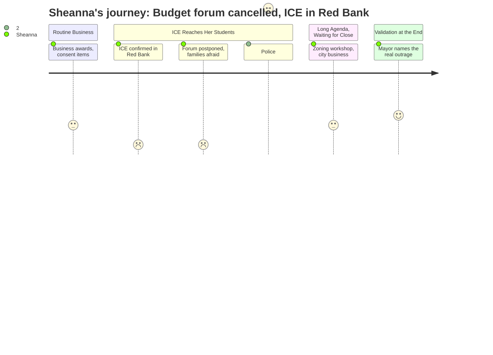

# Interpretation: Sheanna (PERSONA-015)
## Meeting: City Council Regular Meeting -- January 20, 2026 -- 2026-01-20

### Structured Points

#### 1. Kids stayed home from school today — ICE was real, not rumor
- **Fact:** Pedro Vasquez confirmed via cell phone video that ICE agents were at the Scrub-a-Dub car wash and a laundromat in the Red Bank neighborhood on the day of the meeting. He specifically stated that children were missing school and people were missing court dates out of fear. Jeff Steinberg noted earlier that "today, some South Portland kids stayed home from school because of this bullying."
- **Source:** [00:17:26--00:17:27] (Steinberg public comment); [00:21:07--00:22:00] (Vasquez public comment)
- **Emotional valence:** negative
- **Threat level:** 5
- **Open question:** true — How many students on her caseload across all three buildings weren't there today? Which families does she need to check on tomorrow?

#### 2. The community budget forum was cancelled because families are afraid to come out
- **Fact:** School board chair Rosemary D'Angelo announced at the meeting that the January 22nd community budget forum — the primary public input opportunity on proposed school cuts — had been postponed to February 4th. She stated the board felt it was "not responsible" to continue with the original date given "the fear, the tension and anxiety in the community," directly linking the postponement to ICE activity.
- **Source:** [00:18:20--00:19:00] (D'Angelo public comment)
- **Emotional valence:** negative
- **Threat level:** 5
- **Open question:** true — Will the families most affected by proposed cuts to multilingual learner services — the same families currently terrified to leave their homes — be able to attend even on February 4th? What happens to the community input process if they can't?

#### 3. Police will not intervene in ICE activity it considers "lawful"
- **Fact:** Police Chief Ahern stated that SPPD will respond to calls and would act if ICE agents broke the law or used excessive force, but that officers would not "interfere with ICE's activities" if those activities appeared lawful. He also explicitly warned community members not to put themselves between ICE agents and neighbors, stating they could be "committing crimes."
- **Source:** [00:23:51--00:27:03] (Chief Ahern remarks)
- **Emotional valence:** negative
- **Threat level:** 3
- **Open question:** true — "Lawful" is doing a lot of work in that statement. Who decides what's lawful in the moment, on the street, in front of a family?

#### 4. The 2017 city resolution is real — SPPD will not enforce immigration status
- **Fact:** City Manager clarified that the 2017 city council resolution — referenced by Chief Ahern as "our proclamation" — formally prohibits SPPD from seeking delegated authority to enforce federal immigration laws (Section 287G) and bars using city resources for surveillance or registries based on race, ethnicity, or national origin. Information is posted on the city's website under "Immigration Enforcement and Public Safety."
- **Source:** [00:27:20--00:28:10] (City Manager clarification)
- **Emotional valence:** positive
- **Threat level:** 2
- **Open question:** false — Families need to know this exists. It doesn't stop ICE, but it matters.

#### 5. Jeff Steinberg gave families the most actionable information of the night
- **Fact:** Community member Jeff Steinberg provided specific, practical guidance during public comment: ICE agents require a judicial warrant — signed by a judge — to enter a home or private space. Administrative warrants, which ICE typically carries, have no legal power to compel entry. He advised residents to make ICE slide any claimed warrant under the door or show it at a window before opening.
- **Source:** [00:16:18--00:17:26] (Steinberg public comment)
- **Emotional valence:** positive
- **Threat level:** 2
- **Open question:** false — This is exactly the kind of information she can share with families when she sees them.

#### 6. The Mayor named the real stakes at the end — and meant it
- **Fact:** Mayor Tipton in her round robin closing called the forum postponement "deeply disturbing" and explicitly connected it to families being legitimately fearful "about attending a meeting that affects their children's lives and their entire community," stating this was contrary to her understanding of American values. She encouraged peaceful protest.
- **Source:** [03:00:52--03:02:30] (Mayor Tipton round robin)
- **Emotional valence:** positive
- **Threat level:** 1
- **Open question:** false — It's something. Not enough, but the mayor said the quiet part out loud in a public record.

#### 7. A three-hour city agenda carried on — business as usual — while families hid
- **Fact:** The bulk of the meeting — cemetery ordinance, business loan programs, zoning amendments, fee schedules, housing density workshops — proceeded on schedule with no acknowledgment of the community crisis beyond the brief public comment period. The housing workshop alone consumed the equivalent of the entire public comment section in meeting time.
- **Source:** [00:28:10--03:00:00] (Action items and workshop)
- **Emotional valence:** negative
- **Threat level:** 2
- **Open question:** true — Is the February 4th forum rescheduling going to hold, or will the fear still be there? And will anyone making budget decisions actually change their timeline to account for the broken community engagement process?

---

### Journey Map

---

### Reactions

I was following this meeting online after I got my kids to bed, and honestly the first fifteen minutes I was half-paying attention — business awards, consent calendar, you know. And then Rosemary D'Angelo got up and said the budget forum is postponed, and my stomach just dropped. Because I knew why before she even said it. I'd spent all day at three different buildings and I could feel it — some of my kids were missing. The ones I was most worried about. And she confirmed it: the forum got moved because we can't ask families to come out right now when there are credible reports of ICE at the laundromat and the car wash in Red Bank. Pedro Vasquez said he had cell phone video. These aren't rumors anymore.

Here's what's eating at me. The budget forum isn't some optional community event — it's the primary way families are supposed to weigh in before the board makes decisions that are going to gut programming. I have kids on my caseload at two of our elementary schools who are multilingual learners. Their parents need to be in that room. They are the ones who most need to say: don't cut the language services, don't cut the intervention hours, don't reorganize the buildings in a way that makes it even harder to get kids the support they need. And those are exactly the families who are currently too scared to leave the house. The police chief basically confirmed they won't stand in ICE's way if the activity looks "lawful" — whatever that means in the moment. The 2017 resolution is real and I'm glad someone named it, but it doesn't stop federal agents from operating in our neighborhoods. February 4th isn't going to magically be safer.

What I'll hold onto: Jeff Steinberg gave actual, actionable information — judicial warrant versus administrative warrant, don't open the door — and Mayor Tipton stood up at the end and called it what it was: deeply disturbing. She said families have a legitimate right to attend meetings about their children's lives without being afraid, and that not being able to do that is not okay. She said it into the record. That matters. But I've got a caseload of kids I'm going to be tracking over the next two weeks, a postponed forum that's supposedly going to happen while this is all still unresolved, and a $7 million budget gap that doesn't care about any of this. I'll be up for a while.