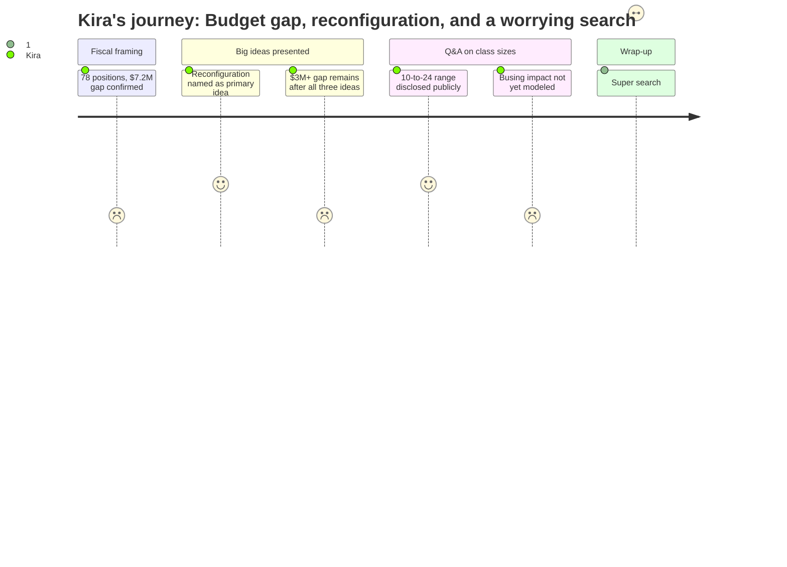

# Interpretation: Kira (PERSONA-015)
## Meeting: School Board Public Budget Forum -- February 4, 2026 -- 2026-02-04

### Structured Points

#### 1. Reconfiguration Named as Primary Cost-Saving Strategy
- **Fact:** Dr. Prince presented reconfiguration of elementary schools -- consolidating grade bands across buildings rather than neighborhood geography -- as the single largest cost-saving idea, with an estimated savings of $2 million or more.
- **Source:** [14:35--17:55]
- **Emotional valence:** positive
- **Threat level:** 2
- **Open question:** true

#### 2. Class Size Range of 10 to 24 Disclosed Publicly
- **Fact:** When asked about current class sizes, Dr. Prince acknowledged elementary classes range from as low as 10 students to as high as 24, with an average around 16 -- and stated the data had been formally requested, implying it hadn't been routinely shared.
- **Source:** [22:59--23:25]
- **Emotional valence:** positive
- **Threat level:** 2
- **Open question:** true

#### 3. Post-Reconfiguration Class Sizes Modeled at 18-19 (K-2) and 22-23 (Grades 2-4)
- **Fact:** Dr. Prince described the modeled class size targets under reconfiguration as 18-19 students for kindergarten through second grade, and 22-23 for grades two through four, noting this would remain within board guidelines.
- **Source:** [23:51--24:09]
- **Emotional valence:** neutral
- **Threat level:** 3
- **Open question:** true

#### 4. Busing Cost Impact Not Yet Modeled
- **Fact:** In response to a community member's question about whether transportation costs would offset reconfiguration savings, Dr. Prince acknowledged those numbers have not yet been calculated and would need to be part of future modeling.
- **Source:** [24:25--25:20]
- **Emotional valence:** negative
- **Threat level:** 3
- **Open question:** true

#### 5. Three Big Ideas Still Leave a $3M+ Unsolved Gap
- **Fact:** Even if the district implements all three major ideas -- elementary reconfiguration ($2M+), secondary schedule efficiencies ($1M), and operational shifts ($1M) -- a gap of over $3 million remains unaccounted for, requiring cuts across every budget line.
- **Source:** [16:15--19:25]
- **Emotional valence:** negative
- **Threat level:** 4
- **Open question:** true

#### 6. Middle School Building Consolidation Deferred to Fall 2027
- **Fact:** A previously discussed idea to consolidate the district's two middle school configurations into one building was removed from the current-year list after administrators determined that permitting requirements and Department of Transportation processes make a September 2026 implementation impossible.
- **Source:** [27:49--28:42]
- **Emotional valence:** negative
- **Threat level:** 3
- **Open question:** false

#### 7. Superintendent Search Has Almost No Community Input So Far
- **Fact:** Dr. Prince disclosed that virtual stakeholder sessions hosted February 3rd by the search firm Team Zeal -- designed to gather community input on superintendent qualities -- were attended by only three people.
- **Source:** [39:17--39:35]
- **Emotional valence:** negative
- **Threat level:** 4
- **Open question:** true

#### 8. Staffing Rose While Enrollment Fell -- District's Own Data Confirms It
- **Fact:** The district's presented enrollment-vs.-staffing chart showed that benefits-eligible staff numbers continued to climb even as student enrollment declined from its 2022-23 peak, creating the core financial mismatch driving the $7.2M gap.
- **Source:** [10:09--11:15]
- **Emotional valence:** neutral
- **Threat level:** 3
- **Open question:** false

---

### Journey Map

---

### Reactions

Okay so I finally heard them say it out loud, in front of the whole community: reconfiguration is the big idea. Not "a committee is studying configurations." Not "we're exploring options." The big idea, slide one, two million dollars. I have been traveling between three buildings watching kids in tiny classrooms at one school wait six weeks for an intervention slot while kids at another school get seen the same week — and the answer to that is grade-band reconfiguration, which is exactly what the Boundaries and Configurations Committee said years ago. So I felt something I haven't felt in a while at one of these meetings, which was: they actually see it. That mattered.

But here's what's going to keep me up: they do not have the busing numbers. Someone asked the exact right question — if you consolidate grade levels across buildings, what does that do to transportation? And Dr. Prince basically said, great question, we'll need to model that. We're already running five different school schedules and crossing kids all over town every single day. That math is not small. And they're projecting two million in savings without it. I need to know what that net number actually looks like before I can tell parents this is a good trade. Because if we reconfigure without redistricting thoughtfully, we could end up with bigger class sizes AND longer bus rides AND the same uneven access to specialists, just shuffled around different buildings.

And then at the very end Rosemary drops this: the virtual sessions to give input on the superintendent search had three people show up. Three. That is the hire that will decide whether any of this reconfiguration actually gets done with equity at the center or just as a cost-cutting checkbox. The next superintendent is going to inherit $3 million in unsolved cuts, a building consolidation that hasn't been modeled for transportation, and a community that is deeply divided about what the schools owe their kids. I don't care how good the budget forum was — if the people picking that leader are not representative of the families who actually depend on this district, we're going to be right back here in three years, same spreadsheet, different interim.