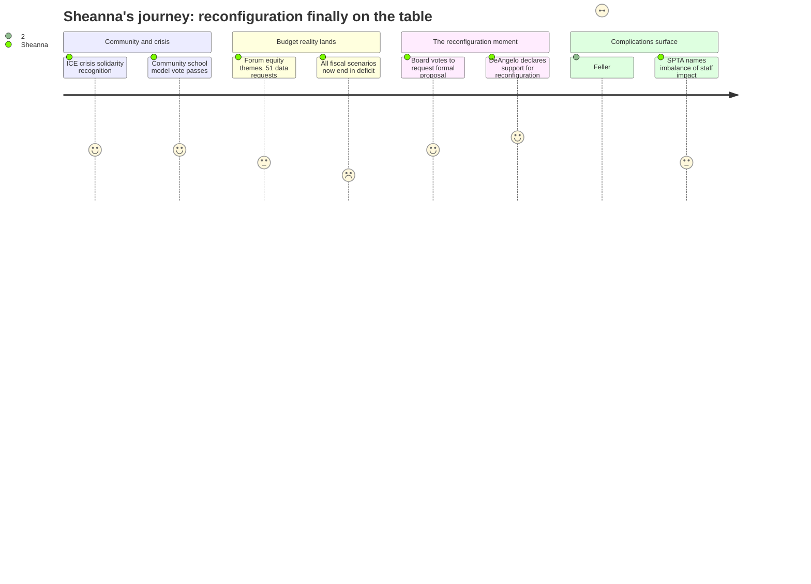

# Interpretation: Sheanna (PERSONA-015)
## Meeting: School Board Regular Meeting -- February 9, 2026 -- 2026-02-09

---

### Structured Points

#### 1. Board Votes Unanimously to Request Formal Reconfiguration Proposal
- **Fact:** The board voted unanimously to direct the superintendent to produce a formal proposal on the benefits and impact of elementary school grade-level reconfiguration, to be presented at the March 2 budget workshop. This makes it an official agenda item requiring data and analysis — not just a forum discussion.
- **Source:** [02:03:52--02:07:42], action item "consideration and approval to request the superintendent to produce a formal proposal related to the benefits and impact of the elementary school configuration"
- **Emotional valence:** positive
- **Threat level:** 2
- **Open question:** true — Will the proposal frame reconfiguration as an equity investment, or only as a cost-cutting measure? Will it include cross-building operational data — wait lists, specialist travel time, per-school resource inequities — or only enrollment numbers and facility costs?

#### 2. Board Chair DeAngelo Publicly Declares Support for Reconfiguration
- **Fact:** Chair DeAngelo gave an extended, unreserved statement in favor of reconfiguration, saying "I think this is good for kids," noting that she had spoken with "a number of teachers who also think this is a great idea," and stating directly that "this board is gonna have to make that decision" regardless of community opposition.
- **Source:** [02:08:25--02:11:25]
- **Emotional valence:** positive
- **Threat level:** 1
- **Open question:** false — DeAngelo's position is clear; the question is whether the rest of the board follows.

#### 3. Board Member Richardson Asks Why School Closure Was Ruled Out
- **Fact:** Richardson specifically requested that the March 2 workshop presentation include an explanation of why "closing one of the elementary schools" was concluded as "not a viable option," including the assumptions behind that decision. This is the distinction Sheanna cares deeply about — reconfiguration without redistricting may fail to fix cross-school inequities.
- **Source:** [02:06:34--02:07:25]
- **Emotional valence:** neutral
- **Threat level:** 3
- **Open question:** true — If the formal proposal only addresses grade-band reconfiguration across all five buildings, does it address the systemic inequities Sheanna observes daily — or does it just redistribute the same unevenness under a new configuration?

#### 4. Budget Forum Showed Community Wants Equity, But 51 Data Requests Cluster Around Reconfiguration
- **Fact:** Dr. Prince reported that budget forums drew about 100 participants and that themes included "commitment to equity and diversity" and "students as first priority." Of the 51 submitted data requests, the majority are about elementary school reconfiguration. Prince noted the formal proposal process will be the vehicle for answering most of them.
- **Source:** [00:46:38--00:52:52]
- **Emotional valence:** neutral
- **Threat level:** 2
- **Open question:** true — Will the community equity framing — which Sheanna endorses — survive contact with single-building parents who dominate public comment? The 51 data requests suggest intense interest, but from which communities?

#### 5. Finance Director Confirms All Budget Scenarios Now End in Deficit
- **Fact:** Abigail Chen disclosed that incorporating the nutrition fund deficit (projected at $1.1M for FY26) means "all scenarios end in deficit" — including the previously rosier Scenario A. The nutrition fund has been running structural deficits for years and was "lost in translation." The district has had seven business managers in six years.
- **Source:** [01:20:11--01:23:10]
- **Emotional valence:** negative
- **Threat level:** 4
- **Open question:** false — The fiscal picture is worse than most attendees understood coming into this meeting. The cuts required are not abstract.

#### 6. Board Member Feller Signals Opposition Is Organized and Vocal
- **Fact:** In his remarks supporting the reconfiguration proposal, Feller noted: "most folks who have reached out to me have not been in favor of this... it's a pretty specific group of people that are not happy about this." He also cautioned this "can't be a decision made by the central office and school board" alone — it needs a "big tent."
- **Source:** [02:04:26--02:05:55]
- **Emotional valence:** negative
- **Threat level:** 3
- **Open question:** true — If the public-facing narrative is dominated by single-school parents opposing change, will the board have the political will to act on the equity data? Who is centering the cross-building operational perspective?

#### 7. Community School District Vote Passed — Middle School Results Are Real
- **Fact:** The board voted unanimously to designate South Portland as a community school district. The middle school data showed chronic absenteeism cut by more than half, 11 family events per year (up from 3), nearly 1,000 school-based health center visits, and 7,000 pounds of food distributed through community partnerships. Dr. Stern noted the model is "an organizational structure" for efficiency, not just a program.
- **Source:** [00:15:08--01:05:30], action item "South Portland Schools to become a community school district"
- **Emotional valence:** positive
- **Threat level:** 1
- **Open question:** true — When does this infrastructure reach the elementary buildings where Sheanna works? The proposal starts with the high school. The students on her MTSS caseload are in elementary school right now.

#### 8. SPTA Publicly Named the Staff Equity Problem With Reconfiguration
- **Fact:** SPTA president Sergey listed specific staff concerns at second public comment: "worry about the imbalance of changes — some are higher impact for some staff but not others," concerns about the quick turnaround timeline, and "students and staff losing access to safe adults and communities they've built relationships with." She also confirmed the union will not endorse plans that cause colleagues to lose jobs.
- **Source:** [02:12:44--02:15:55]
- **Emotional valence:** neutral
- **Threat level:** 3
- **Open question:** true — "Imbalance of changes" is exactly Sheanna's concern as a traveling specialist. Will the formal proposal model what reconfiguration means for itinerant staff deployment specifically — or will that get collapsed into a general headcount number?

---

### Journey Map

---

### Reactions

They finally put it on the agenda. An actual vote, an actual proposal request, an actual deadline — March 2. I sat through the whole community school presentation (which was genuinely good, don't get me wrong, the middle school data is real), and I sat through the nutrition fund drama, and then when we finally got to the reconfiguration item, I could feel my whole body shift. DeAngelo stood up and basically said *I think this is good for kids and I've talked to teachers who agree.* That's the board chair. On the record. That matters. What I keep telling people is that you can't just look at your one school. You have to look at what it means to be me, driving between three buildings every day, watching kids sit on wait lists at one school while a slot opens up two miles away that nobody told anyone about. The middle school integration happened and the sky didn't fall. We can do this.

But here's what's going to keep me up: Feller said most of the people contacting *him* are against it. And I know who's making those calls. It's the parents at the schools that have the most to lose in terms of current advantages — the ones with the full staffing, the consistent programming, the schools that have never had to share. The parents at the schools that are *under-resourced* right now aren't the ones with the time to email every board member. I need to get in front of this. The formal proposal better include the operational data — the wait lists, the specialist travel minutes, the programming gaps by building — not just enrollment curves and facility costs. Because if this gets framed as "we're closing something," we lose. If it gets framed as "we're finally fixing something that's been broken for years," we have a chance.

And then Sarah got up and listed out what the union is worried about — timeline, mental health of staff, imbalance of impact. She said "imbalance of changes — some are higher impact for some staff but not others." She was being diplomatic, but I know exactly what that means. If reconfiguration goes through without careful deployment planning, the traveling specialists — people like me — end up in an even worse situation, or we end up as one of the 42 teacher eliminations if they just headcount-cut without thinking about what itinerant roles actually provide. I need to submit something before March 2. Not a public comment about my feelings — actual data. How many students. Which buildings. What the wait looks like. What gets lost if you cut without redistributing. That's my job right now.