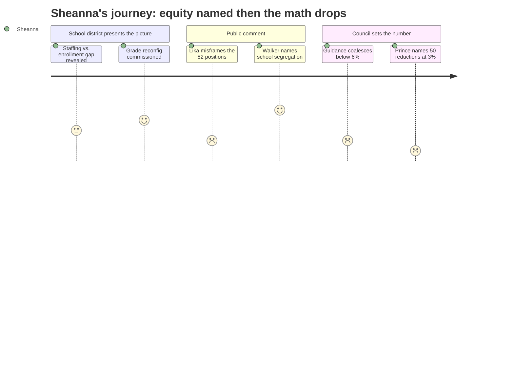

# Interpretation: Sheanna (PERSONA-015)
## Meeting: City Council & School Board Joint Budget Guidance Workshop -- February 10, 2026 -- 2026-02-10

### Structured Points

#### 1. Counselor Walker names de facto segregation across elementary schools — on the record
- **Fact:** Counselor Walker stated publicly that Skillings Elementary has approximately 50% students of color and new Mainers while another elementary school has approximately 27% of the same population, calling the current distribution "almost de facto segregated" and explicitly connecting reconfiguration to cross-school equity — not just cost savings.
- **Source:** [01:44:30--01:46:00]
- **Emotional valence:** positive
- **Threat level:** 2
- **Open question:** true

#### 2. Grade reconfiguration formally commissioned the night before this meeting
- **Fact:** Interim Superintendent Entwistle disclosed that the school board requested a formal reconfiguration proposal at the prior evening's board meeting — a plan converting three schools to grades 2–4 intermediates and two to K–1 primaries — projected to save approximately $2 million, but with no draft yet in hand.
- **Source:** [00:31:40--00:34:00]
- **Emotional valence:** positive
- **Threat level:** 2
- **Open question:** true

#### 3. The 82 positions added since 2017 are mostly ed techs and classroom teachers, not administrators
- **Fact:** In response to public questions about the staffing increase, Dr. Prince clarified that "the majority of those 82 positions are actually in our ed tech and our teaching force," driven by the complexity of the current student population — multilingual learners, students with IEPs, McKinney-Vento students — rather than administrative growth.
- **Source:** [01:17:40--01:19:00]
- **Emotional valence:** neutral
- **Threat level:** 4
- **Open question:** true

#### 4. At 3% tax guidance, the district faces approximately 50 staff reductions district-wide
- **Fact:** Assistant Superintendent Johanna Prince, responding to council members signaling guidance well below 6%, stated that the district is looking at "upwards of probably 50 staff reductions" at 3% — explicitly noting these would "not all come out of one unit" — naming the magnitude and cross-system spread of cuts.
- **Source:** [01:46:30--01:48:30]
- **Emotional valence:** negative
- **Threat level:** 5
- **Open question:** true

#### 5. District benchmarked its staffing against districts with comparable multilingual, special ed, and McKinney-Vento profiles
- **Fact:** Dr. Prince described pulling together a staffing comparison to Cumberland County districts and districts "that share a similar profile to us in terms of multilingual students in special education, our McKinney-Vento youth who are homeless, and our students from lower socioeconomic status" — using per-pupil cost as the metric rather than raw enrollment ratios.
- **Source:** [00:40:22--00:41:00]
- **Emotional valence:** positive
- **Threat level:** 2
- **Open question:** false

#### 6. Mayor Tipton reports hearing teachers describe consolidation as an opportunity — not a loss
- **Fact:** Mayor Tipton, in explaining her support for approximately 6%, noted she heard "many teachers talking more about opportunities in the consolidation model" at the prior week's community meeting — a markedly different framing from the "don't close my neighborhood school" comments that dominated public comment this evening.
- **Source:** [01:54:25--01:55:25]
- **Emotional valence:** positive
- **Threat level:** 1
- **Open question:** false

#### 7. Public commenter frames reconfiguration as "blowing up elementary infrastructure" — without asking what the 82 positions are
- **Fact:** Jenny Lika challenged the school board by asking why the district would "blow up our elementary school infrastructure to take away neighborhood schools from the community" rather than first examining "the 82 positions created since 2017" — treating the staffing increase as waste rather than as a response to student complexity.
- **Source:** [00:59:05--01:00:30]
- **Emotional valence:** negative
- **Threat level:** 3
- **Open question:** false

#### 8. Council guidance coalesces below 6%, with most voices at 3–4%
- **Fact:** After Johanna Prince named 50 reductions and stated cuts would "punish our kids," the council largely held firm: Counselor Walker alone explicitly endorsed 6%; most others signaled 3–4% as their range, with Counselor Matthews questioning whether any of the presented options were acceptable.
- **Source:** [01:37:00--01:57:00]
- **Emotional valence:** negative
- **Threat level:** 4
- **Open question:** true

---

### Journey Map

---

### Reactions

The moment I've been waiting years for actually happened tonight. Jess Walker — a city councilor, not a school board member, not a district employee — said it out loud: our elementary schools are almost de facto segregated. She put numbers on it. 50% of Skillings kids are students of color and new Mainers. About 27% at another school. She said that in a public meeting, connected it directly to why reconfiguration isn't just a budget lever, and named equity as the argument for consolidation. I drive between those buildings every single week. My MTSS caseloads look completely different depending on which parking lot I pull into. I've said this to anyone who would listen, and the response has always been another study, another committee. Tonight it got said on the record, with numbers, by someone who votes on the bottom line.

But then came the math. Johanna Prince did the work everyone else was dancing around: at 3% guidance, you're looking at 50 reductions, and they won't all come from one unit. That sentence will keep me up tonight. "Not all from one unit" means traveling positions are on the table. People like me. And what makes it worse is that Dr. Prince confirmed — in response to public comments about all this administrative bloat — that the majority of those 82 positions added since 2017 are ed techs and classroom teachers. Not directors. Teachers. Ed techs. People responding in real time to kids with IEPs, kids learning English, kids experiencing housing instability. The commenter who said cut those 82 before touching school structure doesn't know what she's looking at. She sees headcount on a slide. I see caseloads.

What scares me most is the sequencing. The board formally commissioned the reconfiguration proposal the night before this meeting. There is no draft. There is no redistricting plan. And now the council is setting guidance that requires cutting nine million dollars while that plan is still being designed. That's the recipe for a structural change that looks like equity reform on paper and functions like the same inequitable distribution, just in different buildings. Mayor Tipton said she heard teachers talking about opportunities in consolidation at last week's community meeting — and I believe her, because the people who work across buildings see exactly what I see. The question is whether anyone designing this plan will think to ask us before it's done.