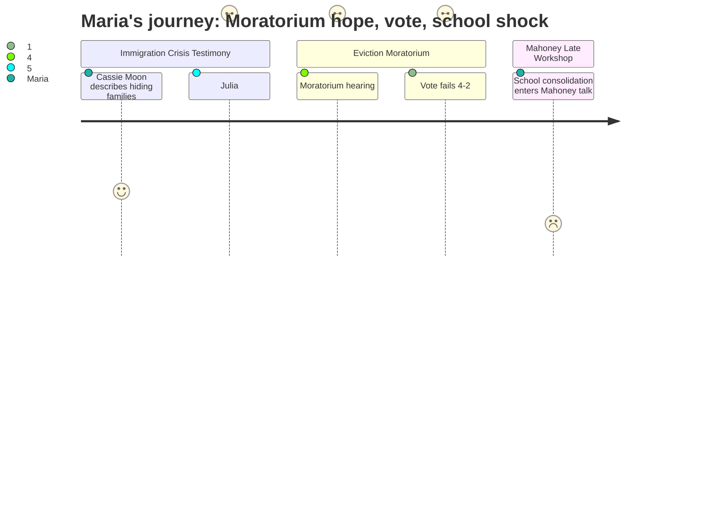

# Interpretation: Maria (PERSONA-001)
## Meeting: City Council Regular Meeting -- February 17, 2026 -- 2026-02-17

---

### Structured Points

#### 1. Children Being Kept Home from School Due to ICE Fear
- **Fact:** Multiple public speakers testified that immigrant families were refusing to send their children to school because of ICE activity. Julia Edwards stated her own six-year-old son — white, not a target — was asking why kids in his class still weren't showing up. Zenya Pantos, an early intervention worker, described a specific South Portland family that kept a child home for over a week because they didn't feel safe walking her to school.
- **Source:** [00:21:11--00:21:45] Julia Edwards public comment; [01:46:32--01:47:35] Zenya Pantos public comment
- **Emotional valence:** negative
- **Threat level:** 4
- **Open question:** true

#### 2. Eviction Moratorium Failed Its First Reading 4-2
- **Fact:** Ordinance 17-25/26, a temporary eviction moratorium covering February 1 through April 30, failed first reading on a 4-2 vote. Councilors Walker and Mayor Tipton voted yes; Councilors Scott, Coleman, Matthews, and Pride voted no. Councilor West recused herself as a landlord with a direct financial conflict.
- **Source:** [02:49:52--02:50:35] Vote and announcement; [02:37:10--02:39:35] Councilor Scott rationale; [02:41:45--02:44:05] Councilor Pride rationale
- **Emotional valence:** negative
- **Threat level:** 4
- **Open question:** true

#### 3. Emergency Housing Fund Projected to Run Dry in 10–11 Days
- **Fact:** Community member Carly Williams reported that Project Home had received 655 contacts requesting emergency rental assistance since January 23rd, with 15% of confirmed-address contacts living in South Portland. The fund had distributed over $196,000 to 95 households but was projected to exhaust its money within 10 to 11 days of the meeting.
- **Source:** [01:54:24--01:55:45] Carly Williams public comment
- **Emotional valence:** negative
- **Threat level:** 4
- **Open question:** true

#### 4. ICE Has Left South Portland — For Now
- **Fact:** The police chief testified that ICE operated in the city for four days and departed before a weekend snowstorm, and confirmed they have not returned. The city manager added that ICE had communicated their departure to police staff before they left.
- **Source:** [00:36:50--00:37:55] Police Chief testimony; [00:35:01--00:35:30] City Manager response to Jeff Steinberg's questions
- **Emotional valence:** positive
- **Threat level:** 2
- **Open question:** true

#### 5. Mahoney Workshop Unexpectedly Surfaces Elementary School Reconfiguration
- **Fact:** During the late-night Mahoney facilities workshop, community member Julia Edwards raised the idea of converting Mahoney into a consolidated elementary school campus rather than city offices. The city manager confirmed the school district had previously surrendered Mahoney and has made no formal new request. Mayor Tipton then clarified that the school board's current discussion is specifically "reconfiguration" — splitting grade levels across existing buildings to save approximately $2 million — not consolidation.
- **Source:** [04:10:25--04:12:05] Julia Edwards public comment; [04:18:40--04:20:10] City Manager and Mayor Tipton responses
- **Emotional valence:** negative
- **Threat level:** 3
- **Open question:** true

#### 6. Councilor Scott Not Required to Recuse Herself on School Budget Vote
- **Fact:** Community member Ed Ki raised the question of whether Councilor Scott, whose spouse is a South Portland school district employee, had a conflict of interest and should be barred from the school budget vote. The city attorney clarified that under city rules and state statute, Councilor Scott has no direct financial interest requiring recusal and may participate and vote as long as she believes she can be unbiased. Councilor West, recusing herself on the eviction moratorium as a direct landlord, drew an explicit contrast between that "direct financial interest" and Councilor Scott's "indirect" one.
- **Source:** [00:29:10--00:30:05] Ed Ki public comment; [00:33:15--00:34:40] City attorney response; [01:00:55--01:01:10] Councilor West clarification
- **Emotional valence:** neutral
- **Threat level:** 2
- **Open question:** false

---

### Journey Map

---

### Reactions

I just got home from that city council meeting and I cannot sleep. Before they even got to the eviction moratorium, there were people at the public comment mic describing things that genuinely made me feel sick. This woman Cassie Moon has been driving immigrant moms to work because they're afraid to walk to their own cars — she described one mom opening the back door and diving to the floor, crying, then calling her kids to lock the door and not answer it for anyone. And then Julia Edwards got up and said her six-year-old son — white kid, no target on his back — is coming home asking why certain kids in his class still aren't showing up. I almost lost it. Those are empty desks in our schools. I've been so deep in the school budget numbers — the 42 teacher cuts being proposed, the ed tech cuts — and meanwhile there are kids who just aren't making it through the door because their parents are terrified. Our kids are noticing the empty seats. Someone needs to be asking the schools what they're doing about this.

Then the eviction moratorium vote happened and it failed 4-2, and honestly I stayed until almost midnight for that. I thought it might pass — they spent over an hour on it, there was so much thoughtful public comment. One woman said it perfectly: "Both of these parties are being affected by ICE, so why are we protecting one and not the other?" But Councilors Scott and Pride basically called it a sledgehammer, too blunt, unfair to small landlords. And I understand that intellectually, I do, but Project Home — the organization that's been paying rent for these families so they don't get evicted — is going to run out of money in ten days. They said that number out loud tonight. Ten days. And the council voted no anyway. I keep thinking about the families in my kids' school, the ones whose kids have had those absences this month, and I don't know what happens to them now. Nobody on that council said what the actual next step is for those families.

And then — this is the part that's going to keep me up — at almost eleven o'clock at night during a Mahoney building workshop that most people had already left for, someone in public comment raised the idea of putting all the elementary schools together at Mahoney. The mayor jumped in and clarified the school board isn't calling it "consolidation," they're calling it "reconfiguration" — which apparently means splitting grades across different buildings, and it saves about $2 million. I have a lot of questions about what that actually means for my kids' specific school, and I've heard nothing about this from the school directly. I'm already in the group chat asking if anyone else caught this because it was buried at the end of a five-hour meeting after midnight. This seems enormous and it came up like a footnote.